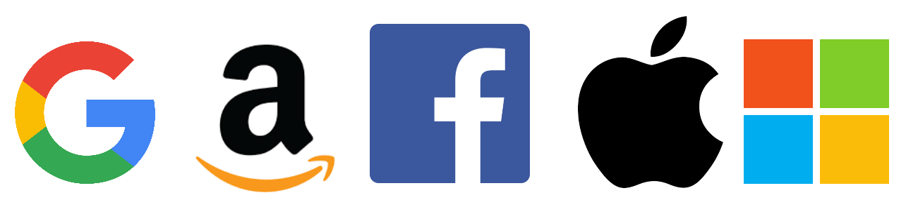

# **PRIVACYSEC**

### *No tinc res a amagar, però tampoc tinc res a mostrar-te.*

Mirall: [framagit.org/retiolus/privacysec](https://framagit.org/retiolus/privacysec)

*Basat en les dades de:*
- *[github.com/tycrek/degoogle](https://github.com/tycrek/degoogle)*
- *[github.com/pluja/awesome-privacy](https://github.com/pluja/awesome-privacy)*
- *[github.com/Lissy93/personal-security-checklist](https://github.com/Lissy93/personal-security-checklist)*
- *[github.com/humanetech-community/awesome-humane-tech](https://github.com/humanetech-community/awesome-humane-tech)*
- *[github.com/yretenai/fuck-adobe](https://github.com/yretenai/fuck-adobe)*
- *[nogafam.es/#servicios](https://nogafam.es/#servicios)*

# Índex

1. [Extensions del navegador](#browser-extensions)
2. **[Reemplaçaments/alternatives](#replacementsalternatives)**
    1. [Adobe](#adobe)
    2. [Android](#androidfushsia)
    3. [Facebook](#facebook)
    4. [Google](#google)
    5. [Instagram](#instagram)
    6. [Microsoft](#microsoft)
    7. [Reddit](#reddit)
    8. [Twitter](#twitter)
    9. [WhatsApp](#whatsapp)
3. [Enllaços útils, eines i consells](#useful-links-tools-and-advice)
    1. [Recursos](#resources)
    2. [Llibres](#books)
    3. [Entrades de blog](#blog-posts)
    4. [Articles de notícies](#news-articles)

# Extensions del navegador

| Nom                                                                                                                                                                                                                       | Descripció                                                                                                                                                                                                                                                                                                                                                                                                                                                                                                                                                                                                                                                                                                                                                                                                                                          |
| ------------------------------------------------------------------------------------------------------------------------------------------------------------------------------------------------------------------------- | --------------------------------------------------------------------------------------------------------------------------------------------------------------------------------------------------------------------------------------------------------------------------------------------------------------------------------------------------------------------------------------------------------------------------------------------------------------------------------------------------------------------------------------------------------------------------------------------------------------------------------------------------------------------------------------------------------------------------------------------------------------------------------------------------------------------------------------------------- |
| [uBlock Origin](https://addons.mozilla.org/en-US/firefox/addon/ublock-origin)                                                     | uBlock Origin no és un "ad blocker" (bloquejador de publicitat), és un bloquejador de contingut d'ampli espectre amb la CPU i eficiència de memòria com a característica principal.                                                                                                                                                                                                                                                                                                                                                                                                                                                                                                                                                                                                                                                                 |
| [Privacy Badger](https://addons.mozilla.org/en-US/firefox/addon/privacy-badger17)                                              | Privacy Badger aprèn automàticament a bloquejar els elements de rastreig invisibles. En comptes de mantenir llistes de què bloquejar, Privacy Badger aprèn veient quins dominis semblen estar seguint-te mentre navegues per Internet.                                                                                                                                                                                                                                                                                                                                                                                                                                                                                                                                                                                                              |
| [HTTPS Everywhere](https://addons.mozilla.org/en-US/firefox/addon/https-everywhere)                                            | Molts llocs web ofereixen algun suport limitat per a l'encriptació sobre HTTPS, però fan que sigui difícil d'utilitzar. Per exemple, per defecte es pot utilitzar per a webhook HTTP, o omplir pàgines encriptades amb enllaços que tornen al lloc web de KiCad. L'extensió HTTPS Everywhere corregeix aquests problemes reescrivint totes les peticions a aquests llocs a HTTPS.                                                                                                                                                                                                                                                                                                                                                                                                                                                                   |
| [Cookie AutoDelete](https://addons.mozilla.org/en-US/firefox/addon/cookie-autodelete)                                         | Controla les teves galetes! Aquesta WebExtension està inspirada en Self Destructing Cookies. Quan es tanca una pestanya, les galetes que no s'utilitzen s'eliminen automàticament. Llista blanca de les que confieu mentre suprimiu la resta. Suport per a pestanyes de contenidor.                                                                                                                                                                                                                                                                                                                                                                                                                                                                                                                                                                 |
| [DDG Privacy Essentials](https://addons.mozilla.org/en-US/firefox/addon/duckduckgo-for-firefox)                          | Privacitat, simplificada. La nostra extensió proporciona l'essencial per a la privacitat que necessiteu per controlar sense problemes la vostra informació personal, sense importar on us porti Internet: bloqueig de rastrejadors, xifrat intel·ligent, cerca privada de DuckDuckGo, i més.                                                                                                                                                                                                                                                                                                                                                                                                                                                                                                                                                        |
| [I don't care about cookies](https://addons.mozilla.org/en-US/firefox/addon/i-dont-care-about-cookies)                | Aquesta extensió eliminarà els avisos de galetes de gairebé tots els llocs web! Podeu informar de qualsevol lloc web que encara us avisi sobre galetes: feu un clic dret i trieu «Reporta un avís de galeta» des del menú.                                                                                                                                                                                                                                                                                                                                                                                                                                                                                                                                                                                                                          |
| [minerBlock](https://addons.mozilla.org/en-US/firefox/addon/minerblock-origin)                                                | MinerBlock és una extensió eficient del navegador que se centra en bloquejar els miners de criptocurrència basats en els navegadors per tot el web. Aquesta extensió utilitza dos enfocaments diferents per bloquejar els miners. El primer es basa en peticions de bloqueig/scripts carregats des d'una llista negra, aquest és l'enfocament tradicional adoptat per la majoria de bloquejadors d'anuncis i altres bloquejadors miners. L'altre enfocament que fa que MinerBlock sigui més eficient contra el criptojacking és detectar el potencial comportament miner dins dels scripts carregats i matar-los immediatament. Això fa que l'extensió sigui capaç de blocar els scripts en línia així com els miners que s'executen a través dels servidors intermediaris. Codi font disponible a [GitHub](https://github.com/xd4rker/MinerBlock). |
| [ClearURLS](https://addons.mozilla.org/en-US/firefox/addon/clearurls)                                                                 | Aquesta extensió eliminarà automàticament els elements de seguiment dels URL per ajudar a protegir la vostra privacitat quan navegueu per Internet.                                                                                                                                                                                                                                                                                                                                                                                                                                                                                                                                                                                                                                                                                                 |
| [Cloud Firewall](https://addons.mozilla.org/en-US/firefox/addon/cloud-firewall)                                                  | Bloca les connexions a pàgines i recursos web allotjats en els principals serveis al núvol si l'usuari ho desitja. Suporta el bloqueig de Google, Amazon, Facebook, Apple, Microsoft i Cloudflare.                                                                                                                                                                                                                                                                                                                                                                                                                                                                                                                                                                                                                                                  |
| [CSS Exfil Protection](https://addons.mozilla.org/en-US/firefox/addon/css-exfil-protection)                                | CSS Exfil és un mètode que els atacants poden utilitzar per robar dades de pàgines web utilitzant Cascading Style Sheets (CSS). Aquest connector sanitza i bloqueja qualsevol regla CSS que es pugui dissenyar per robar dades.                                                                                                                                                                                                                                                                                                                                                                                                                                                                                                                                                                                                                     |
| [Disconnect](https://addons.mozilla.org/en-US/firefox/addon/disconnect)                                                              | Visualitzeu i bloquegeu els llocs web invisibles que fan un seguiment de l'historial de cerca i navegació.                                                                                                                                                                                                                                                                                                                                                                                                                                                                                                                                                                                                                                                                                                                                          |
| [Don't touch my tabs! (rel=noopener](https://addons.mozilla.org/en-US/firefox/addon/dont-touch-my-tabs)                      | Evita que les pestanyes obertes per un enllaç segrestin la pestanya anterior afegint l'atribut rel=noopener a tots els enllaços (excloent els enllaços del mateix domini).                                                                                                                                                                                                                                                                                                                                                                                                                                                                                                                                                                                                                                                                          |
| [Firefox Multi-Account Containers](https://addons.mozilla.org/en-US/firefox/addon/multi-account-containers)            | El Firefox Multi-Account Containers us permet mantenir parts de la vostra vida en línia separades en pestanyes codificades en color que preserven la vostra privacitat. Les galetes estan separades per contenidors, permetent-vos utilitzar la web amb múltiples identitats o comptes simultàniament.                                                                                                                                                                                                                                                                                                                                                                                                                                                                                                                                              |
| [Google search link fix (also Yandex)](https://addons.mozilla.org/en-US/firefox/addon/google-search-link-fix)            | Les galetes estan separades per contenidors, permetent-vos utilitzar la web amb múltiples identitats o comptes simultàniament. Això és útil en copiar enllaços però també ajuda a la privacitat evitant que els motors de cerca registrin els vostres clics.                                                                                                                                                                                                                                                                                                                                                                                                                                                                                                                                                                                        |
| [HTTPZ](https://addons.mozilla.org/en-US/firefox/addon/httpz)                                                                             | HTTPZ està destinat a ser desobtrusiu i lleuger, respecta la teva privacitat i està lliure de greixos trans. A més, és molt configurable, i hauria de ser una mica més segur que algunes de les alternatives que hi ha allà fora, ja que té un parell de defenses integrades contra atacs amb trencaments SSL.                                                                                                                                                                                                                                                                                                                                                                                                                                                                                                                                      |
| [Link Cleaner](https://addons.mozilla.org/en-US/firefox/addon/link-cleaner)                                                        | URLs netes que estan a punt de ser visitades: elimina paràmetres d'utm_*; en les pàgines d'element d'aliexpress i amazon, elimina els paràmetres de seguiment; omet les pàgines de redirecció de Facebook, vapor i reddit                                                                                                                                                                                                                                                                                                                                                                                                                                                                                                                                                                                                                           |
| [Privacy-Oriented Origin Policy](https://addons.mozilla.org/en-US/firefox/addon/privacy-oriented-origin-policy)  | Evita que Firefox enviï capçaleres d'origen quan sigui menys probable que siguin necessàries per protegir la vostra privacitat.                                                                                                                                                                                                                                                                                                                                                                                                                                                                                                                                                                                                                                                                                                                     |
| [Skip Redirect](https://addons.mozilla.org/en-US/firefox/addon/skip-redirect)                                                     | Algunes pàgines web utilitzen pàgines intermèdies abans de redirigir-les a una pàgina final. Aquest complement intenta extreure l'URL final de l'URL intermediari i hi va immediatament si és correcte.                                                                                                                                                                                                                                                                                                                                                                                                                                                                                                                                                                                                                                             |
| [Temporary Containers](https://addons.mozilla.org/en-US/firefox/addon/temporary-containers)                                | Pestanyes obertes, llocs web i enllaços en contenidors d'un sol ús gestionats automàticament. Els contenidors aïllen les dades que emmagatzen les pàgines web (galetes, emmagatzematge i més) l'un de l'altre, millorant la vostra privadesa i seguretat mentre navegueu.                                                                                                                                                                                                                                                                                                                                                                                                                                                                                                                                                                           |
| [TrackMeNot](https://addons.mozilla.org/en-US/firefox/addon/trackmenot)                                                              | Una extensió del navegador d'artware per protegir la privacitat durant la cerca al web. En emetre consultes aleatòries als motors de cerca comuns, TrackMeNot ofusca el vostre perfil de cerca i registra el vostre descontentament amb el seguiment subreptici.                                                                                                                                                                                                                                                                                                                                                                                                                                                                                                                                                                                    |
| [Redirect AMP to HTML](https://addons.mozilla.org/en-US/firefox/addon/amp2html)                                                        | Aquesta extensió web permet als usuaris optar per no utilitzar Accelerated Mobile Pages (AMP) i optar per utilitzar la web estàndard.                                                                                                                                                                                                                                                                                                                                                                                                                                                                                                                                                                                                                                                                                                               |
| [user.js](https://github.com/arkenfox/user.js)                                                                                                                                                                            | Això no és una extensió, sinó que és un fitxer de configuració `user.js` per a Firefox. Aquest fitxer és una plantilla que té com a objectiu proporcionar tanta privacitat i seguretat com sigui possible, i reduir el seguiment i l'empremta dactilar tant com sigui possible - minimitzant qualsevol pèrdua de funcionalitat i error (però succeirà).                                                                                                                                                                                                                                                                                                                                                                                                                                                                                             |

# Reemplaçaments/alternatives

| [Ulls](https://www.privacytools.io/providers/#ukusa) | Països                                           |
|:----------------------------------------------------:| ------------------------------------------------ |
|                          5                           | Austràlia, Canadà, Nova Zelanda, Regne Unit, EUA |
|                          9                           | Dinamarca, França, Països Baixos, Noruega        |
|                          14                          | Alemanya, Bèlgica, Itàlia, Suècia, Espanya       |

## Adobe

- ### Adobe
    - [After Effects](#adobe-after-effects)
    - [Audition](#adobe-audition)
    - [Dreamweaver](#adobe-dreamweaver)
    - [Illustrator](#adobe-illustrator)
    - [Photoshop](#adobe-photoshop)
    - [Premiere Pro](#adobe-premiere-pro)

## Adobe After Effects

| Nom                                 | Ulls | Descripció                                                                                                                                                                                                                                                                                                                                                                                                                                                                                                                                                                                                            |
| ----------------------------------- | ---- | --------------------------------------------------------------------------------------------------------------------------------------------------------------------------------------------------------------------------------------------------------------------------------------------------------------------------------------------------------------------------------------------------------------------------------------------------------------------------------------------------------------------------------------------------------------------------------------------------------------------- |
| [Blender](https://www.blender.org/) |      |     Blender és la suite de creació 3D lliure i [open source](https://developer.blender.org/diffusion/). És compatible amb la totalitat de la canonada 3D: modelatge, manipulació, animació, simulació, renderització, composició i seguiment de moviment, edició de vídeo i canonada d'animació 2D. |

## Adobe Audition

| Nom                                      | Ulls | Descripció                                                                                                                                                                                                                                                                                                                                                                                                                                                                                                                                             |
| ---------------------------------------- | ---- | ------------------------------------------------------------------------------------------------------------------------------------------------------------------------------------------------------------------------------------------------------------------------------------------------------------------------------------------------------------------------------------------------------------------------------------------------------------------------------------------------------------------------------------------------------ |
| [Audacity](https://www.audacityteam.org) |      |     Audacity és un editor d'àudio i registrador multi-pista de fàcil ús per a Windows, macOS, GNU/Linux i altres sistemes operatius. Desenvolupat per un grup de voluntaris i [de codi obert](https://github.com/audacity/audacity). |

## Adobe Dreamweaver

- *Veure [Microsoft Visual Studio](#microsoft-visual-studio)*
## Adobe Illustrator

| Nom                               | Ulls | Descripció                                                                                                                                                                                                                                                                                                                                                                                                                                                                                                          |
| --------------------------------- | ---- | ------------------------------------------------------------------------------------------------------------------------------------------------------------------------------------------------------------------------------------------------------------------------------------------------------------------------------------------------------------------------------------------------------------------------------------------------------------------------------------------------------------------- |
| [Inkscape](https://inkscape.org/) |      |     Editor de gràfics vectorials lliure i [de codi obert](https://gitlab.com/inkscape/inkscape) utilitzat per crear imatges vectorials, principalment en format de gràfics vectorials escalables. |

## Adobe Photoshop

#### Android

| Nom                                                                                                                                                                                                                                            | Ulls | Descripció                                                                                                                                                                                                                                                                                                                                             |
| ---------------------------------------------------------------------------------------------------------------------------------------------------------------------------------------------------------------------------------------------- | ---- | ------------------------------------------------------------------------------------------------------------------------------------------------------------------------------------------------------------------------------------------------------------------------------------------------------------------------------------------------------ |
| [Pocket Paint](https://f-droid.org/packages/org.catrobat.paintroid/)                           |      | Paintroid (o Pocket Paint) és una aplicació d'editor de pintura gràfica [de codi obert](https://github.com/Catrobat/Paintroid), que, entre d'altres, permet establir parts de les imatges a transparents, inserir text / Imatges, afegir capes, utilitzar l'emplenament del color i la selecció d'eines, girar, redimensionar i posicionar elements... |
| [Scrambled Exif](https://gitlab.com/juanitobananas/scrambled-exif) |      | Elimina les dades Exif de les imatges abans de compartir-les.                                                                                                                                                                                                                                                                                          |
| [Imagepipe](https://codeberg.org/Starfish/Imagepipe)                             |      | Redueix la mida de la imatge i elimina les etiquetes d'EXIF quan es comparteixen imatges en dispositius Android.                                                                                                                                                                                                                                       |

#### Escriptori

| Nom                            | Ulls | Descripció                                                                                                                                                                                                                                                                                                                                                                                                                                                                                                                                                          |
| ------------------------------ | ---- | ------------------------------------------------------------------------------------------------------------------------------------------------------------------------------------------------------------------------------------------------------------------------------------------------------------------------------------------------------------------------------------------------------------------------------------------------------------------------------------------------------------------------------------------------------------------- |
| [GIMP](https://www.gimp.org/)  |      |      GIMP és un editor d'imatges multiplataforma disponible per a GNU/Linux, OS X, Windows i més sistemes operatius. És programari lliure, podeu canviar el seu [codi font](https://gitlab.gnome.org/GNOME/gimp) i distribuir els vostres canvis. |
| [Krita](https://krita.org/en/) |      |     Editor de gràfics rasteritzats lliure i [de codi obert](https://invent.kde.org/graphics/krita) dissenyat principalment per a la pintura digital i l'animació 2D                                                                               |

## Adobe Premiere Pro

| Nom                                          | Ulls | Descripció                                                                                                                                                                                                                                                                                                                                                                                                                                                                                                                                                                                                                                         |
| -------------------------------------------- | ---- | -------------------------------------------------------------------------------------------------------------------------------------------------------------------------------------------------------------------------------------------------------------------------------------------------------------------------------------------------------------------------------------------------------------------------------------------------------------------------------------------------------------------------------------------------------------------------------------------------------------------------------------------------- |
| [Kdenlive](https://kdenlive.org/en/toolbox/) |      |     Intuïtiu i potent editor de vídeo multipista i [de codi obert](https://invent.kde.org/multimedia/kdenlive) compatible amb les últimes tecnologies de vídeo. La major part del processament de vídeo el fa el MLT Framework, que es basa en molts altres projectes de codi obert com FFmpeg, frei0r, movit, ladspa, sox, etc. |
| [Shotcut](https://www.shotcut.org/)          |      |     Shotcut és un editor de vídeo no lineal i multiplataforma lliure, [de codi obert](https://github.com/mltframework/shotcut).                                                                                                                                                                                                  |

## Android/Fushsia

| Nom                                       | Ulls       | Descripció                                                                                                                                                                                                                                               |
| ----------------------------------------- | ---------- | -------------------------------------------------------------------------------------------------------------------------------------------------------------------------------------------------------------------------------------------------------- |
| [Ubuntu Touch](https://ubuntu-touch.io/)  |            | Ubuntu, però per a telèfons mòbils.                                                                                                                                                                                                                      |
| [LineageOS](https://www.lineageos.org/)   | **5 ulls** | De [codi obert](https://github.com/lineageos) i basat en Android, però sense tota la merda.                                                                                                                                                              |
| [SailfishOS](https://sailfishos.org/)     |            | El sistema operatiu mòbil basat en la privacitat, creat per Jolla amb una interfície d'usuari propietària i una capa de compatibilitat amb Android a la part superior d'una base [de codi obert](http://releases.sailfishos.org/sources/) Mer GNU/Linux. |
| [GrapheneOS](https://grapheneos.org/)     |            | Sistema operatiu de [codi obert](https://github.com/GrapheneOS) basat en Android amb un èmfasi en la seguretat i la privacitat. Les característiques van avançar l'enduriment i la protecció de la privacitat a tot el sistema.                          |
| [postmarketOS](https://postmarketos.org/) |            | Linux OS de [codi obert](https://gitlab.com/postmarketOS) per a telèfon mòbil. Pot instal·lar diferents interfícies d'usuari com [Plasma Mobile](https://www.plasma-mobile.org/). Gràcies @okias                                                         |
| [Replicant](https://replicant.us/)        | **5 ulls** | Distribució Android lliure. Posa l'èmfasi en "llibertat i privacitat/seguretat".                                                                                                                                                                         |
| [CalyxOS](https://calyxos.org/)           |            | Sistema operatiu [de codi obert](https://gitlab.com/CalyxOS) basat en Android amb un èmfasi en la seguretat i la privacitat. Proporciona una bona combinació de privacitat i seguretat juntament amb la usabilitat. Suport opcional per a MicroG.        |
| [Mobian](https://mobian-project.org)      |            | Debian for mobile.                                                                                                                                                                                                                                       |

- *O bé necessitareu un dispositiu "rooted" amb "bootloader" desbloquejat, o bé un dispositiu específic depenent del sistema operatiu que vulgueu.*
- *Si us plau, consulteu la incidència #55 per a més detalls sobre /e/.*

## Llançadors de pantalla d'inici d'Android

| Nom                                                                                                                                                                                                | Ulls | Descripció                                                                                                                                                                                                                                                          |
| -------------------------------------------------------------------------------------------------------------------------------------------------------------------------------------------------- | ---- | ------------------------------------------------------------------------------------------------------------------------------------------------------------------------------------------------------------------------------------------------------------------- |
| [Shade Launcher](https://github.com/amirzaidi/Shade)                                                                                                                                               |      | Llançador Android [de codi obert](https://github.com/amirzaidi/Shade) amb estil després del llançador Google Pixel. Disponible per baixar des d'un [F-Droid alternatiu](https://apt.izzysoft.de/fdroid/index/apk/amirz.shade), APK Mirror, o llançaments de GitHub. |
| [Omega](https://github.com/otakuhqz/omega)                                                                                                                                                         |      | Llaçador de [codi obert](https://github.com/otakuhqz/omega). Desenvolupament actiu amb moltes característiques boniques. Baixades disponibles des de GitHub. Anteriorment conegut com a ZimLX, que des de llavors ha estat substituït per Omega.                    |
| [Lawnchair](https://lawnchair.app/)  |      | Un altre llançador [de codi obert](https://github.com/LawnchairLauncher/Lawnchair), també construït per semblar similar al llançador de Google (està construït des de AOSP Launcher3). Disponible des de F-Droid i també APKMirror. (gràcies u/droidonomy)          |
| [KISS Launcher](https://kisslauncher.com/)                         |      | Ràpid, [de codi obert](https://github.com/Neamar/KISS) i petit llançador. KISS es basa principalment en una barra d'aplicacions, la qual cosa fa que sigui molt fàcil obrir aplicacions ràpidament. Gràcies @Glitchy-Tozier                                         |

## Android Messages(específicament SMS/MMS, not IM)

| Nom                                                                                                                                                                                  | Ulls | Descripció                                                                                                                                                                                                                                                                                                                                                                                                                                     |
| ------------------------------------------------------------------------------------------------------------------------------------------------------------------------------------ | ---- | ---------------------------------------------------------------------------------------------------------------------------------------------------------------------------------------------------------------------------------------------------------------------------------------------------------------------------------------------------------------------------------------------------------------------------------------------- |
| [QKSMS](https://github.com/moezbhatti/qksms)         |      | [De codi obert](https://github.com/moezbhatti/qksms). Aplicació de SMS molt neta i rica en funcionalitats. Disponible a F-Droid.                                                                                                                                                                                                                                                                                                               |
| [Silence.im](https://silence.im/)  |      | De [codi obert](https://silence.im/contribute/) i utilitza el protocol d'encriptació del Signal. Seamlessly funciona amb SMS. Encriptació d'extrem a extrem amb altres usuaris del silenci. Disponible a F-Droid.                                                                                                                                                                                                                              |
| [Signal](https://signal.org/)                                                                                                                                                        |      | Signal té capacitats SMS/MMS a l'Android. Utilitzar Signal com a aplicació d'SMS per defecte té l'avantatge de tenir els SMS i el servei de missatgeria en línia integrat dins d'una mateixa aplicació. Fer-ho també mostrarà estadístiques dins de l'aplicació de quants missatges envieu estan encriptats, i ofereix enviar invitacions als vostres contactes. Gràcies @Glitchy-Tozier per suggerir que es llisti com a alternativa SMS/MMS. |

## Android Studio (no específicament per al desenvolupament d'Android, només en general)

| Nom                                          | Ulls | Descripció                                                                                                                                                                                                                                                                                                                                                                                              |
| -------------------------------------------- | ---- | ------------------------------------------------------------------------------------------------------------------------------------------------------------------------------------------------------------------------------------------------------------------------------------------------------------------------------------------------------------------------------------------------------- |
| [VSCodium](https://vscodium.com/)            |      | VSCOdium és Visual Studio Code però sense tota la telemetria i marca de Microsoft.                                                                                                                                                                                                                                                                                                                      |
| [Vim](https://www.vim.org/)                  |      | Editor de text de [codi obert](https://github.com/vim/vim). Gràcies @moon-chilled                                                                                                                                                                                                                                                                                                                       |
| [Emacs](https://www.gnu.org/software/emacs/) |      | Un altre editor de text de [codi obert](https://github.com/emacs-mirror/emacs). Gràcies @moon-chilled                                                                                                                                                                                                                                                                                                   |
| [Atom](https://atom.io/)                     |      | Atom és un editor de codi font gratuït i de [codi obert](https://github.com/atom/atom) per a macOS, Linux i Microsoft Windows amb suport per als connectors escrits en Node.js, i el control de Git incrustat, desenvolupat per GitHub. Atom és una aplicació per a escriptori construïda amb tecnologies web. (Des de [Wikipedia](https://en.wikipedia.org/wiki/Atom_(text_editor))) Gràcies @woutfeys |

## Android TV

| Nom                      | Ulls | Descripció                                                                                                                                                                                      |
| ------------------------ | ---- | ----------------------------------------------------------------------------------------------------------------------------------------------------------------------------------------------- |
| [Kodi](https://kodi.tv/) |      | És increïblement poderós i sostingut per una de les comunitats més fortes. Conjunts de connectors per fer gairebé tot el que vulgueu. El programari s'instal·la a gairebé qualsevol plataforma. |
| [OSMC](https://osmc.tv/) |      | Sistema operatiu de centre multimèdia gratuït i [obert](https://github.com/osmc/osmc). Kodi està preinstal·lat. Gràcies a @g4rret i @lgiard per aclarir la diferència entre Kodi i OSMC!        |

## Blogger/Sites

| Nom                                                | Ulls       | Descripció                                                                                                                                                                                                                                                                                                                 |
| -------------------------------------------------- | ---------- | -------------------------------------------------------------------------------------------------------------------------------------------------------------------------------------------------------------------------------------------------------------------------------------------------------------------------- |
| [Joomla](https://www.joomla.org/)                  |            | Sistema de gestió de continguts (CMS) de [codi obert](https://github.com/joomla).                                                                                                                                                                                                                                          |
| [Write.as](https://write.as/)                      |            | Auto-anunciat com a centrat en la privacitat.                                                                                                                                                                                                                                                                              |
| [WordPress auto hostatjat](https://wordpress.org/) |            | La versió de [codi obert](https://code.trac.wordpress.org/browser/wordpress-sources) de WordPress. Una eina molt popular i un nom reconegut.                                                                                                                                                                               |
| [concrete5](https://www.concrete5.org/)            | **5 ulls** | CMS de [codi obert](https://github.com/concrete5).                                                                                                                                                                                                                                                                         |
| [Noblogs](https://noblogs.org/)                    | **9 ulls** | Una plataforma de blogs centrada en la privacitat i la seguretat.                                                                                                                                                                                                                                                          |
| [Ghost](https://ghost.org/)                        |            | CMS modern de [codi obert](https://github.com/TryGhost/Ghost). Boasts "més de 19x més ràpid que el WordPress". Gràcies @peterge1998                                                                                                                                                                                        |
| [Bear](https://bearblog.dev/)                      | **5 ulls** | Blogs lliures, amb sentit, superràpids. Sense javascript, sense fulls d'estil, sense elements de seguiment. Només les vostres paraules.                                                                                                                                                                                    |
| [Simpleblogs](https://simpleblogs.org/)            |            | La plataforma de blogs FLOSS amb un enfocament en la privacitat. Fàcil d'allotjar per si mateix (aplicació de rails estàndard, shipsamb scripts de desplegament d'AWS. no es requereix AWS). Accés restringit als comptes que creeu i distribuïu. És bo per als blogs privats, però no per als blogs comercials o públics. |
| [Plume](https://joinplu.me/)                       |            | Plume no és només un sol lloc web, sinó una xarxa interconnectada i independent del que anomenem casos. Escrius contingut de la teva pròpia instància, però qualsevol altra persona de qualsevol altra instància de Plume també pot gaudir de les teves històries.                                                         |
| [WriteFreely](https://writefreely.org/)            |            | Una plataforma de [codi obert](https://github.com/writeas/writefreely) per construir un espai d'escriptura a la web.                                                                                                                                                                                                       |

## Calculator

| Nom                                                                                                                                                                                                                                              | Ulls | Descripció                                                                                                                                                                                                                                                                                                                                                                                                                                                                                                                   |
| ------------------------------------------------------------------------------------------------------------------------------------------------------------------------------------------------------------------------------------------------ | ---- | ---------------------------------------------------------------------------------------------------------------------------------------------------------------------------------------------------------------------------------------------------------------------------------------------------------------------------------------------------------------------------------------------------------------------------------------------------------------------------------------------------------------------------- |
| [Simple Calculator](https://github.com/SimpleMobileTools/Simple-Calculator)  |      | També forma part del projecte SMT. Disponible a F-Droid.                                                                                                                                                                                                                                                                                                                                                                                                                                                                     |
| [Calculator N+ o NCalc+](https://github.com/tranleduy2000/ncalc)                                                                                                                                                                                 |      | Calculadora rica en funcionalitats, de [codi obert](https://github.com/tranleduy2000/ncalc). L'aplicació en si mateixa ja no està en desenvolupament, però el desenvolupador [promou els pull requests](https://github.com/tranleduy2000/ncalc#calculator-n---powerful-calculator-for-android). L'he utilitzat amb freqüència i funciona bé. No a F-Droid, però una tercera botiga al Play Store probablement la pot trobar; o els APK estan disponibles com a llançaments a GitHub. També podeu compilar des del codi font. |
| [Calculator++](https://github.com/Bubu/android-calculatorpp)                   |      | Calculadora de [codi obert](https://github.com/Bubu/android-calculatorpp) empaquetada amb característiques. Gràcies @ghost                                                                                                                                                                                                                                                                                                                                                                                                   |

## Chromebook

| Nom                                                 | Ulls        | Descripció                                                                                                                                                                                                                                                           |
| --------------------------------------------------- | ----------- | -------------------------------------------------------------------------------------------------------------------------------------------------------------------------------------------------------------------------------------------------------------------- |
| [TUXEDO](https://www.tuxedocomputers.com/)          | **14 ulls** | Fabricant d'ordinadors portàtils centrat en la privacitat d'Alemanya. Les especificacions tècniques són molt competents i poden competir fàcilment amb altres sistemes moderns. Completament compatible amb Linux. També ofereixen escriptoris. (gràcies u/itsec_ho) |
| [Ordinadors portàtils Purism](https://puri.sm/)     | **5 ulls**  | L'ordinador portàtil que s'enfoca en la privacitat que s'executa amb PureOS. Bons dissenys i maquinari decent.                                                                                                                                                       |
| [Pinebook Pro](https://www.pine64.org/pinebook-pro) |             | Alternativa de Linux/FreeBSD de rang mitjà a Chromebook.                                                                                                                                                                                                             |

## Chromecast

| Nom                                                                                                                                         | Ulls       | Descripció                                                                                                                                                                                             |
| ------------------------------------------------------------------------------------------------------------------------------------------- | ---------- | ------------------------------------------------------------------------------------------------------------------------------------------------------------------------------------------------------ |
| [Adaptador HDMI de Microsoft sense fil](https://www.microsoft.com/accessories/en-us/products/adapters/wireless-display-adapter-2/p3q-00001) | **5 ulls** | La **única** raó per la qual recomano aquest producte de Microsoft és perquè no hi ha cap manera d'extreure cap dada i enviar-la a Microsoft. Si algú és capaç de demostrar que *es pot*, l'eliminaré. |
| RaspberryCast(https://github.com/vincelwt/RaspberryCast)                                                                                    |            | Transforma el Raspberry Pi en un dispositiu de streaming. Transmet vídeos de dispositius mòbils o ordinadors al teu televisor.                                                                         |

## Chrome OS

| Nom                                                                | Ulls       | Descripció                                                                                                                                                                                                                                                                                                                                                                                                                                                                                               |
| ------------------------------------------------------------------ | ---------- | -------------------------------------------------------------------------------------------------------------------------------------------------------------------------------------------------------------------------------------------------------------------------------------------------------------------------------------------------------------------------------------------------------------------------------------------------------------------------------------------------------- |
| [GalliumOS](https://galliumos.org/)                                |            | "Una distribució Linux ràpida i lleugera per a dispositius ChromeOS". Basada en Xubuntu.                                                                                                                                                                                                                                                                                                                                                                                                                 |
| [Qubes OS](https://www.qubes-os.org/)                              |            | "Un sistema operatiu raonablement segur", almenys segons el seu lloc web. Edward Snowden ho recomana.                                                                                                                                                                                                                                                                                                                                                                                                    |
| [Subgraph OS](https://subgraph.com/index.en.html)                  |            | Una plataforma de computació i comunicacions d'escriptori que està dissenyada per ser resistent a l'explotació i els atacs de programari maliciós per xarxa.                                                                                                                                                                                                                                                                                                                                             |
| [Tails](https://tails.boum.org/)                                   |            | Per als uber-paranoides. S'executa en directe i tot el sistema operatiu s'encamina a través de Tor des de l'arrencada. Construït a Debian.                                                                                                                                                                                                                                                                                                                                                               |
| [Knoppix](http://www.knopper.net/knoppix/index-en.html)            |            | Un altre sistema operatiu autònom, s'executa des de CD/DVD/USB. També es pot instal·lar si es desitja.                                                                                                                                                                                                                                                                                                                                                                                                   |
| [Parrot OS](https://parrotsec.org/)                                |            | Centrat en la privacitat i basat en Debian. Completament Sandbox. (gràcies u/Safe_Airport)                                                                                                                                                                                                                                                                                                                                                                                                               |
| [PureOS](https://pureos.net/)                                      | **5 ulls** | El sistema operatiu dels ordinadors portàtils Purism (esmentats a la secció de maquinari). IU molt neta. *Nota de l'Editor: No he pogut fer que això funcioni en un portàtil UEFI de Dell. El grup darrere de PureOS no proporciona cap suport a UEFI.*                                                                                                                                                                                                                                                  |
| [GhostBSD](https://ghostbsd.org/)                                  |            | Aquest és un SO segur de [codi obert](https://github.com/GhostBSD) basat en FreeBSD, preconfigurat per ser un entorn d'escriptori per a tots els usuaris.                                                                                                                                                                                                                                                                                                                                                |
| [Qualsevol altra forma de Linux](https://www.linuxfoundation.org/) |            | [Ubuntu](https://www.ubuntu.com/); [Debian](https://www.debian.org/); [Mint](https://linuxmint.com/); [Fedora](https://getfedora.org/); [Arch](https://www.archlinux.org/) or [Manjaro](https://manjaro.org/) (Manjaro és objectivament molt més fàcil de posar en marxa que Arch); [Trisquel](https://trisquel.info/);  [Gentoo](https://www.gentoo.org/); [Alpine](https://www.alpinelinux.org/) (gràcies u/privacyfreak555); [etc etc etc](https://en.wikipedia.org/wiki/List_of_Linux_distributions) |

## Clock

| Nom                                                                                                                                                                                               | Ulls | Descripció                                                                                                                                                                                                                                                                                                      |
| ------------------------------------------------------------------------------------------------------------------------------------------------------------------------------------------------- | ---- | --------------------------------------------------------------------------------------------------------------------------------------------------------------------------------------------------------------------------------------------------------------------------------------------------------------- |
| [Clock +](https://github.com/philliphsu/ClockPlus)  |      | Alarma de [codi obert](https://github.com/philliphsu/ClockPlus), temporitzador i rellotge d'aturada.                                                                                                                                                                                                            |
| [Alarma simple](https://github.com/yuriykulikov/AlarmClock)                                                                                                                                       |      | Exactament com indica el nom; simple rellotge d'alarma, però afegeix moltes millores sobre altres aplicacions. No hi ha mode acoblador ni rellotge del món.                                                                                                                                                     |
| [Insane Alarm!](https://github.com/RIAEvangelist/insane-alarm)                                                                                                                                    |      | El desenvolupador afirma que va "passar una nit amb els companys bevent massa, però que necessitava estar despert al matí". Per tant, va fer el rellotge d'alarma més potent possible basant-se en una alarma d'emergència de quan estava a l'exèrcit. Aquesta aplicació no es fa malbé, utilitza-la sàviament. |
| [Alarmio](https://f-droid.org/en/packages/me.jfenn.alarmio/)  |      | Simple alarm clock focused on design, readability, and Internet radio.                                                                                                                                                                                                                                          |

## Contacts

| Nom                                                                                                                                                                                                                                                          | Ulls | Descripció                                                                                                                                            |
| ------------------------------------------------------------------------------------------------------------------------------------------------------------------------------------------------------------------------------------------------------------ | ---- | ----------------------------------------------------------------------------------------------------------------------------------------------------- |
| [Fruux (aplicació mòbil)](https://fruux.com/)                                                                                                                                                                                                                |      | Fruux *també* proporciona una aplicació de contactes.                                                                                                 |
| [Simple Contacts](https://github.com/SimpleMobileTools/Simple-Contacts)              |      | [Open-source](https://github.com/SimpleMobileTools/Simple-Contacts). Part of the [Simple Mobile Tools](https://github.com/SimpleMobileTools) project. |
| [Open Contacts](https://gitlab.com/sultanahamer/OpenContacts/-/blob/HEAD/README.md)  |      | [Open-source](https://gitlab.com/sultanahamer/OpenContacts/) contacts. (gràcies u/consentio)                                                          |
| [EteSync](https://www.etesync.com)                                                                         |      | Secure, end-to-end encrypted, and [open-source](https://github.com/etesync) sync for your contacts, calendars and tasks.                              |

## Facebook

- ### Facebook
    - [Instagram](#istagram)
    - [Twitter](#twitter)
    - [WhatsApp](#whatsapp)

## FitBit

No known alternatives.

- *Due to Google's  [recent acquisition of FitBit](https://outline.com/tsJCYN), it is recommended to avoid using FitBit. Instead, check out this [list of smart watches](https://asteroidos.org/install/) supported by Asteroid OS (See Wear OS in [Operating systems](#operating-systems)). Thanks @ribtoks*

## Gboard (Google Keyboard)

| Nom                                                                                                                                                                                                                                 | Ulls | Descripció                                                                                                                                                                                                                                   |
| ----------------------------------------------------------------------------------------------------------------------------------------------------------------------------------------------------------------------------------- | ---- | -------------------------------------------------------------------------------------------------------------------------------------------------------------------------------------------------------------------------------------------- |
| [AnySoftKeyboard](https://anysoftkeyboard.github.io/)         |      | [Open-source](https://github.com/AnySoftKeyboard/AnySoftKeyboard) keyboard. Available on F-Droid.                                                                                                                                            |
| [Hacker's Keyboard](https://github.com/klausw/hackerskeyboard)  |      | Also [open-source](https://github.com/klausw/hackerskeyboard). Very useful for developers or sysadmins on the go.                                                                                                                            |
| [kboard](https://github.com/adgad/kboard)                                                       |      | [Open-source](https://github.com/adgad/kboard). Has features for phrases, "lenny faces", macros and more. **Note**: Project [appears to be abandoned](https://github.com/adgad/kboard/issues/16).                                            |
| [Simple Keyboard](https://github.com/rkkr/simple-keyboard)          |      | [Open-source](https://github.com/rkkr/simple-keyboard) keyboard.                                                                                                                                                                             |
| [Indic Keyboard](https://gitlab.com/indicproject/indic-keyboard)                                                                                                                                                                    |      | [Open-source](https://gitlab.com/indicproject/indic-keyboard) keyboard that supports many languages that other keyboards sometimes don't support. Not on F-Droid, but can be built from source or possibly through a Play Store alternative. |
| [OpenBoard](https://github.com/dslul/openboard)       |      | New 100% FOSS keyboard, based on AOSP. Similar to "Simple Keyboard". Gràcies @Glitchy-Tozier                                                                                                                                                 |
| [FlorisBoard](https://apt.izzysoft.de/fdroid/index/apk/dev.patrickgold.florisboard)                                                                                                                                                 |      | FlorisBoard is an [open-source](https://github.com/florisboard/florisboard) keyboard aimed at providing you with an easy way to type while respecting your privacy.                                                                          |

## Gmail

#### Application

| Nom                                                                                                                                                                            | Ulls | Descripció                                                            |
| ------------------------------------------------------------------------------------------------------------------------------------------------------------------------------ | ---- | --------------------------------------------------------------------- |
| [K-9 Mail](https://k9mail.github.io/)                |      | Available on F-Droid.                                                 |
| [FairEmail](https://email.faircode.eu/)  |      | Available on F-Droid.                                                 |
| [DeltaChat](https://delta.chat/)       |      | An email app with a chat-based UI and privacy support with autocrypt. |

#### Web-based

| Nom                                                                                                                                        | Ulls        | Descripció                                                                                                                                                                                                                                                                                                                                                                                                                                                                                 |
| ------------------------------------------------------------------------------------------------------------------------------------------ | ----------- | ------------------------------------------------------------------------------------------------------------------------------------------------------------------------------------------------------------------------------------------------------------------------------------------------------------------------------------------------------------------------------------------------------------------------------------------------------------------------------------------ |
| [Forward Email](https://forwardemail.net/)                                                                                                 |             | A free and [open-source](https://github.com/forwardemail) email forwarding service focused on a user's right to privacy.                                                                                                                                                                                                                                                                                                                                                                   |
| [Protonmail](https://protonmail.com/)                                                                                                      |             | One of the top privacy-focused email providers. Servers are in Switzerland in an underground guarded bunker that they claim can "survive a nuclear attack".                                                                                                                                                                                                                                                                                                                                |
| [Tutanota](https://tutanota.com/)                                                                                                          | **14 ulls** | [Open-source](https://github.com/tutao/tutanota) and one one of the top rated privacy-focused email providers. Located in Germany.                                                                                                                                                                                                                                                                                                                                                         |
| [Posteo](https://posteo.de/en)                                                                                                             | **14 ulls** | Completely anonymous mail provider located in Germany.                                                                                                                                                                                                                                                                                                                                                                                                                                     |
| [mailbox.org](https://mailbox.org/en/)                                                                                                     | **14 ulls** | Paid email provider, also located in Germany.                                                                                                                                                                                                                                                                                                                                                                                                                                              |
| [Disroot](https://disroot.org/)                                                                                                            | **9 ulls**  | Decentralized email service.                                                                                                                                                                                                                                                                                                                                                                                                                                                               |
| [StartMail](https://www.startmail.com/en/)                                                                                                 | **9 ulls**  | Operated by the same people who run StartPage.                                                                                                                                                                                                                                                                                                                                                                                                                                             |
| [SimpleLogin](https://simplelogin.io/)                                                                                                     |             | [Open-source](https://github.com/simple-login/), self-hosted, and privacy focused email forwarding service.                                                                                                                                                                                                                                                                                                                                                                                |
| [Migadu](https://www.migadu.com/en/index.html)                                                                                             |             | Paid email provider, located in Switzerland. Focus on privacy.                                                                                                                                                                                                                                                                                                                                                                                                                             |
| [Fastmail](https://fastmail.com/)                                                                                                          | **5 ulls**  | Paid email provider, located in Australia and US.                                                                                                                                                                                                                                                                                                                                                                                                                                          |
| [Runbox](https://runbox.com/why-runbox/privacy-protection/)                                                                                | **9 ulls**  | Privacy focusued email provider. Gràcies @petertorelli                                                                                                                                                                                                                                                                                                                                                                                                                                     |
| [NextCloud](https://help.nextcloud.com/t/nextcloud-mail-server/157)                                                                        |             | Now also provides an email service (self-hosted). Gràcies @je-vv                                                                                                                                                                                                                                                                                                                                                                                                                           |
| [Anonymize.com Email](https://anonymize.com/)                                                                                              |             | Paid secure email service provided by [Epik.com](http://Epik.com).                                                                                                                                                                                                                                                                                                                                                                                                                         |
| [Thexyz](https://www.thexyz.com/)                                                                                                          | **5 ulls**  | Thexyz is a Canadian company offering privacy-conscious business email. Premium webmail costs USD $2.95 per month.                                                                                                                                                                                                                                                                                                                                                                         |
| [Mailfence](https://www.mailfence.com)                                                                                                     | **14 ulls** | A secure and private email provider much like Protonmail and Tutanota. There are no google analytics nor hidden cookies. There are options to pay anonymously via cryptocurrency. It features a wide array of collaboration tools, such as groups, calendar, contacts, documents with editing space. Offers free, paid, and freemium plans. Can pay with cryptocurrency and has a [warrant canary](https://blog.mailfence.com/transparency-report-and-warrant-canary/). Gràcies @resto1231 |
| [CTemplar](https://ctemplar.com/)                                                                                                          |             | Privacy-focused email provider located in Iceland.                                                                                                                                                                                                                                                                                                                                                                                                                                         |
| [Anonaddy](https://anonaddy.com/)                                                                                                          | **9 ulls**  | [Open-source](https://github.com/anonaddy/anonaddy) Anonymous forwarding email service. Forwarded email can be encrypted (OpenPGP) to prevent Google from reading it. Accepts cryptocurrencies (including Monero).                                                                                                                                                                                                                                                                         |
| [Mail-in-a-Box](https://mailinabox.email/)  |             | Mail-in-a-Box helps individuals take back control of their email by defining a one-click, easy-to-deploy SMTP+everything else server: a mail server in a box.                                                                                                                                                                                                                                                                                                                              |

## Google

- ### Google
    - [Blogger](#bloggersites)
    - [Chromebook](#chromebook)
    - [Chromecast](#chromecast)
    - [Chrome OS](#chrome-os)
    - [FitBit](#fitbit)
    - [Gboard](#gboard)
    - [Gmail](#gmail)
    - [Google Ads/AdMob/AdSense](#google-adsadmobadsense)
    - [Google Alerts](#google-alerts)
    - [Google Analytics](#google-analytics)
    - [Google Assistant](#google-assistant)
    - [Google Authenticator](#google-authenticator)
    - [Google Calendar](#google-calendar)
    - [Google Camera](#google-camera)
    - [Google Chrome](#google-chrome)
    - [Google Classroom](#google-classroom)
    - [Google Docs/Sheets/Slides](#google-docssheetsslides)
    - [Google Domains](#google-domains)
    - [Google Drive](#google-drive)
    - [Google Duo](#google-duo)
    - [Google Fonts](#google-fonts)
    - [Google Earth](#google-earth)
    - [Google Forms](#google-forms)
    - [Google Groups](#google-groups)
    - [Google Home](#google-home)
    - [Google Keep](#google-keep)
    - [Google Maps/Street View](#google-mapsstreet-view)
    - [Google News](#google-news)
    - [Google Photos](#google-photos)
    - [Google Pixel/Nexus](#google-pixelnexus)
    - [Google Play Music, Movies, & TV](#google-play-music-movies--tv)
    - [Google Play Services Framework](#google-play-services-framework)
    - [Google Play Store](#google-play-store)
    - [Google Search](#google-search)
    - [G suite (enterprise cloud)](#g-suite-enterprise-cloud)
    - [Google Translate](#google-translate)
    - [Google Transit](#google-transit)
    - [Wear Os](#wear-os)
    - [YouTube](#youtube)

## Google Ads/AdMob/AdSense

| Nom                                      | Ulls | Descripció                                                                                                                                                               |
| ---------------------------------------- | ---- | ------------------------------------------------------------------------------------------------------------------------------------------------------------------------ |
| [EthicalAds](https://www.ethicalads.io/) |      | A developer-focused, privacy-obsessed ad network from the fine folks at Read the Docs. Source code can be [on GitHub](https://github.com/readthedocs/ethical-ad-server). |

## Google Alerts

| Nom                         | Ulls       | Descripció                                                                                |
| --------------------------- | ---------- | ----------------------------------------------------------------------------------------- |
| [F5Bot](https://f5bot.com/) | **5 ulls** | Emails you when your selected keywords are mentioned on Reddit, Hacker News, or Lobsters. |

## Google Analytics

| Nom                                                | Ulls          | Descripció                                                                                                                                                                                                                                                                                                                                                                                                                                                                                                                                                               |
| -------------------------------------------------- | ------------- | ------------------------------------------------------------------------------------------------------------------------------------------------------------------------------------------------------------------------------------------------------------------------------------------------------------------------------------------------------------------------------------------------------------------------------------------------------------------------------------------------------------------------------------------------------------------------ |
| [Matomo](https://matomo.org/)                      | **9/14 ulls** | (Matomo/parent company) - [Open-source](https://github.com/matomo-org/matomo) analytics platform. (gràcies u/Newblik)                                                                                                                                                                                                                                                                                                                                                                                                                                                    |
| [Fathom](https://usefathom.com/)                   | **5 ulls**    | Simple analytics for bloggers & businesses                                                                                                                                                                                                                                                                                                                                                                                                                                                                                                                               |
| [Plausible](https://plausible.io/)                 | **5 ulls**    | [Open-source](https://github.com/plausible/analytics), privacy-focused web analytics.                                                                                                                                                                                                                                                                                                                                                                                                                                                                                    |
| [GoatCounter](https://www.goatcounter.com/)        | **14 ulls**   | Simple web statistics. No tracking of personal data. [Open-source](https://github.com/zgoat/goatcounter) and may be self-hosted. Free for non-commercial use; paid plans available.                                                                                                                                                                                                                                                                                                                                                                                      |
| [Simple Analytics](https://simpleanalytics.com/)   | **9 ulls**    | Great analytics with privacy and simplicity in mind. Paid plans only (with free trials).                                                                                                                                                                                                                                                                                                                                                                                                                                                                                 |
| [Toasted Analytics](https://toastedanalytics.com/) | **5 ulls**    | Simple, privacy friendly analytics with event tracking. Paid only (with free trial)                                                                                                                                                                                                                                                                                                                                                                                                                                                                                      |
| [Shynet](https://github.com/milesmcc/shynet)       |               | Shynet is a self-hosted analytics tool that doesn't make use of cookies. It is privacy focused and fully [open-source](https://github.com/milesmcc/shynet). Gràcies @woutfeys                                                                                                                                                                                                                                                                                                                                                                                            |
| [Supabase](https://supabase.io/)                   |               | Supabase is an opensource alternative to Firebase. As of right now you can use their hosting plan for free as it's in alpha, or you can self host ([note on self hosting](https://github.com/supabase/supabase/issues/85#issuecomment-636010946)). Gràcies @woutfeys                                                                                                                                                                                                                                                                                                     |
| [GoAccess](https://goaccess.io/)                   |               | An [open-source](https://github.com/allinurl/goaccess) web server analysis tool. Installs on your web server (ideally), but works just as well if you download your logs someplace else. Interactive; cursor around in the report and see what's going on. Can generate HTML reports. Can also generate realtime interactive HTML reports if you run it in server mode. Lightweight, only requires UTF-8 support and ncurses (ncursesw, if you want a UTF-8 enabled console). Available in the default package repositories of multiple Linux distros. Gràcies @virtadpt |
| [Offen](https://www.offen.dev/)                    |               | [Open-source](https://github.com/offen/offen) and self-hosted, Offen is a fair and lightweight web analytics alternative that treats operators and users as equal parties.                                                                                                                                                                                                                                                                                                                                                                                               |
| [Umami](https://umami.is/)                         |               | A simple, easy to use, [open-source](https://github.com/mikecao/umami)/self-hosted web analytics solution.                                                                                                                                                                                                                                                                                                                                                                                                                                                               |
| [Kindmetrics](https://kindmetrics.io)              | **5/14 ulls** | An [open-source](https://github.com/kindmetrics) analytics tool. Landing page and company is based in Sweden, CDN in EU, Servers on Digitalocean (USA) datacenter in Germany.                                                                                                                                                                                                                                                                                                                                                                                            |
| [userTrack](https://www.usertrack.net/)            |               | Self-hosted alternative to Google Analytics, similar to Matomo but cheaper for premium features. Includes user segments, heatmaps, session recordings and A/B testing.                                                                                                                                                                                                                                                                                                                                                                                                   |
| [Piwik PRO](https://piwik.pro/)                    | **5 ulls**    | An analytics suite with a focus on user privacy and data security.                                                                                                                                                                                                                                                                                                                                                                                                                                                                                                       |
| [Panelbear](https://panelbear.com/)                | **14-eyes**   | Privacy-focused analytics + web performance monitoring.                                                                                                                                                                                                                                                                                                                                                                                                                                                                                                                  |

## Google Assistant

| Nom                                                             | Ulls | Descripció                                                                                                                                                                                                                                                                                                                       |
| --------------------------------------------------------------- | ---- | -------------------------------------------------------------------------------------------------------------------------------------------------------------------------------------------------------------------------------------------------------------------------------------------------------------------------------- |
| [Mycroft Android](https://github.com/MycroftAI/Mycroft-Android) |      | Android client for Mycroft. Must be built in IDE; no pre-built binaries are available.                                                                                                                                                                                                                                           |
| [Ara](https://github.com/FultonBrowne/Ara-android)              |      | [Open-source](https://github.com/FultonBrowne/Ara-android) virtual assistant for Android. Can replace Google Assistant (home button functionality) on most devices. Either uses the authors server by default, or you can [run your own server](https://github.com/FultonBrowne/Ara-Server). Gràcies @FultonBrowne (autor d'Ara) |

## Google Authenticator

| Nom                                                                                                                                                                                                                       | Ulls | Descripció                                                                                                  |
| ------------------------------------------------------------------------------------------------------------------------------------------------------------------------------------------------------------------------- | ---- | ----------------------------------------------------------------------------------------------------------- |
| [andOTP](https://github.com/andOTP/andOTP)                      |      | [Open-source](https://github.com/andOTP/andOTP) 2FA app.                                                    |
| [FreeOTP+](https://github.com/helloworld1/FreeOTPPlus)  |      | FreeOTP is no longer in development so this fork should be used instead as it is currently in development.  |
| [Aegis](https://getaegis.app/)                                      |      | [Open-source](https://github.com/beemdevelopment/Aegis) 2FA for Android. Available on F-Droid.              |
| [Authenticator](https://mattrubin.me/authenticator/)                                                                                                                                                                      |      | **iOS** - [Open-source](https://github.com/mattrubin/Authenticator) 2FA for iOS. (gràcies u/SomeoneWannaBe) |
| [Tofu](https://tofuauth.com)                                                                                                                                                                                              |      | **iOS** - [Open-source](https://github.com/calleerlandsson/tofu) 2FA for iOS.                               |

## Google Calendar

#### Application

| Nom                                                                                                                                                                                                                                              | Ulls | Descripció                                                                                                                                                                         |
| ------------------------------------------------------------------------------------------------------------------------------------------------------------------------------------------------------------------------------------------------ | ---- | ---------------------------------------------------------------------------------------------------------------------------------------------------------------------------------- |
| [Lightning Calendar (Thunderbird)](https://www.thunderbird.net/en-US/calendar/)                                                                                                                                                                  |      | Developed by Mozilla Foundation and [open-source](https://www.thunderbird.net/en-US/get-involved/). Integrates into Thunderbird and SeaMonkey.                                     |
| [EteSync](https://www.etesync.com)                                                                                                                                                                                                               |      | Secure, end-to-end encrypted, and [open-source](https://github.com/etesync) sync for your contacts, calendars, tasks and notes.                                                    |
| [DAVx⁵](https://www.davx5.com/)                                                                        |      | DAVx⁵ is an [open-source](https://gitlab.com/bitfireAT/davx5-ose) CalDAV/CardDAV suite and sync app for Android.                                                                   |
| [ICSx⁵](https://icsx5.bitfire.at/)                                                                     |      | ICSx⁵ is an Android app to subscribe to remote (“Webcal”) or local iCalendar files (like time tables of your school/university or event files of your sports team). Gràcies @je-vv |
| [Fruux (mobile app)](https://fruux.com/)                                                                                                                                                                                                         |      | Same service from above provides an Android app.                                                                                                                                   |
| [Etar](https://github.com/xsoh/Etar-Calendar)                                                                        |      | [Open-source](https://github.com/xsoh/Etar-Calendar) material design Calendar that integrates with the Android Calendar API. Can integrate with CalDAV/CardDAV servers.            |
| [Simple Calendar](https://github.com/SimpleMobileTools/Simple-Calendar)  |      | [Open-source](https://github.com/SimpleMobileTools/Simple-Calendar). Part of the [Simple Mobile Tools](https://github.com/SimpleMobileTools) project.                              |

#### Web-based

| Nom                                                 | Ulls        | Descripció                                                                                                                                                                                                                                                                                                       |
| --------------------------------------------------- | ----------- | ---------------------------------------------------------------------------------------------------------------------------------------------------------------------------------------------------------------------------------------------------------------------------------------------------------------- |
| [Tutanota Calendar](https://tutanota.com/calendar/) | **14 ulls** | Developed by Tutanota. Free cross-platform encrypted calendar. Allows importing of other Calendar files. Can't be synced to other calendar software.                                                                                                                                                             |
| [Fruux](https://fruux.com/)                         | **14 ulls** | [Open-source](https://fruux.com/opensource/) calendar using "sabre/dav" (FOSS WebDAV, CardDAV, and CalDAV). They mention privacy quite a bit on their site. Very large number of features, and supports nearly every device: Windows, iOS, Linux, Android, BlackBerry, SailFish, and also a webapp for browsers. |
| [Baïkal](https://sabre.io/baikal/)                  |             | a lightweight CalDAV+CardDAV server. It offers an extensive web interface with easy management of users, address books and calendars. It is fast and simple to install and only needs a basic php capable server. The data can be stored in a MySQL or a SQLite database. Gràcies @mahdi1234                     |
| [Nextcloud](https://nextcloud.com/)                 |             | Nextcloud also offers a calendar solution using CalDAV and CardDAV. Gràcies @mahdi1234 per haver-nos fet observar aquest punt.                                                                                                                                                                                   |
| [Radicale](https://radicale.org/)                   |             | Self-hosted calendar server written in Python. WebUI for desktop, CalDav/CardDav for mobile sync. Can use a reverse proxy with Nginx for HTTPS.                                                                                                                                                                  |
| [Mailfence Calendar](https://www.mailfence.com)     | **14 ulls** | Supports vCal/iCal import, export and can be accessed by using CalDAV. Users can share their calendars with group members and can also create polls.                                                                                                                                                             |

## Google Camera

| Nom                                                                                                                                                                                                        | Ulls | Descripció                                                                                                  |
| ---------------------------------------------------------------------------------------------------------------------------------------------------------------------------------------------------------- | ---- | ----------------------------------------------------------------------------------------------------------- |
| [Open Camera](https://opencamera.sourceforge.io/)  |      | [Open-source](https://sourceforge.net/p/opencamera/code/ci/master/tree/) camera for Android. Gràcies @je-vv |

## Google Chrome

#### Android

| Nom                                                                                                                                                                                                                                 | Ulls | Descripció                                                                                                                                                                     |
| ----------------------------------------------------------------------------------------------------------------------------------------------------------------------------------------------------------------------------------- | ---- | ------------------------------------------------------------------------------------------------------------------------------------------------------------------------------ |
| [Fennec F-Droid](https://f-droid.org/en/packages/org.mozilla.fennec_fdroid/)  |      | A privacy-focused version of Firefox Android available on F-Droid. It's focused on removing any proprietary bits found in official Mozilla's builds. (gràcies u/SupremeLisper) |
| [Bromite](https://www.bromite.org/)                                                                                                                                                                                                 |      | Privacy-focused/[open-source](https://github.com/bromite/bromite) build of Chromium with built-in ad blocking. (gràcies u/SupremeLisper)                                       |

#### Desktop

| Nom                                                                                                                                   | Ulls       | Descripció                                                                                                                                                                                                                                                                                                                                                                                                                                                                                                                                                                                                          |
| ------------------------------------------------------------------------------------------------------------------------------------- | ---------- | ------------------------------------------------------------------------------------------------------------------------------------------------------------------------------------------------------------------------------------------------------------------------------------------------------------------------------------------------------------------------------------------------------------------------------------------------------------------------------------------------------------------------------------------------------------------------------------------------------------------- |
| [Ungoogled Chromium](https://github.com/Eloston/ungoogled-chromium)                                                                   |            | Chromium (which Chrome and countless other browsers are built on top of) is one of the cleanest and light-weight browsers available. This version cuts out all the Google crap.                                                                                                                                                                                                                                                                                                                                                                                                                                     |
| [Firefox](https://firefox.com/)                                                                                                       |            | Built by Mozilla, "The Privacy Company". Huge extension library; great for privacy.                                                                                                                                                                                                                                                                                                                                                                                                                                                                                                                                 |
| [Waterfox](https://www.waterfox.net/)                                                                                                 | **5 ulls** | Based on Firefox, but **64-bit only** with an emphasis on speed and privacy. Has a "classic" version built off older Firefox for legacy extension support and also an "alpha" version built off Quantum. It doesn't collect any telemetry and also removes Pocket from the alpha release. Project is run by [Alex Kontos](https://github.com/MrAlex94/) and is constantly in active development. Looks very clean and fast. Android versions are in the works too. **UPDATE:** @Nudin pointed out in Issue #85 that Waterfox is now [apart of System1](https://www.waterfox.net/blog/waterfox-has-joined-system1/). |
| [Tor Browser](https://www.torproject.org/download/)                                                                                   |            | Firefox-based browser routed through the [Tor network](https://en.wikipedia.org/wiki/Tor_%28anonymity_network%29). Automatically has a few privacy extensions installed (such as HTTPS Everywhere). [Read this article](https://write.privacytools.io/my-thoughts-on-security/slicing-onions-part-1-myth-busting-tor) for more info on how it works and the benefits of using Tor. Available for Windows, Linux, macOS, and Android.                                                                                                                                                                                |
| [IceCat](https://www.gnu.org/software/gnuzilla/)                                                                                      |            |  GNU IceCat is a fork of Firefox that is more private and secure than Firefox and it contains several privacy-protecting features. IceCat 60 makes no unsolicited connections when you run it. Previous versions had privacy problems, but version 60 doesn't have these problems. You can read about the previous version here: [IceCat 59 Review](https://spyware.neocities.org/articles/icecat59.html)                                                                                               |
| [Otter](https://otter-browser.org/)  |            |     Otter Browser aims to recreate the best aspects of the classic Opera (12.x) UI using Qt5. Controlled by the user, not vice versa                                                                                                                                                              |
| [Falkon](https://www.falkon.org/)                                                                                                     |            |     Falkon is a KDE web browser using QtWebEngine rendering engine, previously known as QupZilla. It aims to be a lightweight web browser available through all major platforms. This project has been originally started only for educational purposes. But from its start, Falkon has grown into a feature-rich browser.                                                                         |

## Google Classroom

| Nom                                          | Ulls | Descripció                                                                                                                                                                    |
| -------------------------------------------- | ---- | ----------------------------------------------------------------------------------------------------------------------------------------------------------------------------- |
| [Moodle](https://moodle.org/)                |      | Self-hosted [open-source](https://github.com/moodle/moodle) Classroom software for schools. Very powerful. Gràcies @jankapunkt                                                |
| [ILIAS](https://www.ilias.de/en/)            |      | Another self-hosted [open-source](https://github.com/ILIAS-eLearning/ILIAS) classroom software. Gràcies de nou a @jankapunkt                                                  |
| [Canvas](https://www.instructure.com/canvas) |      | Paid service by Instructure. Also available as a self-hosted, [open-source](https://github.com/instructure/canvas-lms) option. To ensure privacy, use the self-hosted option. |

## Google Docs/Sheets/Slides

#### Applications (cloud)

| Nom                               | Ulls | Descripció                                                                                                                                                                                     |
| --------------------------------- | ---- | ---------------------------------------------------------------------------------------------------------------------------------------------------------------------------------------------- |
| [Etherpad](https://etherpad.org/) |      | Self-hosted collaborative editor. Does not use the browser. Not the greatest interface, but it's [open-source](https://github.com/ether) and you have full control over who can see your data. |

#### Applications (offline)

| Nom                                         | Eyes | Descripció                                                                                                                                                                                                                                                                                                                                             |
| ------------------------------------------- | ---- | ------------------------------------------------------------------------------------------------------------------------------------------------------------------------------------------------------------------------------------------------------------------------------------------------------------------------------------------------------ |
| [LibreOffice](https://www.libreoffice.org/) |      | [Open-source](https://www.libreoffice.org/about-us/source-code/) offline document suites.                                                                                                                                                                                                                                                              |
| [LyX](https://www.lyx.org/)                 |      | It's an [open-source](https://www.lyx.org/Development) (and offline) document processor using TeX/LaTeX. It's different than Docs or Word but amazing, once you get used to it. Gràcies @Glitchy-Tozier                                                                                                                                                |
| [ONLYOFFICE](https://www.onlyoffice.com/)   |      | Offline version of ONLYOFFICE, an [open-source](https://github.com/ONLYOFFICE/) private cloud replacement for Google Docs'suite and Office 360. Also available as a self contained rich application. Gràcies @PalmoliveDev                                                                                                                             |
| [Cryptee](https://crypt.ee/)                |      | Offline version of Cryptee for web. Runs as a progressive web app. Works most modern phone browsers (Chrome, Opera or Firefox on Android; Safari on iOS). Also works in desktop browsers that support PWA (the website lists that only Chrome works, but [others will work](https://github.com/tycrek/degoogle/issues/160#issuecomment-643066320) too. |
| [Calligra](https://calligra.org/)           |      | Calligra Suite is an office and graphic art suite by KDE. It is available for desktop PCs, tablet computers, and smartphones. It contains applications for word processing, spreadsheets, presentation, vector graphics, and editing databases. (Free and [Open-source](https://calligra.org/get-involved/) Software)                                  |

#### Web-based

| Nom                                                                            | Eyes        | Descripció                                                                                                                                                                                                                                                                                    |
| ------------------------------------------------------------------------------ | ----------- | --------------------------------------------------------------------------------------------------------------------------------------------------------------------------------------------------------------------------------------------------------------------------------------------- |
| [CryptPad](https://cryptpad.fr/)                                               | **9-eyes**  | [Open-source](https://github.com/xwiki-labs/cryptpad) "zero knowledge" collaborative cloud editor. They offer Rich Text, Code, Presentation, Sheet (beta), Poll, Kanban, Whiteboard, and CryptDrive. 100% Client side encryption. Tons of useful features.                                    |
| [Cryptee](https://crypt.ee/)                                                   |             | [Open-source](https://github.com/cryptee) and privacy focused photo and document storage/editing. Based in Estonia, so your files are outside the reach of any 14-eyes country. They don't even require an email address to sign up.                                                          |
| [LibreOffice Online](https://www.libreoffice.org/download/libreoffice-online/) | **14-eyes** | Self-hosted instance of LibreOffice that you can run in your browser. Gràcies @flubberding                                                                                                                                                                                                    |
| [ONLYOFFICE](https://www.onlyoffice.com)                                       |             | [Open-source](https://github.com/ONLYOFFICE/) private cloud replacement for Google Docs'suite and Office 360. Also available as a self contained rich application.                                                                                                                            |
| [Arcane Office](https://arcaneoffice.com/)                                     |             | A decentralized office suite with high-security and zero-knowledge on your data. With Arcane Office, you have maximum control on your personal stuff. Full-featured online document and spreadsheet editor. Secure storage to save your photos. All free for personal use. Gràcies @taraletti |

## Google Domains

| Nom                                             | Eyes        | Descripció                                                                                                                                                                                                                                                                                                                                                 |
| ----------------------------------------------- | ----------- | ---------------------------------------------------------------------------------------------------------------------------------------------------------------------------------------------------------------------------------------------------------------------------------------------------------------------------------------------------------- |
| [Njalla](https://njal.la/)                      | **14-eyes** | Privacy-focused domain registration. Competitive pricing and a large list of available domain extensions. They also offer VPS hosting. Built by people who built The Pirate Bay among others. (gràcies u/brais33 i u/HumbleBasi6). Note: some users may have issues with them [legally owning your domain](https://news.ycombinator.com/item?id=14177597). |
| [Orangewebsite](https://www.orangewebsite.com/) |             | An Iceland-based freedom of speech web hosting provider. They never actually ask for your name, at least when you pay in Bitcoin.                                                                                                                                                                                                                          |

## Google Drive

#### Application

| Nom                                         | Eyes       | Descripció                                                                                                                                                                                                                                                                                                                                                       |
| ------------------------------------------- | ---------- | ---------------------------------------------------------------------------------------------------------------------------------------------------------------------------------------------------------------------------------------------------------------------------------------------------------------------------------------------------------------- |
| [Syncthing](https://syncthing.net/)         | **9-eyes** | An [open-source](https://github.com/syncthing/) continuous file synchronization program. It synchronizes files between two or more computers in real time, safely protected from prying eyes. Your data is your data alone and you deserve to choose where it is stored, whether it is shared with some third party, and how it's transmitted over the internet. |
| [Seafile](https://www.seafile.com/en/home/) |            | [Open source](https://github.com/haiwen/seafile) file sync&share solution designed for high reliability, performance and productivity. Sync, share and collaborate across devices and teams. Build your team's knowledge base with Seafile's built-in Wiki feature.                                                                                              |

#### Web-based

| Nom                                                                                      | Eyes        | Descripció                                                                                                                                                                                       |
| ---------------------------------------------------------------------------------------- | ----------- | ------------------------------------------------------------------------------------------------------------------------------------------------------------------------------------------------ |
| [ownCloud](https://owncloud.org/)                                                        |             | [Open-source](https://github.com/owncloud) and self-hosted. Provide your own storage.                                                                                                            |
| [Nextcloud](https://nextcloud.com/)                                                      |             | Also self-hosted. Spin-off of ownCloud. **També ofereix Calendari i Contactes** (gràcies @chribre)                                                                                               |
| [Sia](https://sia.tech/)                                                                 |             | Fully decentralized cloud storage.                                                                                                                                                               |
| [Tresorit](https://tresorit.com/)                                                        |             | Primarily meant for businesses, but offers a free version for individuals as well. (gràcies u/xNick26)                                                                                           |
| [Sync](https://www.sync.com)                                                             | **5-eyes**  | End-to-end encrypted Google Drive/Dropbox replacement.                                                                                                                                           |
| [JottaCloud](https://jottacloud.com/en/)                                                 | **9-eyes**  | Norway based cloud storage provider with free and paid plans. Gràcies @mynamesleon                                                                                                               |
| [seafile](https://www.seafile.com)                                                       |             | [Open-source](https://github.com/haiwen/seafile) and self-hosted file sync&share solution.                                                                                                       |
| [Cozy Cloud](https://cozy.io/)                                                           | **9-eyes**  | French based cloud storage provider with free and paid plans. Can also be self-hosted and is [open-Source](https://github.com/cozy/cozy-stack). And it also offers a collaborative notes editor. |
| [Mailfence Documents](https://www.mailfence.com)                                         | **14-eyes** | Documents can be accessed using WebDAV or edited online. Users can drag and drop files in folders and categorize them with tags.                                                                 |
| [Filecloud Community Edition](https://www.getfilecloud.com/filecloud-community-edition/) |             | Powerful, secure Dropbox-like enterprise class file sharing and sync solution for home or business.                                                                                              |
| [Cryptomator](https://cryptomator.org/)                                                  |             | Cryptomator encrypts your data quickly and easily. Afterwards you upload them protected to your favorite cloud service.                                                                          |

## Google Duo

| Nom                                                                                                                                                                           | Eyes       | Descripció                                                                                                                                                                                                                                                                                                                                                                                                                                                                                                                                                  |
| ----------------------------------------------------------------------------------------------------------------------------------------------------------------------------- | ---------- | ----------------------------------------------------------------------------------------------------------------------------------------------------------------------------------------------------------------------------------------------------------------------------------------------------------------------------------------------------------------------------------------------------------------------------------------------------------------------------------------------------------------------------------------------------------- |
| [Jitsi Meet (F-Droid)](https://meet.jit.si/)  |            | Jitsi is an [open-source](https://github.com/jitsi) secure video conferencing platform. No cal cap compte per utilitzar-lo, simplement introduïu un nom de sala per unir-vos o organitzar una reunió. The host is able to kick rogue users from the call. Works directly in your browser, with apps available for iOS and Android. It is not necessary to self-host, but self-hosting is an option for those who wish to. Very low latency and easy to set up. A free public server is available at [meet.jit.si](https://meet.jit.si). (**5-eyes** server) |
| [Jami](https://jami.net/)                                   | **5-eyes** | Audio / Video Calls, Conferences, Messaging app with peer-to-peer and end-to-end encrypted communications.                                                                                                                                                                                                                                                                                                                                                                                                                                                  |

## Google Fonts

| Nom                                                                          | Eyes       | Descripció                                                                                                                                                  |
| ---------------------------------------------------------------------------- | ---------- | ----------------------------------------------------------------------------------------------------------------------------------------------------------- |
| [Open Font Library](https://fontlibrary.org/)                                | **5-eyes** | Lots of Serif and Sans-Serif fonts that can be directly embedded into a website.                                                                            |
| [google webfonts helper](https://google-webfonts-helper.herokuapp.com/fonts) | **5-eyes** | Hassle-free way for webmasters to self-host [open-source](https://github.com/majodev/google-webfonts-helper) fonts from Google Fonts                        |
| [Brick](https://brick.im)                                                    | **9-eyes** | [Open-source](https://github.com/alfredxing/brick) fonts that work in a very similar way to Google fonts. Most of the fonts render nicer than Google Fonts. |

## Google Earth

| Nom                                                                 | Eyes | Descripció                                                                                                            |
| ------------------------------------------------------------------- | ---- | --------------------------------------------------------------------------------------------------------------------- |
| [KDE Marble](https://kde.org/applications/education/org.kde.marble) |      | Strong alternative for G Earth. Currently only on Linux, but is being ported to other platforms. Gràcies a @PopeRigby |

## Google Forms

| Nom                                                      | Eyes | Descripció                                                                                                                                                                                                                                                                                                                                     |
| -------------------------------------------------------- | ---- | ---------------------------------------------------------------------------------------------------------------------------------------------------------------------------------------------------------------------------------------------------------------------------------------------------------------------------------------------- |
| [BlockSurvey](https://blocksurvey.io/)                   |      | BlockSurvey enables digital rights (identity and data ownership) to users using Blockstack's blockchain. Users truly own their data with BlockSurvey. All your data is protected using your key and only you can access it. There are no trackers, cookies, or fingerprints on the forms of data providers. Gràcies @compresstudio             |
| [Nextcloud Forms](https://apps.nextcloud.com/apps/forms) |      | Simple surveys and questionnaires, self-hosted! No mass of options, only the essentials. Works well on mobile of course. Results are visualized and can also be exported as CSV in the same format used by Google Forms. Unlike in Google Forms, Typeform, Doodle and others, the survey info and responses are kept private on your instance. |

## Google Groups

#### Applications

| Nom                              | Eyes | Descripció                                                                                                                                                                                                                                                                                                                                                  |
| -------------------------------- | ---- | ----------------------------------------------------------------------------------------------------------------------------------------------------------------------------------------------------------------------------------------------------------------------------------------------------------------------------------------------------------- |
| [GNU Mailman](https://list.org/) |      | Mailman is free software for managing electronic mail discussion and e-newsletter lists. Mailman is integrated with the web, making it easy for users to manage their accounts and for list owners to administer their lists. Mailman supports built-in archiving, automatic bounce processing, content filtering, digest delivery, spam filters, and more. |

#### Web-based

| Nom                                   | Eyes       | Descripció                                                                                                                                                                                                                                                       |
| ------------------------------------- | ---------- | ---------------------------------------------------------------------------------------------------------------------------------------------------------------------------------------------------------------------------------------------------------------- |
| [Sympa](https://www.sympa.org/)       |            | Sympa is an [open-source](https://github.com/sympa-community/sympa) mailing list manager. It provides advanced features with a rich and secure web interface.                                                                                                    |
| [Discourse](https://discourse.group/) | **5-eyes** | Discourse is the 100% [open-source](https://github.com/discourse/discourse) discussion platform built for the next decade of the Internet. Use it as a mailing list, discussion forum, or long-form chat room.                                                   |
| [Groups.io](https://groups.io/)       | **5-eyes** | a privacy focused email list system that does not track you, nor your members. It is not open source. Data is hosted on one central server but the server is encrypted. It has modern email group features such as a wiki, integrations, and RSS import support. |

- *Use other forum sites relating to specific topics. This is a very broad service.*

## Google Home

| Nom                                              | Eyes       | Descripció                                                                                                                |
| ------------------------------------------------ | ---------- | ------------------------------------------------------------------------------------------------------------------------- |
| [Mycroft](https://mycroft.ai/)                   | **5-eyes** | [Open-source](https://github.com/MycroftAI) virtual personal assistant. Can be run on a Raspberry Pi. (gràcies u/Kentto7) |
| [Home Assistant](https://www.home-assistant.io/) |            | [Open-source](https://github.com/home-assistant/) home automation. (gràcies u/bilange)                                    |

## Google Keep

#### Application

| Nom                                                                                                                                                                                                   | Eyes | Descripció                                                                                                                                                                                                                                                         |
| ----------------------------------------------------------------------------------------------------------------------------------------------------------------------------------------------------- | ---- | ------------------------------------------------------------------------------------------------------------------------------------------------------------------------------------------------------------------------------------------------------------------ |
| [Joplin](https://joplinapp.org/)                                                                                                                                                                      |      | [Open-source](https://github.com/laurent22/joplin) notes/todo app. Available for Windows, macOS, Linux, Android, and iOS. Also offers a terminal version. It can import Evernote `.enex` files if you use that. It can also sync with Nextcloud (mentioned above). |
| [Standard Notes](https://standardnotes.org/)                    |      | Encrypted note storage with loads of features. Offers a web app as well as downloads for most operating systems. Has a paid plan, but the free tier has many useful features as well.                                                                              |
| [Turtl](https://turtlapp.com/)                                                                                                                                                                        |      | Encrypted collaborative notebook with possibility of running your own server.                                                                                                                                                                                      |
| [QOwnNotes](https://www.qownnotes.org/)                                                                                                                                                               |      | [Open-source](https://github.com/pbek/QOwnNotes) file editor with Markdown support. (gràcies u/mqp2)                                                                                                                                                               |
| [EteSync](https://www.etesync.com)                                                                                                                                                                    |      | Secure, end-to-end encrypted, and [open-source](https://github.com/etesync) sync for your contacts, calendars, tasks and notes.                                                                                                                                    |
| [GitJournal](https://gitjournal.io/)                                                                                                                                                                  |      | Your Markdown notes stores in any Git Repo. Available for both Android (Play Store) and iOS.                                                                                                                                                                       |
| [Nextcloud Notes](https://apps.nextcloud.com/apps/notes)                                                                                                                                              |      | A distraction free notes taking app for Nextcloud. It provides categories for better organization and supports formatting using Markdown syntax. Notes are saved as files in your Nextcloud, so you can view and edit them with every Nextcloud client.            |
| [Notepad](https://github.com/farmerbb/Notepad)            |      | [Open-source](https://github.com/farmerbb/Notepad). Supports Markdown and HTML. Very clean and feature-rich. *Offline only*.                                                                                                                                       |
| [Omni Notes](https://omninotes.app/)  |      | Very feature rich, [open-source](https://github.com/federicoiosue/Omni-Notes), material design notes app. Very active development. Available on F-Droid.                                                                                                           |
| [Carnet](https://github.com/PhieF/CarnetDocumentation)  |      | I had some trouble finding info on this one. Looks like it has pretty seamless/painless ownCloud and NextCloud integration. Also available on F-Droid.                                                                                                             |
| [Markor](https://gsantner.net/project/markor.html)          |      | [Open-source](https://github.com/gsantner/markor) notes/to-do app for Android. Supports Markdown editing. Available on F-Droid. App is 100% offline, as stated on the [GitHub README](https://github.com/gsantner/markor#privacy).                                 |
| [Orgzly](http://orgzly.com/)                                                  |      | [Open-source](https://github.com/orgzly). Notes are stored in the plain-text [Org mode](https://orgmode.org/) format. Supports searching, metadata, and manual sync with Dropbox or local directory, which can be synced using e.g. Syncthing.                     |
| [Notally](https://github.com/OmGodse/Notally)               |      | A beautiful, light and minimalistic notes app with no trackers, ads or analytics of any kind.                                                                                                                                                                      |

#### Web-based

| Nom                                                                                                                                | Eyes | Descripció                                                                                                                                                                                                                                                                                                                                                                                                                     |
| ---------------------------------------------------------------------------------------------------------------------------------- | ---- | ------------------------------------------------------------------------------------------------------------------------------------------------------------------------------------------------------------------------------------------------------------------------------------------------------------------------------------------------------------------------------------------------------------------------------ |
| [TiddlyWiki](https://tiddlywiki.com/)  |      |   An [open-source](https://github.com/Jermolene/TiddlyWiki5) personal note-taking system that can run in the browser as a single HTML file or as a NodeJS application. It can be stored locally on a hard drive or removable drive, self-hosted on one's own server, or use various web-based storage options. |

## Google Maps/Street View

#### Application

| Nom                                                                                                                                                                                                     | Eyes | Descripció                                                                                                                                                                                                                                                                                                                                                          |
| ------------------------------------------------------------------------------------------------------------------------------------------------------------------------------------------------------- | ---- | ------------------------------------------------------------------------------------------------------------------------------------------------------------------------------------------------------------------------------------------------------------------------------------------------------------------------------------------------------------------- |
| [Maps](https://gitlab.com/axet/omim/-/blob/HEAD/README.md)  |      | [Open-source](https://gitlab.com/axet/omim) navigation app based on MAPS.ME. Searching for addresses doesn't always work and finding businesses can be a slight hassle, but overall one of the better apps I've used.                                                                                                                                               |
| [OsmAnd](https://osmand.net/)                                         |      | OpenStreetMap for Android. (thanks u/masao77). As OsmAnd is primarily crowdsourced, many regions may not be totally accurate. If you would like to help improve OpenStreetMap and OsmAnd, check out [StreetComplete](https://wiki.openstreetmap.org/wiki/StreetComplete) (available from [F-Droid](https://f-droid.org/en/packages/de.westnordost.streetcomplete/). |
| [Transportr](https://transportr.app/)                                                                                                                                                                   |      | Primarily European, this is an [open-source](https://transportr.app/contribute/) public transport app. Thanks to @lgiard                                                                                                                                                                                                                                            |
| [Öffi (Offi)](https://oeffi.schildbach.de/)                   |      | Öffi is a public transport Android app (also shows delays and replacement bus service for more and more transport authorities in Europe and beyond) - similar to Transportr                                                                                                                                                                                         |

#### Web-based

| Nom                                             | Eyes       | Descripció                                                                                                                                    |
| ----------------------------------------------- | ---------- | --------------------------------------------------------------------------------------------------------------------------------------------- |
| [OpenStreetMap](https://www.openstreetmap.org/) | **9-eyes** | Collaborative project to create a free, editable map of the world (from Wikipedia). Completely crowdsourced. Very strong alternative to Maps. |
| [Qwant Maps](https://www.qwant.com/maps/)       |            | Maps from the makers of Qwant search engine. Thanks @mynamesleon                                                                              |
| [Benmaps](https://benmaps.fr)                   |            | Another maps alternative based on OpenStreetMap. Thanks @dimqua                                                                               |

## Google News

#### Application

| Nom                                                                                                                                                                                                                            | Eyes | Descripció                                                                 |
| ------------------------------------------------------------------------------------------------------------------------------------------------------------------------------------------------------------------------------ | ---- | -------------------------------------------------------------------------- |
| [Flym](https://github.com/FredJul/Flym)                                                          |      | [Open-source](https://github.com/FredJul/Flym) Material Design RSS reader. |
| [Feeder](https://gitlab.com/spacecowboy/Feeder/-/blob/master/README.md)  |      | Use good old-fashioned RSS feeds with Feeder                               |

#### Web-based

| Nom                                                                                      | Eyes | Descripció                                                                                                                                                     |
| ---------------------------------------------------------------------------------------- | ---- | -------------------------------------------------------------------------------------------------------------------------------------------------------------- |
| [Local newspaper](https://en.wikipedia.org/wiki/Category:Lists_of_newspapers_by_country) |      | Support independent and qualitative journalism in your community.                                                                                              |
| [AllSides](https://www.allsides.com/unbiased-balanced-news)                              |      | Unbiased news source (primarily for US politics). Thanks @jeanofthedead                                                                                        |
| [Miniflux](https://miniflux.app/)                                                        |      | Miniflux is a minimalist and opinionated feed reader. Completely [open-source](https://github.com/miniflux), along with automatically removing pixel trackers. |

## Google Photos

### Application

| Nom                                                        | Eyes       | Descripció                                                                                                                                                                                                                                                                                                                  |
| ---------------------------------------------------------- | ---------- | --------------------------------------------------------------------------------------------------------------------------------------------------------------------------------------------------------------------------------------------------------------------------------------------------------------------------- |
| [Piwigo Android](https://github.com/Piwigo/Piwigo-Android) |            | You need to have Piwigo set up first.                                                                                                                                                                                                                                                                                       |
| [Stingle Photos](https://stingle.org/)                     | **5-eyes** | A convenient, easy to use Gallery/Camera application with Backup and Sync functionality for your photos and videos which seamlessly provides strong security, privacy and encryption. All photos and videos are encrypted prior to being stored and backed up, so they are secure at rest, in transit and on cloud storage. |

#### Web-based

| Nom                                                                                                                                                      | Eyes       | Descripció                                                                                                                                                                                     |
| -------------------------------------------------------------------------------------------------------------------------------------------------------- | ---------- | ---------------------------------------------------------------------------------------------------------------------------------------------------------------------------------------------- |
| [Photoprism](https://photoprism.pro/)                                                                                                                    |            | Self-hosted and [open-source](https://github.com/photoprism/photoprism) Personal Photo Management powered by Go and Google TensorFlow.                                                         |
| [ownPhotos](https://github.com/hooram/ownphotos)                                                                                                         |            | Self-hosted and [open-source](https://github.com/hooram/ownphotos) Google Photos alternative.                                                                                                  |
| [Piwigo](https://piwigo.org/)                                                                                                                            | **9-eyes** | Self-hosted and [open-source](https://github.com/Piwigo) cloud photo manager. You can also sign up for an ["as a service" account](https://piwigo.com).                                        |
| [JottaCloud](https://jottacloud.com/)                                                                                                                    | **9-eyes** | Norway based cloud storage provider with free and paid plans. Thanks @mynamesleon                                                                                                              |
| [Cryptee](https://crypt.ee/)                                                                                                                             |            | Encrypted photo storage in a simple solution similar to Google Photos.                                                                                                                         |
| [PhotoStructure](https://photostructure.com/)                                                                                                            |            | Self-hosted photo and video manager. Cross-platform (macOS, Windows, Linux, Docker). Scales to millions of assets, with automatic organization, auto-transcoding, and advanced de-duplication. |
| [Lychee](https://lycheeorg.github.io/)                                                                                                                   |            | An [open-source](https://github.com/LycheeOrg/Lychee) self-hosted photo-management tool that includes built-in support for videos. Thanks @m0yP                                                |
| [LibrePhotos](https://github.com/LibrePhotos/librephotos)  |            | Active [OwnPhotos](https://github.com/hooram/ownphotos) fork. Self hosted alternative to Google Photos.                                                                                        |
| [Nextcloud Photos](https://github.com/nextcloud/photos)                                                                                                  |            | The open source self-hosted productivity platform that keeps you in control. It has a Photos plugin to help you organize and visualize your photos.                                            |

## Google Pixel/Nexus

| Nom                                                   | Eyes       | Descripció                                                                                                                        |
| ----------------------------------------------------- | ---------- | --------------------------------------------------------------------------------------------------------------------------------- |
| [This list](https://www.oneclickroot.com/rootable/)   |            | Shows compatibility for rooting Android devices.                                                                                  |
| [Purism Librem 5](https://puri.sm/products/librem-5/) | **5-eyes** | From the company that makes Purism laptops. Runs PureOS. Thanks @brandonnodnarb                                                   |
| [PinePhone](https://www.pine64.org/pinephone/)        | **5-eyes** | From the company that makes the Pine A64 Single Board Computer. Runs a variety of mainline Linux OSs with UIs adapted for mobile. |

## Google Play Music, Movies, & TV

#### Application

| Nom                                                                                                                                                                                                               | Eyes | Descripció                                                                                                                                                                                                                                  |
| ----------------------------------------------------------------------------------------------------------------------------------------------------------------------------------------------------------------- | ---- | ------------------------------------------------------------------------------------------------------------------------------------------------------------------------------------------------------------------------------------------- |
| [Jellyfin](https://jellyfin.org/)                                                                                                                                                                                 |      | [Open-source](https://github.com/jellyfin) alternative to the Play media services. You do need to provide your own content, however. In active development with frequent updates (to the source, that is).                                  |
| [Music Player Daemon](https://www.musicpd.org/)                                                                                                                                                                   |      | A "flexible, powerful, server-side application for playing music".                                                                                                                                                                          |
| [Popcorn Time](https://popcorntime.sh/)                                                                                                                                                                           |      | [Open-source](https://github.com/popcorn-official) software for desktop and mobile that let you easily stream movie/TV torrents. **Be careful if your country or ISP has policies against torrenting, a VPN is recommended.** Thanks @je-vv |
| [Nuclear Music Player](https://nuclear.js.org/)                                                                                                                                                                   |      | Streaming music player that finds music from free sources automatically.                                                                                                                                                                    |
| [Tribler](https://www.tribler.org/)                                                                                                                                                                               |      | [Open-source](https://github.com/Tribler/tribler) peer-to-peer file sharing that provides a "Youtube"-like streaming experience. Tribler uses Tor-like onion routing to protect the privacy of its users.                                   |
| [Audinaut](https://github.com/nvllsvm/Audinaut)                       |      | An [open-source](https://github.com/nvllsvm/Audinaut) Airsonic client for Android.                                                                                                                                                          |
| [MALP](https://gitlab.com/gateship-one/malp/-/blob/master/README.md)  |      | An [open-source](https://gitlab.com/gateship-one/malp/) Android client for MPD. Available on F-Droid.                                                                                                                                       |

#### Web-based

| Nom                                                                                                                    | Eyes | Descripció                                                                                                                                                                                                                             |
| ---------------------------------------------------------------------------------------------------------------------- | ---- | -------------------------------------------------------------------------------------------------------------------------------------------------------------------------------------------------------------------------------------- |
| [Funkwhale](https://funkwhale.audio/)                                                                                  |      | Self-hosted, decentralized music service. Provide your own audio. (thanks u/DashEquals)                                                                                                                                                |
| [Airsonic](https://airsonic.github.io/)                                                                                |      | Self-hosted [open-source](https://github.com/airsonic/airsonic) media streamer. Has features for transcoding audio on-the-fly for "virtually any audio format". You can also set bandwidth limits if you need to. Looks very powerful. |
| [Ampache](https://ampache.org/)  |      | [Open-source](https://github.com/ampache/ampache) and self-hosted web based media manager and media server. API available to allow usage on various platforms. On-the-fly transcoding available. Supports both music and video.        |

- *I can no longer recommend [Emby](https://emby.media/) as they are [no longer open source](https://www.linuxuprising.com/2018/12/jellyfin-free-software-emby-media.html).*
- *Thanks to u/eA8KESARaW6iqCpHsbE4 for suggesting Jellyfin and pointing out that Emby isn't open source.*

## Google Play Services Framework

| Nom                                                                                                                                                                                                                                                                                                                         | Eyes | Descripció                                                                                                                                                                                                                                                                                                                                                                        |
| --------------------------------------------------------------------------------------------------------------------------------------------------------------------------------------------------------------------------------------------------------------------------------------------------------------------------- | ---- | --------------------------------------------------------------------------------------------------------------------------------------------------------------------------------------------------------------------------------------------------------------------------------------------------------------------------------------------------------------------------------- |
| [microG](https://microg.org/)                                                                                                                                                                                                                                                                                               |      | A re-implementation of Google’s proprietary Android user space apps and libraries. It allows to use more precise navigation (which is proprietary in standard Android ROMs) and optionally receive push messages (requires connection to Google's servers, but also supports routing this connection through Tor). Thanks @notpushkin                                             |
| [RHVoice](https://github.com/RHVoice/RHVoice)   |      |       RHVoice is a free and open source speech synthesizer. |

## Google Play Store

| Nom                                                                                                                                                                                                                       | Eyes | Descripció                                                                                                                                                                                                                                                                                                                                                          |
| ------------------------------------------------------------------------------------------------------------------------------------------------------------------------------------------------------------------------- | ---- | ------------------------------------------------------------------------------------------------------------------------------------------------------------------------------------------------------------------------------------------------------------------------------------------------------------------------------------------------------------------- |
| [F-Droid](https://f-droid.org/)                                                                                                                                                                                           |      | Catalogue of FOSS apps for Android. Easy to install and keeps track of updates. Also has a browser version if you don't want to install the app.                                                                                                                                                                                                                    |
| [Yalp Store (fork)](https://github.com/kiliakin/YalpStore)  |      | Yalp downloads Play Store apps as APK files. Helpful if you want to stay away from the Play Store, but require an app that is only available there. This version is a fork of the original project that is no longer active. Thank @onlyjob                                                                                                                         |
| [APKMirror](https://www.apkmirror.com/)                                                                                                                                                                                   |      | An online library of user-uploaded APK files. Helpful if you need a specific older version of an app or don't want to download it through Google Play.                                                                                                                                                                                                              |
| [Aurora Store](https://gitlab.com/AuroraOSS/AuroraStore)                              |      | Aurora Store is ~~simply a fork of the Yalp Store~~ no longer a fork of Yalp, but is now its own project (see their [readme](https://gitlab.com/AuroraOSS/AuroraStore/blob/master/README.md)). **Update:** Removed note on using microG as Aurora Store [does not use it](https://gitlab.com/AuroraOSS/AuroraStore/-/blob/master/README.md#L77). Thanks @notpushkin |
| [Fossdroid](https://fossdroid.com/)                                                                                                                                                                                       |      | Uses the same library as F-Droid, but with a modern UI similar to that of the Play Store and the ability to view apps by popularity.                                                                                                                                                                                                                                |
| [G-Droid](https://gitlab.com/gdroid/gdroidclient/)                                                                                                                                                                        |      | Also uses the F-Droid repo but with a different UI.                                                                                                                                                                                                                                                                                                                 |
| [APKGrabber](https://github.com/hemker/apkgrabber)                                                                                                                                                                        |      | Fork of [APKUpdater](https://github.com/rumboalla/apkupdater). Both are great tools for avoiding app stores (on Android).                                                                                                                                                                                                                                           |
| [Aurora Droid](https://forum.xda-developers.com/android/apps-games/app-aurora-droid-fdroid-client-t3932663)                                                                                                               |      | Yet another F-Droid client, potentially has a few bugs (thanks u/OfficialJohnGL4)                                                                                                                                                                                                                                                                                   |

- *When searching for replacements, check the alternative stores (such as F-Droid) before checking the Play Store.*

## Google Search

| Nom                                                          | Ulls        | Descripció                                                                                                                                                                                                                                                                                                                                                                                                 |
| ------------------------------------------------------------ | ----------- | ---------------------------------------------------------------------------------------------------------------------------------------------------------------------------------------------------------------------------------------------------------------------------------------------------------------------------------------------------------------------------------------------------------- |
| [DuckDuckGo](https://duckduckgo.com/)                        | **5-eyes**  | One of the best privacy-focused search engines. Domain is hosted in USA which could potentially be problematic for some.                                                                                                                                                                                                                                                                                   |
| [Startpage](https://www.startpage.com/)                      | **9-eyes**  | Another privacy search engine that claims to not track any of your data. They operate servers in both USA and Europe. Note: Startpage was recently acquired. See [Issue #12](https://github.com/tycrek/degoogle/issues/12). Thanks @pydo, @ThijsRay, and @DatAres37. Also see [this comment in Issue #99](https://github.com/tycrek/degoogle/issues/99#issuecomment-616224650) from @danarel on Startpage. |
| [searx.me](https://searx.me/)                                |             | [Open-source](https://github.com/asciimoo/searx) (thanks for clarification u/Sheezdudeln) privacy search engine. Domain hosted in Germany.                                                                                                                                                                                                                                                                 |
| [MetaGer](https://metager.org/about)                         | **14-eyes** | MetaGer is the search engine project from the registered nonprofit organization SUMA E.V. in Germany.                                                                                                                                                                                                                                                                                                      |
| [Qwant](https://www.qwant.com/)                              | **9-eyes**  | Major improvements since 2018's guide. *would prefer better info other than an outdated reference*                                                                                                                                                                                                                                                                                                         |
| [Swisscows](https://swisscows.ch)                            |             | A Swiss search engine that offers a unique search experience for the web, images, videos, music, and more. They are currently funding a mail service. Read through their [datacenter about page](https://swisscows.ch/en/datacenter), it's really interesting.                                                                                                                                             |
| [Mojeek](https://www.mojeek.com/)                            | **5-eyes**  | Unlike other privacy search engines which act as a "middle man" between you and Google/Bing/Yahoo, Mojeek has their own crawler and index. The results aren't as complete as some of the others, but it is still impressive and they are actively building their index to include more results with better accuracy.                                                                                       |
| [Ekoru](https://ekoru.org/)                                  |             | Privacy focused search engine that also aims to clean up the oceans. Thanks @mynamesleon                                                                                                                                                                                                                                                                                                                   |
| [Cyberd](https://cyber.page/)                                |             | Decentralized Google. A web 3 alternative for the Google search engine. In Beta testing mode. Uses IPFS and Tendermint consensus for security and economic incentives. Please see their [ELI-5 FAQ](https://github.com/cybercongress/congress/blob/master/ecosystem/ELI-5%20FAQ.md) for more info.                                                                                                         |
| [Infinity Search](https://infinitysearch.co/)                | **5-eyes**  | Infinity Search is a privacy metasearch engine that does not log any information about its users. In terms of privacy, it works the same way as DuckDuckGo. It is free to use and is funded by non-tracking advertisements and affiliate links. It is also completely [open-source](https://gitlab.com/infinitysearch/infinity-search).                                                                    |
| [Runnaroo](https://www.runnaroo.com/)                        | **5-eyes**  | "Runnaroo was built from the ground up to provide an all around better search experience." Thanks @codingepaduli                                                                                                                                                                                                                                                                                           |
| [Whoogle Search](https://github.com/benbusby/whoogle-search) |             | A self-hosted, ad-free, privacy-respecting Google metasearch engine.                                                                                                                                                                                                                                                                                                                                       |

## G suite (enterprise cloud)

| Nom                                                                                                                              | Ulls | Descripció                                                                                                                                                                                                                                                |
| -------------------------------------------------------------------------------------------------------------------------------- | ---- | --------------------------------------------------------------------------------------------------------------------------------------------------------------------------------------------------------------------------------------------------------- |
| [Nextcloud](https://www.nextcloud.com/)                                                                                          |      | Nextcloud 19 now has Community Document Server and **[ONLYOFFICE](https://www.onlyoffice.com/)** apps integrated which allows self-hosted instances of docs/sheets/slides. Users are able to edit documents in real time. Thanks @k3tan172 and @plutocrat |
| [Open-Xchange](https://www.open-xchange.com)                                                                                     |      | A secure hosted email and productivity platform, designed for providers of all sizes to offer their customers email, calendar, storage, encryption and more.                                                                                              |
| [Sandstorm](https://sandstorm.io/)  |      | An [open-source](https://github.com/sandstorm-io/sandstorm) self-hosted web hosting platform for a wide set of web applications, including Etherpad (collaborative text editing), Radicale (calendar), Lychee (image hosting), Wekan (Kanban)             |

## Google Translate

#### Web-based

| Nom                                           | Ulls        | Descripció                                                                                                                                                                                                                                                                      |
| --------------------------------------------- | ----------- | ------------------------------------------------------------------------------------------------------------------------------------------------------------------------------------------------------------------------------------------------------------------------------- |
| [LibreTranslate](https://libretranslate.com/) |             | Free and [Open Source](https://github.com/uav4geo/LibreTranslate) Machine Translation API, entirely self-hosted. Unlike other APIs, it doesn't rely on proprietary providers such as Google or Azure to perform translations.                                                   |
| [DeepL](https://deepl.com/)                   | **14-eyes** | DeepL is an artifical intelligence translation service. **Please keep in mind DeepL tracks the text you translate unless you purchase Pro**. See sections 4 & 5 of their [privacy policy](https://www.deepl.com/privacy.html) for more information. Thanks u/TheCy-FiJuggernaut |
| [Apertium](https://apertium.org/)             |             | A free, [open-source](https://github.com/apertium/apertium) translation system.                                                                                                                                                                                                 |

## Google Transit

| Nom                                   | Ulls | Descripció                                                                                                                                                                                                                                                                                                                                                                                                                                                                                                                             |
| ------------------------------------- | ---- | -------------------------------------------------------------------------------------------------------------------------------------------------------------------------------------------------------------------------------------------------------------------------------------------------------------------------------------------------------------------------------------------------------------------------------------------------------------------------------------------------------------------------------------- |
| [Transportr](https://transportr.app/) |      | An [open-source](https://github.com/grote/Transportr) Transit app on Android that takes information from several providers (e.g Deutsche Bahn in Germany) and enables you to use them in the app. Visualises the routes on an online OpenStreetMap map. Works in most of Western-Europe, as well as the USA, Australia, Canada, New Zealand, Brazil, Nicaragua, Costa Rica, the UAE and Ghana. **Beware: most information-providers only have beta or alpha support, it may be a good idea to keep a second app as a fallback option** |

## Instagram

#### Application

| Nom                                                                                                                                                                 | Ulls | Descripció                                                                                 |
| ------------------------------------------------------------------------------------------------------------------------------------------------------------------- | ---- | ------------------------------------------------------------------------------------------ |
| [PixelDroid](https://github.com/H-PixelDroid/PixelDroid)              |      | Free (as in freedom) Android client for Pixelfed, the federated image sharing platform.    |
| [Barinsta](https://f-droid.org/en/packages/me.austinhuang.instagrabber/)  |      | The beautiful, open source, and privacy-friendly alternative Instagram client for Android. |

#### Web-based

| Nom                                   | Ulls | Descripció                                                                                                                                                                                                                                                                              |
| ------------------------------------- | ---- | --------------------------------------------------------------------------------------------------------------------------------------------------------------------------------------------------------------------------------------------------------------------------------------- |
| [Pixelfed](https://pixelfed.org)      |      | Decentralized, federated and Open Source alternative to Instagram with posts, videos, stories, tags, etc.                                                                                                                                                                               |
| [Bibliogram](https://bibliogram.art/) |      | Bibliogram is an [open-source](https://sr.ht/~cadence/bibliogram/) website that takes data from Instagram's public profile views and puts it into a friendlier page that loads faster, gives downloadable images, eliminates ads, generates RSS feeds, and doesn't urge you to sign up. |

## Microsoft

- ### Microsoft
    - [Microsoft Office](#microsft-office)
    - [Microsoft OneDrive](#microsoft-onedrive)
    - [Microsoft Teams](#microsft-teams)
    - [Microsoft Visual Studio](#microsoft-visual-studio)

## Microsoft Office

- *See [Google Docs](#google-docs)*

## Microsoft OneDrive

- *See [Google Drive](#google-drive)*

## Microsoft Teams

| Nom                                                                                                          | Ulls | Descripció                                                                                                                                                                                                                                                                                                                                                                                                                                                                                                                                                                                                                                                                                                                                                                                                                            |
| ------------------------------------------------------------------------------------------------------------ | ---- | ------------------------------------------------------------------------------------------------------------------------------------------------------------------------------------------------------------------------------------------------------------------------------------------------------------------------------------------------------------------------------------------------------------------------------------------------------------------------------------------------------------------------------------------------------------------------------------------------------------------------------------------------------------------------------------------------------------------------------------------------------------------------------------------------------------------------------------- |
| [Jitsi Meet](https://jitsi.org/jitsi-meet/)                                                                  |      |        Jitsi is a collection of free and [open-source](https://github.com/jitsi/jitsi-meet) multiplatform voice, videoconferencing and instant messaging applications for the web platform, Windows, Linux, macOS, iOS and Android.                                                                               |
| [Wire](https://wire.com/) |      |        Wire is the most secure collaboration platform featuring messenger, voice, video, conference calls, file-sharing, and external collaboration –all protected by the most secure end-to-end-encryption. |

## Microsoft Visual Studio

| Nom                      | Ulls | Descripció                                                                                                                                                                                                                                                                                                                                                                                                                                                                                                                                          |
| ------------------------ | ---- | --------------------------------------------------------------------------------------------------------------------------------------------------------------------------------------------------------------------------------------------------------------------------------------------------------------------------------------------------------------------------------------------------------------------------------------------------------------------------------------------------------------------------------------------------- |
| [Atom](https://atom.io/) |      |     Atom is a free and [open-source](https://github.com/atom) text and source code editor for macOS, Linux, and Microsoft Windows with support for plug-ins written in Javascript, and embedded Git Control, developed by GitHub. |

## Reddit

#### Application

| Nom                                                                                                                                                                                                                                                                                                                                                                   | Ulls | Descripció                                                                                                                                                                                                                                                                                                                                                                                                                                |
| --------------------------------------------------------------------------------------------------------------------------------------------------------------------------------------------------------------------------------------------------------------------------------------------------------------------------------------------------------------------- | ---- | ----------------------------------------------------------------------------------------------------------------------------------------------------------------------------------------------------------------------------------------------------------------------------------------------------------------------------------------------------------------------------------------------------------------------------------------- |
| [lemmur](https://github.com/krawieck/lemmur)                                                                                                                                                                                                                                    |      |   A mobile client for [lemmy](https://github.com/retiolus/privacysec/blob/main/README.md#web-based-11) - a federated reddit alternative                                                                                                                                                                                   |
| [Infinity](https://f-droid.org/packages/ml.docilealligator.infinityforreddit/) |      |  Infinity is a beautiful, feature-rich app that offers a smooth Reddit browsing experience. It is completely free and ad-less; you can browse Reddit without interruptions or distractions. Built by a passionate university student, Infinity is [open source](https://github.com/Docile-Alligator/Infinity-For-Reddit). |
| [RedReader](https://play.google.com/store/apps/details?id=org.quantumbadger.redreader)                                                                                                                                                                                  |      |  An unofficial, [open source](https://github.com/QuantumBadger/RedReader) Android client for Reddit.                                                                                                                                                                                                                      |
| [Slide](https://f-droid.org/packages/me.ccrama.redditslide/)                                                                         |      |  Slide is an [open source](https://github.com/ccrama/Slide), ad free Reddit browser for Android. It is based around the [Java Reddit API Wrapper](https://github.com/thatJavaNerd/JRAW).                                                                                                                                  |

#### Web-based

| Nom                                                                                                                             | Ulls | Descripció                                                                                                                                                                                                                                                                                                                                                                                                                                                                                                                                                                                                  |
| ------------------------------------------------------------------------------------------------------------------------------- | ---- | ----------------------------------------------------------------------------------------------------------------------------------------------------------------------------------------------------------------------------------------------------------------------------------------------------------------------------------------------------------------------------------------------------------------------------------------------------------------------------------------------------------------------------------------------------------------------------------------------------------- |
| [Lemmy](https://github.com/LemmyNet/lemmy) |      |  Lemmy is similar to sites like [Reddit](https://reddit.com/), [Lobste.rs](https://lobste.rs/), or [Hacker News](https://news.ycombinator.com/): you subscribe to forums you're interested in, post links and discussions, then vote, and comment on them. Behind the scenes, it is very different; anyone can easily run a server, and all these servers are federated (think email), and connected to the same universe, called the [Fediverse](https://en.wikipedia.org/wiki/Fediverse). |

## Slack

| Nom                                                                                                                                      | Ulls | Descripció                                                                                                                                                                                                                                                                                                                                                                                                                                                                                                                                                                                                                                                                                                                                                             |
| ---------------------------------------------------------------------------------------------------------------------------------------- | ---- | ---------------------------------------------------------------------------------------------------------------------------------------------------------------------------------------------------------------------------------------------------------------------------------------------------------------------------------------------------------------------------------------------------------------------------------------------------------------------------------------------------------------------------------------------------------------------------------------------------------------------------------------------------------------------------------------------------------------------------------------------------------------------- |
| [Mattermost](https://mattermost.com/) |      |       Mattermost is an [open source](https://github.com/mattermost/mattermost-server), private cloud, Slack-alternative built for developers. |

## Spotify

| Nom                                   | Ulls | Descripció                                                                                                                                                            |
| ------------------------------------- | ---- | --------------------------------------------------------------------------------------------------------------------------------------------------------------------- |
| [Funkwhale](https://funkwhale.audio/) |      | Funkwhale is a community-driven project that lets you listen and share music and audio within a decentralized, [open](https://dev.funkwhale.audio/funkwhale) network. |

## Twitter

#### Application

| Nom                                                                                                                                                                                                                                                                                                               | Ulls | Descripció                                                                                                                                                                                                                                                                                                                                                                       |
| ----------------------------------------------------------------------------------------------------------------------------------------------------------------------------------------------------------------------------------------------------------------------------------------------------------------- | ---- | -------------------------------------------------------------------------------------------------------------------------------------------------------------------------------------------------------------------------------------------------------------------------------------------------------------------------------------------------------------------------------- |
| [Twidere](https://f-droid.org/packages/org.mariotaku.twidere/) |      |   An Open Source, fully featured Twitter/Mastodon/StatusNet/Fanfou app. There is also TwidereX, currently in development, available for [Android](https://github.com/TwidereProject/TwidereX-Android) and [iOS](https://github.com/TwidereProject/TwidereX-iOS). |

#### Web-based

| Nom                                                                                                                                                                     | Ulls | Descripció                                                                                                                                                                                                                                                                                                                                                                         |
| ----------------------------------------------------------------------------------------------------------------------------------------------------------------------- | ---- | ---------------------------------------------------------------------------------------------------------------------------------------------------------------------------------------------------------------------------------------------------------------------------------------------------------------------------------------------------------------------------------- |
| [Mastodon](https://joinmastodon.org/) |      | Mastodon is software for web-based federated microblogging, intended to be an "actually viable alternative to Twitter". Users can post 500-character status messages which can optionally include images, topic tags, and linked mentions of other users. It is open source and there are a number of independent instances online in addition to the flagship at mastodon.social. |
| [Pleroma](https://pleroma.social/)                                                                                                                                      |      | Pleroma is a free, federated social networking server built on [open protocols](https://git.pleroma.social/pleroma/pleroma/). It is compatible with GNU Social, Mastodon, and many other ActivityPub implementations.                                                                                                                                                              |
| [Nitter](https://nitter.net/)                                                       |      | Nitter is a free and [open source](https://github.com/zedeus/nitter) alternative Twitter front-end focused on privacy.                                                                                                                                                                                                                                                             |
| [Yotter](https://yotter.xyz/)                     |      | Yotter allows you to follow and gather all the content from your favorite Twitter and YouTube accounts in a beautiful feed so you can stay up to date without compromising your privacy at all.                                                                                                                                                                                    |

## WhatsApp

- *[WhatsApp recently expanded on the "Information You Provide" section](https://outline.com/MdjvpZ) that goes into detail about how it uses and shares the information gathered from WhatsApp with other Facebook products or third-parties.*
- *See [this article](https://outline.com/BK8f7h) for why you should NOT use WhatsApp (if someone has a better Outline link, that would be much appreciated).*

#### Application

| Nom                                                                                                                                                                                         | Ulls        | Descripció                                                                                                                                                                                                                                                                                                                                                                                                                                                                                                                        |
| ------------------------------------------------------------------------------------------------------------------------------------------------------------------------------------------- | ----------- | --------------------------------------------------------------------------------------------------------------------------------------------------------------------------------------------------------------------------------------------------------------------------------------------------------------------------------------------------------------------------------------------------------------------------------------------------------------------------------------------------------------------------------- |
| [Signal](https://signal.org/)                                                                                                                                                               | **5-eyes**  | Whistleblower and privacy advocate Edward Snowden recommends Signal.                                                                                                                                                                                                                                                                                                                                                                                                                                                              |
| [Molly](https://github.com/mollyim/mollyim-android)                                           | **5-eyes**  | Signal-compatible fork client with some security enhancements.                                                                                                                                                                                                                                                                                                                                                                                                                                                                    |
| [Tox](https://tox.chat/)                                                                             |             | Tox is unique as it uses P2P technology to ensure the network *never* goes down, as long as there are users to keep it alive. They specifically say on the website "Tox has no central servers that can be raided, shut down, or forced to turn over data".                                                                                                                                                                                                                                                                       |
| [Wire](https://wire.com/en/)                                                                                                                                                                | **5-eyes**  | Uses end-to-end encryption. Looks to be more of a corporate service with tiered plans.                                                                                                                                                                                                                                                                                                                                                                                                                                            |
| [Element](https://element.io/)                                                                                                                                                              | **5-eyes**  | [Open-source](https://github.com/vector-im/) privacy-focused chat service with end-to-end encryption. They offer webapps, desktop apps, iOS, and Android (Play Store and F-Droid). Uses the "Matrix" protocol for decentralized communication.                                                                                                                                                                                                                                                                                    |
| [Threema](https://threema.ch/en)                                                                                                                                                            |             | Swiss-based GDPR-compliant instant messenger. Has apps for both iOS and Android. Unlike Signal, no phone number is required (nor is an email) to sign up. End-to-end encrypted. Thanks to @nathanvogel                                                                                                                                                                                                                                                                                                                            |
| [Keybase](https://keybase.io/)                                                                                                                                                              | **5-eyes**  | encrypted chat like Signal with features like Slack. Does not require a phone number to sign up. Also has file storage. **Note:** Keybase was acquired by Zoom, Inc. in May 2020 ([Keybase blog](https://keybase.io/blog/keybase-joins-zoom), [Zoom blog](https://blog.zoom.us/wordpress/2020/05/07/zoom-acquires-keybase-and-announces-goal-of-developing-the-most-broadly-used-enterprise-end-to-end-encryption-offering/)). Thanks @notpushkin & @multimob.                                                                    |
| [Jami](https://jami.net/)                                                                                                                                                                   | **5-eyes**  | Audio / Video Calls, Conferences, Messaging app with peer-to-peer and end-to-end encrypted communications.                                                                                                                                                                                                                                                                                                                                                                                                                        |
| [Mumble](https://www.mumble.info/)                                                                                                                                                          |             | A free, [open-source](https://github.com/mumble-voip), low latency, high quality voice chat application.                                                                                                                                                                                                                                                                                                                                                                                                                          |
| [Session](https://getsession.org/)                                                                                                                                                          |             | [Open-source](https://github.com/loki-project?type=source). It is an end-to-end encrypted messenger that removes sensitive metadata collection. No phone number required to create an account.                                                                                                                                                                                                                                                                                                                                    |
| [Conversations](https://conversations.im/)  | **14-eyes** | An [open-source](https://github.com/inputmice/Conversations) Android Jabber/XMPP client. It's a paid app on Google Play, but you can also [build it from source](https://github.com/siacs/Conversations) for free if you want to.                                                                                                                                                                                                                                                                                                 |
| [Jitsi Meet (F-Droid)](https://meet.jit.si/)                |             | Jitsi is an [open-source](https://github.com/jitsi) secure video conferencing platform. No account is needed to use it, simply enter a Room Name to join or host a meeting. The host is able to kick rogue users from the call. Works directly in your browser, with apps available for iOS and Android. It is not necessary to self-host, but self-hosting is an option for those who wish to. Very low latency and easy to set up. A free public server is available at [meet.jit.si](https://meet.jit.si). (**5-eyes** server) |
| [Mumla (client for Mumble)](https://mumla-app.gitlab.io/)                                                                                                                                   |             | Third-party Android client for Mumble.                                                                                                                                                                                                                                                                                                                                                                                                                                                                                            |
| [Briar](https://briarproject.org/)                                                                                                                                                          |             | An [open-source](https://code.briarproject.org/briar/briar/tree/master) app which supports Peer-to-Peer encrypted messaging. No phone number required for signing up. If the internet’s down, Briar can sync via Bluetooth or Wi-Fi, keeping the information flowing in a crisis. If the internet’s up, Briar can sync via the Tor network, protecting users and their relationships from surveillance. Can install through a [third-party F-Droid repo](https://briarproject.org/installing-briar-via-f-droid/).                 |

#### Web-based

| Nom                         | Ulls       | Descripció                                                                                                                                                                                                                                                                                                                                                                                                                                                                                                                        |
| --------------------------- | ---------- | --------------------------------------------------------------------------------------------------------------------------------------------------------------------------------------------------------------------------------------------------------------------------------------------------------------------------------------------------------------------------------------------------------------------------------------------------------------------------------------------------------------------------------- |
| [Jitsi](https://jitsi.org/) | **5-eyes** | Jitsi is an [open-source](https://github.com/jitsi) secure video conferencing platform. No account is needed to use it, simply enter a Room Name to join or host a meeting. The host is able to kick rogue users from the call. Works directly in your browser, with apps available for iOS and Android. It is not necessary to self-host, but self-hosting is an option for those who wish to. Very low latency and easy to set up. A free public server is available at [meet.jit.si](https://meet.jit.si). (**5-eyes** server) |

- ***Removed** Telegram. See [Issue #29](https://github.com/tycrek/degoogle/issues/29) from @arsv on [@tycrek repo.](https://github.com/tycrek/degoogle)*

## Wear OS

| Nom                                   | Ulls        | Descripció                                                                                                                                 |
| ------------------------------------- | ----------- | ------------------------------------------------------------------------------------------------------------------------------------------ |
| [AsteroidOS](https://asteroidos.org/) | **14-eyes** | The cleanest (and only) [open-source](https://github.com/AsteroidOS/) alternative for Wear OS. Make sure you buy a watch that supports it! |

## YouTube

#### Applications

| Name                                                                                                                                         | Eyes | Description                                                                                                                                                                                                                                                                                                                                                                                                                                                                                                                                        |
| -------------------------------------------------------------------------------------------------------------------------------------------- | ---- | -------------------------------------------------------------------------------------------------------------------------------------------------------------------------------------------------------------------------------------------------------------------------------------------------------------------------------------------------------------------------------------------------------------------------------------------------------------------------------------------------------------------------------------------------- |
| [NewPipe](https://github.com/TeamNewPipe/NewPipe)  |      | [Open-source](https://github.com/FreeTubeApp/FreeTube) desktop YouTube client that uses the [Invidio.us](https://github.com/iv-org/invidious) API to serve content.                                                                                                                                                                                                                                                                                                                                                                                |
| [FreeTube](https://freetubeapp.io/)               |      | [Open-source](https://github.com/FreeTubeApp/FreeTube) desktop YouTube client that uses the [Invidio.us](https://github.com/iv-org/invidious) API to serve content.                                                                                                                                                                                                                                                                                                                                                                                |
| [YouTube Vanced](https://forum.xda-developers.com/android/apps-games/app-youtube-vanced-edition-t3758757)                                    |      | Please read the XDA post before deciding to use this.                                                                                                                                                                                                                                                                                                                                                                                                                                                                                              |
| [youtube-local](https://github.com/user234683/youtube-local)                                                                                 |      |    Open-source browser-based client for watching Youtube anonymously and with greater page performance. Non-video requests can be routed through Tor. Optionally the videos can be routed through Tor as well. Can be used without Javascript. No server software installation required. Uses self-hosted subscriptions and playlists. |

#### Web-based

| Name                                                                                                                                     | Eyes       | Description                                                                                                                                                                                                                                                                                                                                                                                                                                                               |
| ---------------------------------------------------------------------------------------------------------------------------------------- | ---------- | ------------------------------------------------------------------------------------------------------------------------------------------------------------------------------------------------------------------------------------------------------------------------------------------------------------------------------------------------------------------------------------------------------------------------------------------------------------------------- |
| [PeerTube](https://joinpeertube.org/)          |            | Decentralized, federated video hosting network. Still quite small, but is growing and has a dedicated community. Although there is no central database/server, all the separate instances can still talk to one another. This allows for data exchange and a way to view anyone's videos while only associating with one instance. Thanks @kdkasad for clarifying federation.                                                                                             |
| [BitChute](https://www.bitchute.com/)                                                                                                    | **5-eyes** | Also P2P, but not decentralized. Due to it being proprietary, if BitChute goes down then the whole thing goes down (unlike PeerTube). (thanks u/up-sky-7)                                                                                                                                                                                                                                                                                                                 |
| [DTube](https://d.tube/)                                                                                                                 |            | Looks very similar to YouTube. Advertised as "first crypt-decentralized video-platform". Built on Steemit and IPFS.                                                                                                                                                                                                                                                                                                                                                       |
| [Bit.tube](https://bit.tube/)                                                                                                            |            | Appears to be a crypto-powered decentralized video sharing service. (thanks u/rudolf323)                                                                                                                                                                                                                                                                                                                                                                                  |
| [Invidious](https://github.com/iv-org/invidious)  |            | An [open-source](https://github.com/omarroth/invidious) front-end alternative to YouTube. Seems to work pretty well from my experience so far, and it hasn't triggered *anything* on my adblocker/privacy extensions. Also offers downloads in many formats for videos (including `.vtt` subtitles).                                                                                                                                                                      |
| [Hooktube](https://hooktube.com/)                                                                                                        |            | A slightly better way to use actual YouTube. (Use as a "last resort")                                                                                                                                                                                                                                                                                                                                                                                                     |
| [LBRY](https://lbry.com/)                                                                                                                |            | A decentralized platform for distributing and supporting creators's work. It aims to be Open, Community driven "digital marketplace". It can be used in a similar way to YouTube: browsing, subscribing to channels, there is a mechanism to send "tips" to creators. Looks up videos based on a blockchain and is [open-source](https://github.com/lbryio) and uncensored. It already has some "larger" creators like Minutephysics, Veritasium, Barnacules and Lunduke. |
| [Yotter](https://github.com/ytorg/yotter)             |            | Youtube and Twitter with privacy. Never share any of your data to Youtube, yet be able to watch Youtube videos.                                                                                                                                                                                                                                                                                                                                                           |
| [Piped](https://github.com/TeamPiped/Piped)        |            | Yet another alternative frontend for YouTube.                                                                                                                                                                                                                                                                                                                                                                                                                             |

## *Other*

| Name                                                                                                                                                                                                                                          | Eyes | Description                                                                                                                                                                                                                                                                                                                                    |
| --------------------------------------------------------------------------------------------------------------------------------------------------------------------------------------------------------------------------------------------- | ---- | ---------------------------------------------------------------------------------------------------------------------------------------------------------------------------------------------------------------------------------------------------------------------------------------------------------------------------------------------- |
| [Blokada](https://blokada.org/)                                                                         |      | From the website: "If you want to efficiently block ads, trackers, malware, save on your data plan, speed up your device and protect your privacy with just one application, then Blokada is for you. It is free, secure and [open-source](https://github.com/blokadaorg/blokada)." Uses internal VPN on Android to block ads.                 |
| [TrackerControl](https://github.com/OxfordHCC/tracker-control-android)  |      | From the GitHub README: Allows users to monitor and control the widespread, ongoing, hidden data collection in mobile apps about user behaviour ("tracking"). To detect tracking, TrackerControl checks all network traffic against the Disconnect blocklist, used and trusted by the Mozilla Firefox browser. Thanks @E5dZEUpc3BKaJrHnQVZd5zE |

# Useful links, tools, and advice

## Resources

Everything you need to become a Privacy Wizard.

- [Privacy Tools](https://www.privacytools.io/) (thanks u/yieldingTemporarily)
- [ethical.net](https://ethical.net/) (thanks u/yieldingTemporarily)
- [AlternativeTo](https://alternativeto.net/) - Find alternatives for software. Used extensively to build this guide. Also check out [Switching.software](https://switching.software/) (thanks @mynamesleon)
- [Framasoft](https://framasoft.org/en/) - Lots of alternatives and software. Too many to fit into the list. Also check out [this link](https://degooglisons-internet.org/en/). Thanks @NicolasPA
- [r/Privacy wiki](https://old.reddit.com/r/privacy/wiki/index)
- [Awesome-Selfhosted](https://github.com/awesome-selfhosted/awesome-selfhosted) - A list of Free Software network services and web applications which can be hosted locally. Selfhosting is the process of hosting and managing applications instead of renting from Software-as-a-Service providers
- [r/VPN](https://old.reddit.com/r/VPN/) - Read the sidebar and [wiki](https://old.reddit.com/r/VPN/wiki/index) to learn more about why you should consider using a VPN. I personally use [Mullvad](https://mullvad.net) but do your own research before choosing.
- [Four Methods to Create a Secure Password You'll Actually Remember](https://outline.com/XuMTFA)
- [How to Create a Strong Password (and Remember It)](https://outline.com/dqfuqL)
- Use a [password manager](https://outline.com/NC69FD) such as [Bitwarden](https://bitwarden.com)
- Set up [multi-factor/two-factor authentication](https://en.wikipedia.org/wiki/Multi-factor_authentication) on as many accounts as you can
- Don't save passwords to your browser: [Erase the entire password cache](http://www.wikihow.com/Delete-Remembered-Passwords) once you set up a password manager.
- [Remove bloatware from Android (without root)](https://www.xda-developers.com/uninstall-carrier-oem-bloatware-without-root-access/)
- [What are 5-eyes, 9-eyes, and 14-eyes?](https://restoreprivacy.com/5-eyes-9-eyes-14-eyes/)
- [Outline](https://outline.com/) is an awesome tool for getting all the junk out of news articles (I've used it a few times in this guide already). Sometimes it can get around paywalls for "premium" news sites.
- [What is Tor and should I use it?](https://outline.com/JRCscH)
- [HTTP vs. HTTPS](https://outline.com/xUXZMh)
- The EFF has an [excellent guide](https://ssd.eff.org/) on how to stay safe and secure online. It is incredibly useful and I suggest that everyone read through it.
- Click [here](https://www.thewindowsclub.com/windows-10-telemetry) and [here](https://winaero.com/blog/how-to-disable-telemetry-and-data-collection-in-windows-10/) for tips on disabling Windows 10 telemetry/data collection.
- Click [here](https://duckduckgo.com/newsletter) to sign up for DuckDuckGo's privacy newsletter, and [here](https://spreadprivacy.com/) for more tips, articles, and blog posts from DuckDuckGo.
- [Delete Facebook](https://deletefacebook.com/). Another guide can be found [here](https://www.wikihow.com/Permanently-Delete-a-Facebook-Account).
- [Why you should put tape over your webcam](https://outline.com/fYCu98)
- [What is DNS and why should I change it?](https://outline.com/8jsWXw) Use [DNSPerf](https://www.dnsperf.com/#!dns-resolvers) to see which one is fastest for you. (Thanks @resynth1943)
- What is GDPR? [TechRadar](https://outline.com/6sjd76) and [The Guardian](https://outline.com/exmSpf)
- [Here](https://github.com/lfit/itpol/blob/master/linux-workstation-security.md) is a really good guide for configuring a super secure Linux workstation (thanks u/aoeudhtns)
- [A website to raise awareness of online privacy](https://theytrackyou.com/). Lot's of good tips in here (thanks u/brais33)
- [Android Privacy Guide](https://gitlab.com/Attedz/AndroidPrivacyGuide) (thanks u/rightknobhead)
- [Windows 10 Privacy Guide](https://fdossena.com/?p=w10debotnet/index_1903.frag) (thanks again u/rightknobhead)
- Check out [Prism Break](https://prism-break.org/en/) (thanks u/FrontierPsycho)
- [Guide for Linux users](https://github.com/wesaphzt/block-all-google) on blocking everything Google at the network level. This can and probably will break other alternatives that rely on Google to serve content. Thanks u/wesaphzt
- u/wesaphzt also provided [this](https://github.com/pyllyukko/user.js), [this](https://ffprofile.com/), and [this](https://www.privacytools.io/browsers/#about_config) for hardening Firefox.
- Check out [WindowsSpyBlocker](https://github.com/crazy-max/WindowsSpyBlocker) and [this tutorial](https://github.com/adolfintel/Windows10-Privacy) for even more Windows 10 tips (thanks u/rudolf323)
- [VirusTotal](https://www.virustotal.com/) lets you upload files and scans them against multiple antivirus programs at once. Very helpful for checking false negatives. Unfortunately Alphabet Inc owns VirusTotal but there are no good alternatives.
- Did you read the [wiki](https://old.reddit.com/r/privacy/wiki/index) yet? Go do that.
- [Tracking Exposed](https://tracking.exposed), fight for a web that is home for many, not property of the few!
- [fix-windows-privacy](https://modzero.github.io/fix-windows-privacy/), Fix Windows Privacy is a tool to disable privacy breaches on Windows 10.

## Books

| Title                                                                                                                                             | Published                                                                       | Author          |
| ------------------------------------------------------------------------------------------------------------------------------------------------- | ------------------------------------------------------------------------------- | --------------- |
| [Permanent Record](https://www.goodreads.com/book/show/46223297-permanent-record)                                                                 |  | Edward Snowden  |
| [Ten Arguments for Deleting Your Social Media Accounts Right Now](http://www.jaronlanier.com/tenarguments.html)                                   |  | Jaron Lanier    |
| [The Age of Surveillance Capitalism](https://www.publicaffairsbooks.com/titles/shoshana-zuboff/the-age-of-surveillance-capitalism/9781610395694/) |  | Shoshana Zuboff |
| [The Attention Merchants](http://www.timwu.org/AttentionMerchants.html)                                                                           |  | Tim Wu          |
| [Zucked](https://www.zuckedbook.com/)                                                                                                             |  | Roger McNamee   |

## Blog posts

| Title                                                                                                                                                  | Published                                                                               | Author                                 |
| ------------------------------------------------------------------------------------------------------------------------------------------------------ | --------------------------------------------------------------------------------------- | -------------------------------------- |
| [Google Chrome’s users take a back seat to its bottom line](https://www.eff.org/deeplinks/2018/11/google-chromes-users-take-back-seat-its-bottom-line) |  | Bennett Cyphers and Mitch Stoltz - EFF |
| [Quitting Facebook & Google](https://medium.com/@natematias/https-medium-com-natematias-quitting-facebook-google-aaf8f4c80fbf)                         |  | J. Nathan Matias                       |
| [How to fight back against Google AMP as a web user and a web developer](https://markosaric.com/google-amp/)                                           |  | Marko Saric                            |

## News articles

| Title                                                                                                                                                      | Published                                                                               | Author                                                |
| ---------------------------------------------------------------------------------------------------------------------------------------------------------- | --------------------------------------------------------------------------------------- | ----------------------------------------------------- |
| [Google Can Survive Too Much Innovation. You Can't.](https://outline.com/pwWc6B)                                                                           |  | Robert Sher - Forbes                                  |
| [The truth about Google's famous '20% time' policy](https://outline.com/SmyHJW)                                                                            |  | Jillian D'Onfro - Business Insider                    |
| [The Binge Breaker](https://outline.com/EmHWna)                                                                                                            |  | Bianca Bosker - The Atlantic                          |
| [How Malware Keeps Sneaking Past Google Play’s Defenses](https://outline.com/2mAwU7)                                                                       |  | Lily Hay Newman - WIRED                               |
| [Forget Killer Robots — Bias Is the Real AI Danger](https://outline.com/VqaaUD)                                                                            |  | Will Knight - MIT Technology Review                   |
| [Google managers kept blacklists of conservative employees and one manager considered holding 'trials,' a new lawsuit alleges](https://outline.com/NMrzg2) |  | Julie Bort - Business Insider                         |
| [A longtime Google engineer quits, saying the company is ’100% competitor-focused’ and ‘can no longer innovate’](https://outline.com/WfF8DP)               |  | Jillian D'Onfro - CNBC                                |
| [Facebook and Google are doomed, George Soros says](https://outline.com/GTMKNM)                                                                            |  | Hamza Shaban - Washington Post                        |
| [Google Isn't Listening, So Its Employees Are Suing](https://outline.com/9awE8Z)                                                                           |  | Kate Conger - Gizmodo                                 |
| [Google sees major claims of harassment and discrimination as lawsuits proceed](https://outline.com/NcxRr3)                                                |  | Sam Levin - The Guardian                              |
| [How to stop Google from tracking everything you do online](https://outline.com/uez3G5)                                                                    |  | Todd Haselton - CNBC                                  |
| [Google will always do evil](https://outline.com/YhAP7C)                                                                                                   |  | Jessica Conditt - Engadget                            |
| [Google’s new ‘AI principles’ forbid its use in weapons and human rights violations](https://outline.com/NjBrf9)                                           |  | Devin Coldewey - TechCrunch                           |
| [Google Plans to Launch Censored Search Engine in China, Leaked Documents Reveal](https://outline.com/dXrdLr)                                              |  | Ryan Gallagher - The Intercept                        |
| [Google’s China plan isn’t just evil — it’s bad for business](https://outline.com/VRAxTZ)                                                                  |  | Josh Rogin - Washington Post                          |
| [How Google Protected Andy Rubin, the ‘Father of Android’](https://outline.com/4Ua6SY)                                                                     |  | Daisuke Wakabayashi and Katie Benner - New York Times |
| [A New Google+ Blunder Exposed Data From 52.5 Million Users](https://outline.com/w7Gxux)                                                                   |  | Lily Hay Newman - WIRED                               |
| [Three Years of Misery Inside Google, the Happiest Company in Tech](https://outline.com/XUCRBr)                                                            |  | Nitasha Tiku - WIRED                                  |
| [Google’s latest user-hostile design change makes ads and search results look identical](https://outline.com/utGbnh)                                       |  | Natasha Lomas - TechCrunch                            |
| [You Are Now Remotely Controlled](https://outline.com/uzKKcq)                                                                                              |  | Shoshana Zuboff - New York Times                      |

## Stargazers over time

