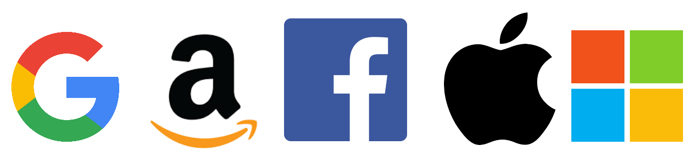

# **PRIVACYSEC**

### *No tengo nada que ocultar, pero tampoco tengo nada que mostrar.*

Espejo: [framagit.org/retiolus/privacysec](https://framagit.org/retiolus/privacysec)

*Basado en los datos de:*
- *[github.com/tycrek/degoogle](https://github.com/tycrek/degoogle)*
- *[github.com/pluja/awesome-privacy](https://github.com/pluja/awesome-privacy)*
- *[github.com/Lissy93/personal-security-checklist](https://github.com/Lissy93/personal-security-checklist)*
- *[github.com/humanetech-community/awesome-humane-tech](https://github.com/humanetech-community/awesome-humane-tech)*
- *[github.com/yretenai/fuck-adobe](https://github.com/yretenai/fuck-adobe)*
- *[nogafam.es/#servicios](https://nogafam.es/#servicios)*

# Índice

1. [Extensiones del navegador](#browser-extensions)
2. **[Reemplazos/alternativas](#replacementsalternatives)**
    1. [Adobe](#adobe)
    2. [Android](#androidfushsia)
    3. [Facebook](#facebook)
    4. [Google](#google)
    5. [Instagram](#instagram)
    6. [Microsoft](#microsoft)
    7. [Reddit](#reddit)
    8. [Twitter](#twitter)
    9. [WhatsApp](#whatsapp)
3. [Enlaces, herramientas y consejos útiles](#useful-links-tools-and-advice)
    1. [Recursos](#resources)
    2. [Libros](#books)
    3. [Entradas de blog](#blog-posts)
    4. [Artículos de noticias](#news-articles)

# Extensiones del navegador

| Nombre                                                                                                                                                                                                                     | Descripción                                                                                                                                                                                                                                                                                                                                                                                                                                                                                                                                                                                                                                                                                                                                                                                                                                 |
| -------------------------------------------------------------------------------------------------------------------------------------------------------------------------------------------------------------------------- | ------------------------------------------------------------------------------------------------------------------------------------------------------------------------------------------------------------------------------------------------------------------------------------------------------------------------------------------------------------------------------------------------------------------------------------------------------------------------------------------------------------------------------------------------------------------------------------------------------------------------------------------------------------------------------------------------------------------------------------------------------------------------------------------------------------------------------------------- |
| [uBlock Origin](https://addons.mozilla.org/en-US/firefox/addon/ublock-origin)                                                   | uBlock Origin no es un "bloqueador de anuncios", es un bloqueador de contenido de amplio espectro con eficiencia de CPU y memoria como característica principal.                                                                                                                                                                                                                                                                                                                                                                                                                                                                                                                                                                                                                                                                            |
| [Privacy Badger](https://addons.mozilla.org/en-US/firefox/addon/privacy-badger17)                                              | Privacy Badger aprende automáticamente a bloquear los rastreadores invisibles. En lugar de guardar las listas de lo que tiene que bloquear, Privacy Badger aprende observando cuales de los dominios parecen rastrearte mientras navegas por la Web.                                                                                                                                                                                                                                                                                                                                                                                                                                                                                                                                                                                        |
| [HTTPS Everywhere](https://addons.mozilla.org/en-US/firefox/addon/https-everywhere)                                            | Muchos sitios web ofrecen un soporte limitado para el cifrado sobre HTTPS, pero dificultan su uso. Por ejemplo, pueden usar HTML sin cifrar, o llenar páginas cifradas con enlaces que regresan al sitio sin cifrar. La extensión HTTPS Everywhere arregla estos problemas reescribiendo todas las peticiones a estos sitios a HTTPS.                                                                                                                                                                                                                                                                                                                                                                                                                                                                                                       |
| [Cookie AutoDelete](https://addons.mozilla.org/en-US/firefox/addon/cookie-autodelete)                                       | Controla tus cookies! Esta WebExtension está inspirada en Self Destructing Cookies. Cuando se cierra una pestaña, todas las cookies que no han sido utilizadas se eliminan automáticamente. Poner en la lista blanca en la que confías mientras eliminas el resto.  Soporte para contenedores de pestañas.                                                                                                                                                                                                                                                                                                                                                                                                                                                                                                                                  |
| [DDG Privacy Essentials](https://addons.mozilla.org/en-US/firefox/addon/duckduckgo-for-firefox)                          | Privacidad, simplificada. Nuestro modulo complementario proporciona los elementos esenciales de privacidad que necesitas para tomar el control de tu información personal sin importar dónde te lleva Internet: bloqueo de rastreadores, cifrado más inteligente, búsqueda privada en DuckDuckGo y mucho más.                                                                                                                                                                                                                                                                                                                                                                                                                                                                                                                               |
| [I don't care about cookies](https://addons.mozilla.org/en-US/firefox/addon/i-dont-care-about-cookies)              | ¡Este modulo complementario eliminará las advertencias de cookies de casi todos los sitios web! Puedes informar de cualquier sitio web que siga advirtiendote de las cookies: haz un clic con el botón derecho y elije la opción en el menú "Informar de una advertencia de cookie".                                                                                                                                                                                                                                                                                                                                                                                                                                                                                                                                                        |
| [minerBlock](https://addons.mozilla.org/en-US/firefox/addon/minerblock-origin)                                                | MinerBlock es una extención de navegador eficiente que se focaliza en bloquear a los mineros de criptomonedas por toda la web, basados en el navegador. Esta extención utiliza dos métodos diferentes para bloquear a los mineros. La primera está basada en bloquear peticiones/guiones cargados desde una lista negra, este es el enfoque tradicional adoptado por la mayoría de bloquadores de anuncios y otros bloquadores de minage. El otro enfoque que hace que MinerBlock sea mas eficiente contra el criptojeo, es detectando el comportamiento potencial de la minería dentro de guiones cargados matándolos inmediatamente. Esto hace que la extención sea capaz de bloquear scripts en línea así como mineros que se ejecutan a través de proxies. Cógido fuente disponible en [GitHub](https://github.com/xd4rker/MinerBlock). |
| [ClearURLS](https://addons.mozilla.org/en-US/firefox/addon/clearurls)                                                                 | Esta extención eliminará automaticamente los elementos de rastreo de las URLs para ayudar a proteger tu privacidad cuando navegues por Internet.                                                                                                                                                                                                                                                                                                                                                                                                                                                                                                                                                                                                                                                                                            |
| [Cloud Firewall](https://addons.mozilla.org/en-US/firefox/addon/cloud-firewall)                                                  | Bloquea las conexiones a páginas y recursos web alojados en los principales servicios en la nube si el usuario desea hacerlo. Apoya el bloqueo de Google, Amazon, Facebook, Apple, Microsoft y Cloudflare.                                                                                                                                                                                                                                                                                                                                                                                                                                                                                                                                                                                                                                  |
| [CSS Exfil Protection](https://addons.mozilla.org/en-US/firefox/addon/css-exfil-protection)                                | CSS Exfil es un método que los atacantes pueden usar para robar datos de páginas web usando Cascading Style Sheets (CSS). Este plugin limia y bloquea cualquier regla CSS que pueda ser diseñada para robar datos.                                                                                                                                                                                                                                                                                                                                                                                                                                                                                                                                                                                                                          |
| [Disconnect](https://addons.mozilla.org/en-US/firefox/addon/disconnect)                                                                 | Visualiza y bloquea los sitios web por lo demás invisibles que rastrean tu historial de búsqueda y navegación.                                                                                                                                                                                                                                                                                                                                                                                                                                                                                                                                                                                                                                                                                                                              |
| [Don't touch my tabs! (rel=noopener](https://addons.mozilla.org/en-US/firefox/addon/dont-touch-my-tabs)                      | Evita que las pestañas abiertas por un hiperlink secuencien la pestaña anterior añadiendo el atributo rel=noopener a todos los hiperenlaces (excluyendo los hiperlinks del mismo dominio).                                                                                                                                                                                                                                                                                                                                                                                                                                                                                                                                                                                                                                                  |
| [Firefox Multi-Account Containers](https://addons.mozilla.org/en-US/firefox/addon/multi-account-containers)            | Firefox Multi-Account Containers te permite mantener separadas partes de tu vida en línea en pestañas codificadas por colores que preservan tu privacidad. Las cookies se separan por contenedor, lo que le permite utilizar la web con múltiples identidades o cuentas simultáneamente.                                                                                                                                                                                                                                                                                                                                                                                                                                                                                                                                                    |
| [Google search link fix (also Yandex)](https://addons.mozilla.org/en-US/firefox/addon/google-search-link-fix)            | Esta extensión evita que las páginas de búsqueda de Google y Yandex modifiquen los enlaces de resultados de búsqueda al hacer clic en ellas. Esto es útil cuando se copian enlaces, pero también ayuda a la privacidad al impedir que los motores de búsqueda graben sus clics.                                                                                                                                                                                                                                                                                                                                                                                                                                                                                                                                                             |
| [HTTPZ](https://addons.mozilla.org/en-US/firefox/addon/httpz)                                                                             | HTTPZ está pensado para ser discreto y ligero, respeta tu privacidad y no contiene grasas de tránsito. Además, es muy configurable, y debería ser un poco más seguro que algunas de las alternativas ahí fuera, ya que tiene un par de defensas integradas contra ataques de desguace de SSL.                                                                                                                                                                                                                                                                                                                                                                                                                                                                                                                                               |
| [Link Cleaner](https://addons.mozilla.org/en-US/firefox/addon/link-cleaner)                                                        | Limpia las URLs que están a punto de ser visitadas: elimina los parámetros utm_*; en las páginas de artículos de aliexpress y amazon, elimina los parámetros de seguimiento; omite las páginas de redirección de facebook, steam y reddit                                                                                                                                                                                                                                                                                                                                                                                                                                                                                                                                                                                                   |
| [Privacy-Oriented Origin Policy](https://addons.mozilla.org/en-US/firefox/addon/privacy-oriented-origin-policy)  | Evita que Firefox envíe cabeceras Origin cuando sean menos propensas a ser necesarias, para proteger tu privacidad.                                                                                                                                                                                                                                                                                                                                                                                                                                                                                                                                                                                                                                                                                                                         |
| [Skip Redirect](https://addons.mozilla.org/en-US/firefox/addon/skip-redirect)                                                     | Algunas páginas web usan páginas intermediarias antes de redirigir a una página final. Este complemento trata de extraer la url final de la url intermedia y va allí enseguida si tiene éxito.                                                                                                                                                                                                                                                                                                                                                                                                                                                                                                                                                                                                                                              |
| [Temporary Containers](https://addons.mozilla.org/en-US/firefox/addon/temporary-containers)                                | Abrir pestañas, sitios web y enlaces en contenedores desechables gestionados automáticamente. Los contenedores aislan el almacenamiento de datos de sitios web (cookies, almacenamiento y más) unos de otros, mejorando su privacidad y seguridad mientras navega.                                                                                                                                                                                                                                                                                                                                                                                                                                                                                                                                                                          |
| [TrackMeNot](https://addons.mozilla.org/en-US/firefox/addon/trackmenot)                                                              | Un complemento del navegador Artware para proteger la privacidad en la búsqueda web. Al emitir consultas aleatorias a motores de búsqueda comunes, TrackMeNot ofusca su perfil de búsqueda y registra su descontento con el seguimiento subrepticio.                                                                                                                                                                                                                                                                                                                                                                                                                                                                                                                                                                                        |
| [Redirect AMP to HTML](https://addons.mozilla.org/en-US/firefox/addon/amp2html)                                                        | Esta extensión web permite a los usuarios optar por no usar las páginas móviles aceleradas (AMP) y elegir utilizar la web estándar en su lugar.                                                                                                                                                                                                                                                                                                                                                                                                                                                                                                                                                                                                                                                                                             |
| [user.js](https://github.com/arkenfox/user.js)                                                                                                                                                                             | Esto no es una extensión, sino un archivo de configuración de Firefox `user.js`. Este archivo es una plantilla cuyo objetivo es proporcionar tanta privacidad y seguridad mejorada como sea posible, y reducir el rastreo y las huellas dactilares tanto como sea posible - mientras se minimiza cualquier pérdida de funcionalidad y rotura (pero sucederá).                                                                                                                                                                                                                                                                                                                                                                                                                                                                               |

# Reemplazos/alternativas

| [Ojos](https://www.privacytools.io/providers/#ukusa) | Países                                                       |
|:----------------------------------------------------:| ------------------------------------------------------------ |
|                          5                           | Australia, Canadá, Nueva Zeland, Reino Unido, Estados Unidos |
|                          9                           | Dinamarca, Francia, Países Bajos, Noruega                    |
|                          14                          | Alemania, Bélgica, Italia, Suecia, España                    |

## Adobe

- ### Adobe
    - [After Effects](#adobe-after-effects)
    - [Audition](#adobe-audition)
    - [Dreamweaver](#adobe-dreamweaver)
    - [Illustrator](#adobe-illustrator)
    - [Photoshop](#adobe-photoshop)
    - [Premiere Pro](#adobe-premiere-pro)

## Adobe After Effects

| Nombre                              | Ojos | Descripción                                                                                                                                                                                                                                                                                                                                                                                                                                                                                                                                                                                                                   |
| ----------------------------------- | ---- | ----------------------------------------------------------------------------------------------------------------------------------------------------------------------------------------------------------------------------------------------------------------------------------------------------------------------------------------------------------------------------------------------------------------------------------------------------------------------------------------------------------------------------------------------------------------------------------------------------------------------------- |
| [Blender](https://www.blender.org/) |      |     Blender es el juego de creación 3D gratuito y [de código abierto](https://developer.blender.org/diffusion/). Soporta la totalidad de la tubería 3D: modelado, manipulación, animación, simulación, renderización, seguimiento de composición y movimiento, edición de vídeo y tuberías de animación 2D. |

## Adobe Audition

| Nombre                                   | Ojos | Descripción                                                                                                                                                                                                                                                                                                                                                                                                                                                                                                                                                |
| ---------------------------------------- | ---- | ---------------------------------------------------------------------------------------------------------------------------------------------------------------------------------------------------------------------------------------------------------------------------------------------------------------------------------------------------------------------------------------------------------------------------------------------------------------------------------------------------------------------------------------------------------- |
| [Audacity](https://www.audacityteam.org) |      |     Audacity es un editor y grabador de audio multipista fácil de usar para Windows, macOS, GNU/Linux y otros sistemas operativos. Desarrollado por un grupo de voluntarios como [código abierto](https://github.com/audacity/audacity). |

## Adobe Dreamweaver

- *Vea [Microsoft Visual Studio](#microsoft-visual-studio)*
## Adobe Illustrator

| Nombre                            | Ojos | Descripción                                                                                                                                                                                                                                                                                                                                                                                                                                                                                                          |
| --------------------------------- | ---- | -------------------------------------------------------------------------------------------------------------------------------------------------------------------------------------------------------------------------------------------------------------------------------------------------------------------------------------------------------------------------------------------------------------------------------------------------------------------------------------------------------------------- |
| [Inkscape](https://inkscape.org/) |      |     Editor vectorial gratuito y [de código abierto](https://gitlab.com/inkscape/inkscape) utilizado para crear imágenes vectoriales, principalmente en formato de gráficos vectoriales escalables. |

## Adobe Photoshop

#### Android

| Nombre                                                                                                                                                                                                                                         | Ojos | Descripción                                                                                                                                                                                                                                                                                                                      |
| ---------------------------------------------------------------------------------------------------------------------------------------------------------------------------------------------------------------------------------------------- | ---- | -------------------------------------------------------------------------------------------------------------------------------------------------------------------------------------------------------------------------------------------------------------------------------------------------------------------------------- |
| [Pocket Paint](https://f-droid.org/packages/org.catrobat.paintroid/)                           |      | Paintroid (o Pocket Paint) es un editor gráfico de pinturas de [código abierto](https://github.com/Catrobat/Paintroid), que, entre otros, permite ajustar partes de imágenes a transparentes, insertar texto / imágenes, añadir capas, usar herramientas de relleno y selección de colores, rotar, redimensionar y posicionar... |
| [Scrambled Exif](https://gitlab.com/juanitobananas/scrambled-exif) |      | Elimina los datos de Exfir de las imágenes antes de compartirlas.                                                                                                                                                                                                                                                                |
| [Imagepipe](https://codeberg.org/Starfish/Imagepipe)                             |      | Reduce el tamaño de la imagen y elimina las etiquetas Exfir al compartir imágenes en dispositivos android.                                                                                                                                                                                                                       |

#### Escritorio

| Nombre                         | Ojos | Descripción                                                                                                                                                                                                                                                                                                                                                                                                                                                                                                                                                  |
| ------------------------------ | ---- | ------------------------------------------------------------------------------------------------------------------------------------------------------------------------------------------------------------------------------------------------------------------------------------------------------------------------------------------------------------------------------------------------------------------------------------------------------------------------------------------------------------------------------------------------------------ |
| [GIMP](https://www.gimp.org/)  |      |      GIMP es un editor de imágenes multiplataforma disponible para GNU/Linux, OS X, Windows y más sistemas operativos. Es software libre, puedes cambiar su [código fuente](https://gitlab.gnome.org/GNOME/gimp) y distribuir tus cambios. |
| [Krita](https://krita.org/en/) |      |     Editor de gráficos raster gratuito y [de código abierto](https://invent.kde.org/graphics/krita) diseñado principalmente para pintura digital y animación 2D                                                                            |

## Adobe Premiere Pro

| Nombre                                       | Ojos | Descripción                                                                                                                                                                                                                                                                                                                                                                                                                                                                                                                                                                                                                                          |
| -------------------------------------------- | ---- | ---------------------------------------------------------------------------------------------------------------------------------------------------------------------------------------------------------------------------------------------------------------------------------------------------------------------------------------------------------------------------------------------------------------------------------------------------------------------------------------------------------------------------------------------------------------------------------------------------------------------------------------------------- |
| [Kdenlive](https://kdenlive.org/en/toolbox/) |      |     Intuitivo y potente editor de vídeo de [código abierto](https://invent.kde.org/multimedia/kdenlive) compatible con las últimas tecnologías de vídeo. La mayor parte del procesamiento de vídeo lo realiza MLT Framework, que se basa en muchos otros proyectos de código abierto como FFmpeg, frei0r, movit, ladspa, sox, etc. |
| [Shotcut](https://www.shotcut.org/)          |      |     Shotcut es un editor de vídeo gratuito, de [código abierto](https://github.com/mltframework/shotcut), multiplataforma y no lineal.                                                                                                                                                                                             |

## Android/Fushsia

| Nombre                                    | Ojos       | Descripción                                                                                                                                                                                                                        |
| ----------------------------------------- | ---------- | ---------------------------------------------------------------------------------------------------------------------------------------------------------------------------------------------------------------------------------- |
| [Ubuntu Touch](https://ubuntu-touch.io/)  |            | Ubuntu, pero para teléfonos.                                                                                                                                                                                                       |
| [LineageOS](https://www.lineageos.org/)   | **5 ojos** | [Código abierto](https://github.com/lineageos) y basado en Android, pero sin la basura.                                                                                                                                            |
| [SailfishOS](https://sailfishos.org/)     |            | Sistema operativo móvil centrado en la privacidad por Jolla con una capa de compatibilidad de interfaz de usuario y Android propietaria sobre una base [de código abierto](http://releases.sailfishos.org/sources/) Mer GNU/Linux. |
| [GrapheneOS](https://grapheneos.org/)     |            | [Sistema operativo de código abierto](https://github.com/GrapheneOS) basado en Android con énfasis en la seguridad y la privacidad. Características avanzadas de endurecimiento y protección de la privacidad en todo el sistema.  |
| [postmarketOS](https://postmarketos.org/) |            | Linux OS de [código abierto](https://gitlab.com/postmarketOS) para móvil. Puede instalar diferentes interfaces de usuario como [Plasma Mobile](https://www.plasma-mobile.org/). Gracias @okias                                     |
| [Replicant](https://replicant.us/)        | **5 ojos** | Free Android distribution. Puts the emphasis on "freedom and privacy/security".                                                                                                                                                    |
| [CalyxOS](https://calyxos.org/)           |            | [Open-source](https://gitlab.com/CalyxOS) Android-based OS with an emphasis on security and privacy. Provides good combination of privacy and security together with usability. Optional support for MicroG.                       |
| [Mobian](https://mobian-project.org)      |            | Debian for mobile.                                                                                                                                                                                                                 |

- *You'll either need a rooted device with an unlocked bootloader, or a specific device depending on which OS you like.*
- *Please see Issue #55 for details on /e/.*

## Android home screen launchers

| Nombre                                                                                                                                                                                             | Ojos | Descripción                                                                                                                                                                                                                                           |
| -------------------------------------------------------------------------------------------------------------------------------------------------------------------------------------------------- | ---- | ----------------------------------------------------------------------------------------------------------------------------------------------------------------------------------------------------------------------------------------------------- |
| [Shade Launcher](https://github.com/amirzaidi/Shade)                                                                                                                                               |      | [Open-source](https://github.com/amirzaidi/Shade) Android launcher styled after the Google Pixel launcher. Available to download from an [alternative F-Droid](https://apt.izzysoft.de/fdroid/index/apk/amirz.shade), APK Mirror, or GitHub Releases. |
| [Omega](https://github.com/otakuhqz/omega)                                                                                                                                                         |      | [Open-source](https://github.com/otakuhqz/omega) launcher. Active development with lots of nice features. Downloads available from GitHub. Previously known as ZimLX which has since been replaced by Omega.                                          |
| [Lawnchair](https://lawnchair.app/)  |      | Another [open-source](https://github.com/LawnchairLauncher/Lawnchair) launcher, also built to look similar to Google's launcher (it is built off AOSP Launcher3). Available from F-Droid and also APKMirror. (thanks u/droidonomy)                    |
| [KISS Launcher](https://kisslauncher.com/)                         |      | Fast, [open-source](https://github.com/Neamar/KISS) and small launcher. KISS mainly relies on an app-search-bar, which makes it very easy to open up apps quickly. Thanks @Glitchy-Tozier                                                             |

## Android Messages(specifically SMS/MMS, not IM)

| Nombre                                                                                                                                                                               | Ojos | Descripción                                                                                                                                                                                                                                                                                                                                                                                        |
| ------------------------------------------------------------------------------------------------------------------------------------------------------------------------------------ | ---- | -------------------------------------------------------------------------------------------------------------------------------------------------------------------------------------------------------------------------------------------------------------------------------------------------------------------------------------------------------------------------------------------------- |
| [QKSMS](https://github.com/moezbhatti/qksms)         |      | [Open-source](https://github.com/moezbhatti/qksms). Very clean and feature rich SMS app. Disponible en F-Droid.                                                                                                                                                                                                                                                                                    |
| [Silence.im](https://silence.im/)  |      | [Open-source](https://silence.im/contribute/) and utilizes Signal's encryption protocol. Seamlessly works with SMS. End-to-end encryption with other Silence users. Available on F-Droid.                                                                                                                                                                                                          |
| [Signal](https://signal.org/)                                                                                                                                                        |      | Signal posee capacidades SMS/MMS en Android. Using it as your default SMS app has the advantage of having your SMS and your online-messaging-service integrated within one app. Doing so will also show stats within the app of how many messages you send are encrypted, and offers to send invites to your contacts. Thanks @Glitchy-Tozier for suggesting it be listing as SMS/MMS alternative. |

## Android Studio (not specifically for Android development, just in general)

| Nombre                                       | Ojos | Descripción                                                                                                                                                                                                                                                                                                                                                                       |
| -------------------------------------------- | ---- | --------------------------------------------------------------------------------------------------------------------------------------------------------------------------------------------------------------------------------------------------------------------------------------------------------------------------------------------------------------------------------- |
| [VSCodium](https://vscodium.com/)            |      | VSCodium is Visual Studio Code but without all the Microsoft telemetry and branding.                                                                                                                                                                                                                                                                                              |
| [Vim](https://www.vim.org/)                  |      | [Open-source](https://github.com/vim/vim) text editor. Thanks @moon-chilled                                                                                                                                                                                                                                                                                                       |
| [Emacs](https://www.gnu.org/software/emacs/) |      | Another [open-source](https://github.com/emacs-mirror/emacs) text editor. Thanks @moon-chilled                                                                                                                                                                                                                                                                                    |
| [Atom](https://atom.io/)                     |      | Atom is a free and [open-source](https://github.com/atom/atom) text and source code editor for macOS, Linux, and Microsoft Windows with support for plug-ins written in Node.js, and embedded Git Control, developed by GitHub. Atom is a desktop application built using web technologies. (From [Wikipedia](https://en.wikipedia.org/wiki/Atom_(text_editor))) Thanks @woutfeys |

## Android TV

| Nombre                   | Ojos | Descripción                                                                                                                                                                  |
| ------------------------ | ---- | ---------------------------------------------------------------------------------------------------------------------------------------------------------------------------- |
| [Kodi](https://kodi.tv/) |      | It's incredibly powerful and backed by one of the strongest communities around. Tons of plugins to do nearly anything you want. Software installs on nearly any platform.    |
| [OSMC](https://osmc.tv/) |      | Free, [open-source](https://github.com/osmc/osmc) media center OS. Kodi is pre-installed. Thanks to @g4rret and @lgiard for clarifying the difference between Kodi and OSMC! |

## Blogger/Sites

| Nombre                                          | Ojos       | Descripción                                                                                                                                                                                                                                                                  |
| ----------------------------------------------- | ---------- | ---------------------------------------------------------------------------------------------------------------------------------------------------------------------------------------------------------------------------------------------------------------------------- |
| [Joomla](https://www.joomla.org/)               |            | Self-hosted and [open-source](https://github.com/joomla) content management system (CMS).                                                                                                                                                                                    |
| [Write.as](https://write.as/)                   |            | Self-advertised as privacy-focused.                                                                                                                                                                                                                                          |
| [WordPress self-hosted](https://wordpress.org/) |            | The [open-source](https://code.trac.wordpress.org/browser/wordpress-sources) version of WordPress. Una herramienta muy popular y un nombre reconocido.                                                                                                                       |
| [concrete5](https://www.concrete5.org/)         | **5 ojos** | [Open-source](https://github.com/concrete5) CMS.                                                                                                                                                                                                                             |
| [Noblogs](https://noblogs.org/)                 | **9 ojos** | A privacy/security focused blogging platform.                                                                                                                                                                                                                                |
| [Ghost](https://ghost.org/)                     |            | [Open-source](https://github.com/TryGhost/Ghost) modern CMS. Boasts "over 19x faster than WordPress". Thanks @peterge1998                                                                                                                                                    |
| [Bear](https://bearblog.dev/)                   | **5 ojos** | Free, no-nonsense, super-fast blogging. No javascript, no stylesheets, no trackers. Just your words.                                                                                                                                                                         |
| [Simpleblogs](https://simpleblogs.org/)         |            | FLOSS blogging platform with a focus on privacy. Easy to self-host (standard rails app, ships with AWS deployment scripts. AWS is not required). Access restricted to accounts which you create and hand out. Good for private blogs but not for commercial/public blogging. |
| [Plume](https://joinplu.me/)                    |            | Plume is not just a single website, but an entire interconnected, yet independent network of what we call instances. You write content from your own instance, but anyone else on any other Plume instance can enjoy your stories too.                                       |
| [WriteFreely](https://writefreely.org/)         |            | An [open source](https://github.com/writeas/writefreely) platform for building a writing space on the web.                                                                                                                                                                   |

## Calculator

| Nombre                                                                                                                                                                                                                                           | Ojos | Descripción                                                                                                                                                                                                                                                                                                                                                                                                                                                      |
| ------------------------------------------------------------------------------------------------------------------------------------------------------------------------------------------------------------------------------------------------ | ---- | ---------------------------------------------------------------------------------------------------------------------------------------------------------------------------------------------------------------------------------------------------------------------------------------------------------------------------------------------------------------------------------------------------------------------------------------------------------------- |
| [Simple Calculator](https://github.com/SimpleMobileTools/Simple-Calculator)  |      | Also part of the SMT project. Available on F-Droid.                                                                                                                                                                                                                                                                                                                                                                                                              |
| [Calculator N+ or NCalc+](https://github.com/tranleduy2000/ncalc)                                                                                                                                                                                |      | [Open-source](https://github.com/tranleduy2000/ncalc) feature-rich calculator. App itself is no longer in development, but the developer does [encourage pull requests](https://github.com/tranleduy2000/ncalc#calculator-n---powerful-calculator-for-android). I've used it frequently and it works great. Not on F-Droid, but a 3rd party play store can probably find it; or the APK's are available as releases on GitHub. You can also compile from source. |
| [Calculator++](https://github.com/Bubu/android-calculatorpp)                   |      | [Open-source](https://github.com/Bubu/android-calculatorpp) calculator packed with features. Thanks @ghost                                                                                                                                                                                                                                                                                                                                                       |

## Chromebook

| Nombre                                              | Ojos        | Descripción                                                                                                                                                                                        |
| --------------------------------------------------- | ----------- | -------------------------------------------------------------------------------------------------------------------------------------------------------------------------------------------------- |
| [TUXEDO](https://www.tuxedocomputers.com/)          | **14 ojos** | Privacy-focused laptop maker out of Germany. Tech specs are very competent and can easily compete with other modern systems. Fully Linux compatible. They also offer desktops. (thanks u/itsec_ho) |
| [Purism Laptops](https://puri.sm/)                  | **5 ojos**  | Privacy-focused laptop running PureOS. Good designs and decent hardware.                                                                                                                           |
| [Pinebook Pro](https://www.pine64.org/pinebook-pro) |             | Mid-range Linux/FreeBSD alternative to Chromebook.                                                                                                                                                 |

## Chromecast

| Nombre                                                                                                                                | Ojos       | Descripción                                                                                                                                                                                                               |
| ------------------------------------------------------------------------------------------------------------------------------------- | ---------- | ------------------------------------------------------------------------------------------------------------------------------------------------------------------------------------------------------------------------- |
| [Microsoft Wireless HDMI adapter](https://www.microsoft.com/accessories/en-us/products/adapters/wireless-display-adapter-2/p3q-00001) | **5 ojos** | The **only** reason I'm recommending this Microsoft product is because there is no possible way for it to extract any data and ship it off to Microsoft. If anyone is able to find proof that it *can*, I will remove it. |
| RaspberryCast(https://github.com/vincelwt/RaspberryCast)                                                                              |            | Transform your Raspberry Pi into a streaming device. Cast videos from mobile devices or computers to your TV.                                                                                                             |

## Chrome OS

| Nombre                                                      | Ojos       | Descripción                                                                                                                                                                                                                                                                                                                                                                                                                                                                                      |
| ----------------------------------------------------------- | ---------- | ------------------------------------------------------------------------------------------------------------------------------------------------------------------------------------------------------------------------------------------------------------------------------------------------------------------------------------------------------------------------------------------------------------------------------------------------------------------------------------------------ |
| [GalliumOS](https://galliumos.org/)                         |            | "A fast and lightweight Linux distro for ChromeOS devices". Based on Xubuntu.                                                                                                                                                                                                                                                                                                                                                                                                                    |
| [Qubes OS](https://www.qubes-os.org/)                       |            | "A reasonably secure operating system", at least according to their website. Edward Snowden recommends it.                                                                                                                                                                                                                                                                                                                                                                                       |
| [Subgraph OS](https://subgraph.com/index.en.html)           |            | A desktop computing and communications platform that is designed to be resistant to network-borne exploit and malware attacks.                                                                                                                                                                                                                                                                                                                                                                   |
| [Tails](https://tails.boum.org/)                            |            | For the uber-paranoid. Runs live and the entire OS is routed through Tor right from boot. Built on Debian.                                                                                                                                                                                                                                                                                                                                                                                       |
| [Knoppix](http://www.knopper.net/knoppix/index-en.html)     |            | Another Live OS, runs from CD/DVD/USB. Can also be installed if desired.                                                                                                                                                                                                                                                                                                                                                                                                                         |
| [Parrot OS](https://parrotsec.org/)                         |            | Debian-based and privacy focused. Fully sandboxed. (thanks u/Safe_Airport)                                                                                                                                                                                                                                                                                                                                                                                                                       |
| [PureOS](https://pureos.net/)                               | **5 ojos** | The OS of Purism Laptops (mentioned in the Hardware section). Very clean UI. *Editor note: I could not get this working on a UEFI Dell laptop. The group behind PureOS does not provide any UEFI support.*                                                                                                                                                                                                                                                                                       |
| [GhostBSD](https://ghostbsd.org/)                           |            | This is a secure [open-source](https://github.com/GhostBSD) OS based on FreeBSD, preconfigured to be a sane desktop environment for all users.                                                                                                                                                                                                                                                                                                                                                   |
| [Any other form of Linux](https://www.linuxfoundation.org/) |            | [Ubuntu](https://www.ubuntu.com/); [Debian](https://www.debian.org/); [Mint](https://linuxmint.com/); [Fedora](https://getfedora.org/); [Arch](https://www.archlinux.org/) or [Manjaro](https://manjaro.org/) (Manjaro is objectively much easier to get running than Arch); [Trisquel](https://trisquel.info/);  [Gentoo](https://www.gentoo.org/); [Alpine](https://www.alpinelinux.org/) (thanks u/privacyfreak555); [etc etc etc](https://en.wikipedia.org/wiki/List_of_Linux_distributions) |

## Clock

| Nombre                                                                                                                                                                                            | Ojos | Descripción                                                                                                                                                                                                                                                                          |
| ------------------------------------------------------------------------------------------------------------------------------------------------------------------------------------------------- | ---- | ------------------------------------------------------------------------------------------------------------------------------------------------------------------------------------------------------------------------------------------------------------------------------------ |
| [Clock +](https://github.com/philliphsu/ClockPlus)  |      | [Open-source](https://github.com/philliphsu/ClockPlus) Alarm clock, timer, and stop watch.                                                                                                                                                                                           |
| [Simple Alarm Clock](https://github.com/yuriykulikov/AlarmClock)                                                                                                                                  |      | Exactamente como su nombre dice; reloj de alarma simple y añade muchas mejoras sobre otras aplicaciones. No dock mode or world clock.                                                                                                                                                |
| [Insane Alarm!](https://github.com/RIAEvangelist/insane-alarm)                                                                                                                                    |      | Developer states that he had "spent a night out with the boys and drank a bit too much but needed to be up in the morning". So, he made the loudest alarm clock possible based off an emergency alarm from when he was in the military. This app doesn't mess around, use it wisely. |
| [Alarmio](https://f-droid.org/en/packages/me.jfenn.alarmio/)  |      | Simple alarm clock focused on design, readability, and Internet radio.                                                                                                                                                                                                               |

## Contacts

| Nombre                                                                                                                                                                                                                                                       | Ojos | Descripción                                                                                                                                           |
| ------------------------------------------------------------------------------------------------------------------------------------------------------------------------------------------------------------------------------------------------------------ | ---- | ----------------------------------------------------------------------------------------------------------------------------------------------------- |
| [Fruux (mobile app)](https://fruux.com/)                                                                                                                                                                                                                     |      | Fruux *also* provides a contacts app.                                                                                                                 |
| [Simple Contacts](https://github.com/SimpleMobileTools/Simple-Contacts)              |      | [Open-source](https://github.com/SimpleMobileTools/Simple-Contacts). Part of the [Simple Mobile Tools](https://github.com/SimpleMobileTools) project. |
| [Open Contacts](https://gitlab.com/sultanahamer/OpenContacts/-/blob/HEAD/README.md)  |      | [Open-source](https://gitlab.com/sultanahamer/OpenContacts/) contacts. (thanks u/consentio)                                                           |
| [EteSync](https://www.etesync.com)                                                                         |      | Secure, end-to-end encrypted, and [open-source](https://github.com/etesync) sync for your contacts, calendars and tasks.                              |

## Facebook

- ### Facebook
    - [Instagram](#istagram)
    - [Twitter](#twitter)
    - [WhatsApp](#whatsapp)

## FitBit

No known alternatives.

- *Due to Google's  [recent acquisition of FitBit](https://outline.com/tsJCYN), it is recommended to avoid using FitBit. Instead, check out this [list of smart watches](https://asteroidos.org/install/) supported by Asteroid OS (See Wear OS in [Operating systems](#operating-systems)). Thanks @ribtoks*

## Gboard (Google Keyboard)

| Nombre                                                                                                                                                                                                                              | Ojos | Descripción                                                                                                                                                                                                                                  |
| ----------------------------------------------------------------------------------------------------------------------------------------------------------------------------------------------------------------------------------- | ---- | -------------------------------------------------------------------------------------------------------------------------------------------------------------------------------------------------------------------------------------------- |
| [AnySoftKeyboard](https://anysoftkeyboard.github.io/)         |      | [Open-source](https://github.com/AnySoftKeyboard/AnySoftKeyboard) keyboard. Available on F-Droid.                                                                                                                                            |
| [Hacker's Keyboard](https://github.com/klausw/hackerskeyboard)  |      | Also [open-source](https://github.com/klausw/hackerskeyboard). Very useful for developers or sysadmins on the go.                                                                                                                            |
| [kboard](https://github.com/adgad/kboard)                                                       |      | [Open-source](https://github.com/adgad/kboard). Has features for phrases, "lenny faces", macros and more. **Note**: Project [appears to be abandoned](https://github.com/adgad/kboard/issues/16).                                            |
| [Simple Keyboard](https://github.com/rkkr/simple-keyboard)          |      | [Open-source](https://github.com/rkkr/simple-keyboard) keyboard.                                                                                                                                                                             |
| [Indic Keyboard](https://gitlab.com/indicproject/indic-keyboard)                                                                                                                                                                    |      | [Open-source](https://gitlab.com/indicproject/indic-keyboard) keyboard that supports many languages that other keyboards sometimes don't support. Not on F-Droid, but can be built from source or possibly through a Play Store alternative. |
| [OpenBoard](https://github.com/dslul/openboard)       |      | New 100% FOSS keyboard, based on AOSP. Similar to "Simple Keyboard". Thanks @Glitchy-Tozier                                                                                                                                                  |
| [FlorisBoard](https://apt.izzysoft.de/fdroid/index/apk/dev.patrickgold.florisboard)                                                                                                                                                 |      | FlorisBoard is an [open-source](https://github.com/florisboard/florisboard) keyboard aimed at providing you with an easy way to type while respecting your privacy.                                                                          |

## Gmail

#### Application

| Nombre                                                                                                                                                                         | Ojos | Descripción                                                                                                                                                                                                                                                                                                                                                          |
| ------------------------------------------------------------------------------------------------------------------------------------------------------------------------------ | ---- | -------------------------------------------------------------------------------------------------------------------------------------------------------------------------------------------------------------------------------------------------------------------------------------------------------------------------------------------------------------------- |
| [K-9 Mail](https://k9mail.github.io/)                |      | Available on F-Droid.                                                                                                                                                                                                                                                                                                                                                |
| [FairEmail](https://email.faircode.eu/)  |      | Available on F-Droid.                                                                                                                                                                                                                                                                                                                                                |
| [DeltaChat](https://delta.chat/)       |      | An email app with a chat-based UI and privacy support with autocrypt.                                                                                                                                                                                                                                                                                                |
| [Thunderbird](https://www.thunderbird.net)                                                                                                                                     |      |      A free customizable open source email client. |

#### Web-based

| Nombre                                                                                                                                     | Ojos        | Descripción                                                                                                                                                                                                                                                                                                                                                                                                                                                                               |
| ------------------------------------------------------------------------------------------------------------------------------------------ | ----------- | ----------------------------------------------------------------------------------------------------------------------------------------------------------------------------------------------------------------------------------------------------------------------------------------------------------------------------------------------------------------------------------------------------------------------------------------------------------------------------------------- |
| [Forward Email](https://forwardemail.net/)                                                                                                 |             | A free and [open-source](https://github.com/forwardemail) email forwarding service focused on a user's right to privacy.                                                                                                                                                                                                                                                                                                                                                                  |
| [Protonmail](https://protonmail.com/)                                                                                                      |             | One of the top privacy-focused email providers. Servers are in Switzerland in an underground guarded bunker that they claim can "survive a nuclear attack".                                                                                                                                                                                                                                                                                                                               |
| [Tutanota](https://tutanota.com/)                                                                                                          | **14 ojos** | [Open-source](https://github.com/tutao/tutanota) and one one of the top rated privacy-focused email providers. Located in Germany.                                                                                                                                                                                                                                                                                                                                                        |
| [Posteo](https://posteo.de/en)                                                                                                             | **14 ojos** | Completely anonymous mail provider located in Germany.                                                                                                                                                                                                                                                                                                                                                                                                                                    |
| [mailbox.org](https://mailbox.org/en/)                                                                                                     | **14 ojos** | Paid email provider, also located in Germany.                                                                                                                                                                                                                                                                                                                                                                                                                                             |
| [Disroot](https://disroot.org/)                                                                                                            | **9 ojos**  | Decentralized email service.                                                                                                                                                                                                                                                                                                                                                                                                                                                              |
| [StartMail](https://www.startmail.com/en/)                                                                                                 | **9 ojos**  | Operated by the same people who run StartPage.                                                                                                                                                                                                                                                                                                                                                                                                                                            |
| [SimpleLogin](https://simplelogin.io/)                                                                                                     |             | [Open-source](https://github.com/simple-login/), self-hosted, and privacy focused email forwarding service.                                                                                                                                                                                                                                                                                                                                                                               |
| [Migadu](https://www.migadu.com/en/index.html)                                                                                             |             | Paid email provider, located in Switzerland. Focus on privacy.                                                                                                                                                                                                                                                                                                                                                                                                                            |
| [Fastmail](https://fastmail.com/)                                                                                                          | **5 ojos**  | Paid email provider, located in Australia and US.                                                                                                                                                                                                                                                                                                                                                                                                                                         |
| [Runbox](https://runbox.com/why-runbox/privacy-protection/)                                                                                | **9 ojos**  | Privacy focusued email provider. Thanks @petertorelli                                                                                                                                                                                                                                                                                                                                                                                                                                     |
| [NextCloud](https://help.nextcloud.com/t/nextcloud-mail-server/157)                                                                        |             | Now also provides an email service (self-hosted). Thanks @je-vv                                                                                                                                                                                                                                                                                                                                                                                                                           |
| [Anonymize.com Email](https://anonymize.com/)                                                                                              |             | Paid secure email service provided by [Epik.com](http://Epik.com).                                                                                                                                                                                                                                                                                                                                                                                                                        |
| [Thexyz](https://www.thexyz.com/)                                                                                                          | **5 ojos**  | Thexyz is a Canadian company offering privacy-conscious business email. Premium webmail costs USD $2.95 per month.                                                                                                                                                                                                                                                                                                                                                                        |
| [Mailfence](https://www.mailfence.com)                                                                                                     | **14 ojos** | A secure and private email provider much like Protonmail and Tutanota. There are no google analytics nor hidden cookies. There are options to pay anonymously via cryptocurrency. It features a wide array of collaboration tools, such as groups, calendar, contacts, documents with editing space. Offers free, paid, and freemium plans. Can pay with cryptocurrency and has a [warrant canary](https://blog.mailfence.com/transparency-report-and-warrant-canary/). Thanks @resto1231 |
| [CTemplar](https://ctemplar.com/)                                                                                                          |             | Privacy-focused email provider located in Iceland.                                                                                                                                                                                                                                                                                                                                                                                                                                        |
| [Anonaddy](https://anonaddy.com/)                                                                                                          | **9 ojos**  | [Open-source](https://github.com/anonaddy/anonaddy) Anonymous forwarding email service. Forwarded email can be encrypted (OpenPGP) to prevent Google from reading it. Accepts cryptocurrencies (including Monero).                                                                                                                                                                                                                                                                        |
| [Mail-in-a-Box](https://mailinabox.email/)  |             | Mail-in-a-Box helps individuals take back control of their email by defining a one-click, easy-to-deploy SMTP+everything else server: a mail server in a box.                                                                                                                                                                                                                                                                                                                             |

## Google

- ### Google
    - [Blogger](#bloggersites)
    - [Chromebook](#chromebook)
    - [Chromecast](#chromecast)
    - [Chrome OS](#chrome-os)
    - [FitBit](#fitbit)
    - [Gboard](#gboard)
    - [Gmail](#gmail)
    - [Google Ads/AdMob/AdSense](#google-adsadmobadsense)
    - [Google Alerts](#google-alerts)
    - [Google Analytics](#google-analytics)
    - [Google Assistant](#google-assistant)
    - [Google Authenticator](#google-authenticator)
    - [Google Calendar](#google-calendar)
    - [Google Camera](#google-camera)
    - [Google Chrome](#google-chrome)
    - [Google Classroom](#google-classroom)
    - [Google Docs/Sheets/Slides](#google-docssheetsslides)
    - [Google Domains](#google-domains)
    - [Google Drive](#google-drive)
    - [Google Duo](#google-duo)
    - [Google Fonts](#google-fonts)
    - [Google Earth](#google-earth)
    - [Google Forms](#google-forms)
    - [Google Groups](#google-groups)
    - [Google Home](#google-home)
    - [Google Keep](#google-keep)
    - [Google Maps/Street View](#google-mapsstreet-view)
    - [Google News](#google-news)
    - [Google Photos](#google-photos)
    - [Google Pixel/Nexus](#google-pixelnexus)
    - [Google Play Music, Movies, & TV](#google-play-music-movies--tv)
    - [Google Play Services Framework](#google-play-services-framework)
    - [Google Play Store](#google-play-store)
    - [Google Search](#google-search)
    - [G suite (enterprise cloud)](#g-suite-enterprise-cloud)
    - [Google Translate](#google-translate)
    - [Google Transit](#google-transit)
    - [Wear Os](#wear-os)
    - [YouTube](#youtube)

## Google Ads/AdMob/AdSense

| Nombre                                   | Ojos | Descripción                                                                                                                                                              |
| ---------------------------------------- | ---- | ------------------------------------------------------------------------------------------------------------------------------------------------------------------------ |
| [EthicalAds](https://www.ethicalads.io/) |      | A developer-focused, privacy-obsessed ad network from the fine folks at Read the Docs. Source code can be [on GitHub](https://github.com/readthedocs/ethical-ad-server). |

## Google Alerts

| Nombre                      | Ojos       | Descripción                                                                               |
| --------------------------- | ---------- | ----------------------------------------------------------------------------------------- |
| [F5Bot](https://f5bot.com/) | **5 ojos** | Emails you when your selected keywords are mentioned on Reddit, Hacker News, or Lobsters. |

## Google Analytics

| Nombre                                             | Ojos          | Descripción                                                                                                                                                                                                                                                                                                                                                                                                                                                                                                                                                             |
| -------------------------------------------------- | ------------- | ----------------------------------------------------------------------------------------------------------------------------------------------------------------------------------------------------------------------------------------------------------------------------------------------------------------------------------------------------------------------------------------------------------------------------------------------------------------------------------------------------------------------------------------------------------------------- |
| [Matomo](https://matomo.org/)                      | **9/14 ojos** | (Matomo/parent company) - [Open-source](https://github.com/matomo-org/matomo) analytics platform. (thanks u/Newblik)                                                                                                                                                                                                                                                                                                                                                                                                                                                    |
| [Fathom](https://usefathom.com/)                   | **5 ojos**    | Simple analytics for bloggers & businesses                                                                                                                                                                                                                                                                                                                                                                                                                                                                                                                              |
| [Plausible](https://plausible.io/)                 | **5 ojos**    | [Open-source](https://github.com/plausible/analytics), privacy-focused web analytics.                                                                                                                                                                                                                                                                                                                                                                                                                                                                                   |
| [GoatCounter](https://www.goatcounter.com/)        | **14 ojos**   | Simple web statistics. No tracking of personal data. [Open-source](https://github.com/zgoat/goatcounter) and may be self-hosted. Free for non-commercial use; paid plans available.                                                                                                                                                                                                                                                                                                                                                                                     |
| [Simple Analytics](https://simpleanalytics.com/)   | **9 ojos**    | Great analytics with privacy and simplicity in mind. Paid plans only (with free trials).                                                                                                                                                                                                                                                                                                                                                                                                                                                                                |
| [Toasted Analytics](https://toastedanalytics.com/) | **5-eyes**    | Simple, privacy friendly analytics with event tracking. Paid only (with free trial)                                                                                                                                                                                                                                                                                                                                                                                                                                                                                     |
| [Shynet](https://github.com/milesmcc/shynet)       |               | Shynet is a self-hosted analytics tool that doesn't make use of cookies. It is privacy focused and fully [open-source](https://github.com/milesmcc/shynet). Thanks @woutfeys                                                                                                                                                                                                                                                                                                                                                                                            |
| [Supabase](https://supabase.io/)                   |               | Supabase is an opensource alternative to Firebase. As of right now you can use their hosting plan for free as it's in alpha, or you can self host ([note on self hosting](https://github.com/supabase/supabase/issues/85#issuecomment-636010946)). Thanks @woutfeys                                                                                                                                                                                                                                                                                                     |
| [GoAccess](https://goaccess.io/)                   |               | An [open-source](https://github.com/allinurl/goaccess) web server analysis tool. Installs on your web server (ideally), but works just as well if you download your logs someplace else. Interactive; cursor around in the report and see what's going on. Can generate HTML reports. Can also generate realtime interactive HTML reports if you run it in server mode. Lightweight, only requires UTF-8 support and ncurses (ncursesw, if you want a UTF-8 enabled console). Available in the default package repositories of multiple Linux distros. Thanks @virtadpt |
| [Offen](https://www.offen.dev/)                    |               | [Open-source](https://github.com/offen/offen) and self-hosted, Offen is a fair and lightweight web analytics alternative that treats operators and users as equal parties.                                                                                                                                                                                                                                                                                                                                                                                              |
| [Umami](https://umami.is/)                         |               | A simple, easy to use, [open-source](https://github.com/mikecao/umami)/self-hosted web analytics solution.                                                                                                                                                                                                                                                                                                                                                                                                                                                              |
| [Kindmetrics](https://kindmetrics.io)              | **5/14-eyes** | An [open-source](https://github.com/kindmetrics) analytics tool. Landing page and company is based in Sweden, CDN in EU, Servers on Digitalocean (USA) datacenter in Germany.                                                                                                                                                                                                                                                                                                                                                                                           |
| [userTrack](https://www.usertrack.net/)            |               | Self-hosted alternative to Google Analytics, similar to Matomo but cheaper for premium features. Includes user segments, heatmaps, session recordings and A/B testing.                                                                                                                                                                                                                                                                                                                                                                                                  |
| [Piwik PRO](https://piwik.pro/)                    | **5-eyes**    | An analytics suite with a focus on user privacy and data security.                                                                                                                                                                                                                                                                                                                                                                                                                                                                                                      |
| [Panelbear](https://panelbear.com/)                | **14-eyes**   | Privacy-focused analytics + web performance monitoring.                                                                                                                                                                                                                                                                                                                                                                                                                                                                                                                 |
| [Nullitics](https://nullitics.com/)                |               | Zero-effort open-source cheap analytics.                                                                                                                                                                                                                                                                                                                                                                                                                                                                                                                                |

## Google Assistant

| Nombre                                                          | Eyes | Descripción                                                                                                                                                                                                                                                                                                                       |
| --------------------------------------------------------------- | ---- | --------------------------------------------------------------------------------------------------------------------------------------------------------------------------------------------------------------------------------------------------------------------------------------------------------------------------------- |
| [Mycroft Android](https://github.com/MycroftAI/Mycroft-Android) |      | Android client for Mycroft. Must be built in IDE; no pre-built binaries are available.                                                                                                                                                                                                                                            |
| [Ara](https://github.com/FultonBrowne/Ara-android)              |      | [Open-source](https://github.com/FultonBrowne/Ara-android) virtual assistant for Android. Can replace Google Assistant (home button functionality) on most devices. Either uses the authors server by default, or you can [run your own server](https://github.com/FultonBrowne/Ara-Server). Thanks @FultonBrowne (author of Ara) |

## Google Authenticator

| Nombre                                                                                                                                                                                                                    | Eyes | Descripción                                                                                                |
| ------------------------------------------------------------------------------------------------------------------------------------------------------------------------------------------------------------------------- | ---- | ---------------------------------------------------------------------------------------------------------- |
| [andOTP](https://github.com/andOTP/andOTP)                      |      | [Open-source](https://github.com/andOTP/andOTP) 2FA app.                                                   |
| [FreeOTP+](https://github.com/helloworld1/FreeOTPPlus)  |      | FreeOTP is no longer in development so this fork should be used instead as it is currently in development. |
| [Aegis](https://getaegis.app/)                                      |      | [Open-source](https://github.com/beemdevelopment/Aegis) 2FA for Android. Available on F-Droid.             |
| [Authenticator](https://mattrubin.me/authenticator/)                                                                                                                                                                      |      | **iOS** - [Open-source](https://github.com/mattrubin/Authenticator) 2FA for iOS. (thanks u/SomeoneWannaBe) |
| [Tofu](https://tofuauth.com)                                                                                                                                                                                              |      | **iOS** - [Open-source](https://github.com/calleerlandsson/tofu) 2FA for iOS.                              |

## Google Calendar

#### Application

| Nombre                                                                                                                                                                                                                                           | Eyes | Descripción                                                                                                                                                                       |
| ------------------------------------------------------------------------------------------------------------------------------------------------------------------------------------------------------------------------------------------------ | ---- | --------------------------------------------------------------------------------------------------------------------------------------------------------------------------------- |
| [Lightning Calendar (Thunderbird)](https://www.thunderbird.net/en-US/calendar/)                                                                                                                                                                  |      | Developed by Mozilla Foundation and [open-source](https://www.thunderbird.net/en-US/get-involved/). Integrates into Thunderbird and SeaMonkey.                                    |
| [EteSync](https://www.etesync.com)                                                                                                                                                                                                               |      | Secure, end-to-end encrypted, and [open-source](https://github.com/etesync) sync for your contacts, calendars, tasks and notes.                                                   |
| [DAVx⁵](https://www.davx5.com/)                                                                        |      | DAVx⁵ is an [open-source](https://gitlab.com/bitfireAT/davx5-ose) CalDAV/CardDAV suite and sync app for Android.                                                                  |
| [ICSx⁵](https://icsx5.bitfire.at/)                                                                     |      | ICSx⁵ is an Android app to subscribe to remote (“Webcal”) or local iCalendar files (like time tables of your school/university or event files of your sports team). Thanks @je-vv |
| [Fruux (mobile app)](https://fruux.com/)                                                                                                                                                                                                         |      | Same service from above provides an Android app.                                                                                                                                  |
| [Etar](https://github.com/xsoh/Etar-Calendar)                                                                        |      | [Open-source](https://github.com/xsoh/Etar-Calendar) material design Calendar that integrates with the Android Calendar API. Can integrate with CalDAV/CardDAV servers.           |
| [Simple Calendar](https://github.com/SimpleMobileTools/Simple-Calendar)  |      | [Open-source](https://github.com/SimpleMobileTools/Simple-Calendar). Part of the [Simple Mobile Tools](https://github.com/SimpleMobileTools) project.                             |

#### Web-based

| Nombre                                              | Eyes        | Descripción                                                                                                                                                                                                                                                                                                      |
| --------------------------------------------------- | ----------- | ---------------------------------------------------------------------------------------------------------------------------------------------------------------------------------------------------------------------------------------------------------------------------------------------------------------- |
| [Tutanota Calendar](https://tutanota.com/calendar/) | **14-eyes** | Developed by Tutanota. Free cross-platform encrypted calendar. Allows importing of other Calendar files. Can't be synced to other calendar software.                                                                                                                                                             |
| [Fruux](https://fruux.com/)                         | **14-eyes** | [Open-source](https://fruux.com/opensource/) calendar using "sabre/dav" (FOSS WebDAV, CardDAV, and CalDAV). They mention privacy quite a bit on their site. Very large number of features, and supports nearly every device: Windows, iOS, Linux, Android, BlackBerry, SailFish, and also a webapp for browsers. |
| [Baïkal](https://sabre.io/baikal/)                  |             | a lightweight CalDAV+CardDAV server. It offers an extensive web interface with easy management of users, address books and calendars. It is fast and simple to install and only needs a basic php capable server. The data can be stored in a MySQL or a SQLite database. Thanks @mahdi1234                      |
| [Nextcloud](https://nextcloud.com/)                 |             | Nextcloud also offers a calendar solution using CalDAV and CardDAV. Thanks @mahdi1234 for pointing this out.                                                                                                                                                                                                     |
| [Radicale](https://radicale.org/)                   |             | Self-hosted calendar server written in Python. WebUI for desktop, CalDav/CardDav for mobile sync. Can use a reverse proxy with Nginx for HTTPS.                                                                                                                                                                  |
| [Mailfence Calendar](https://www.mailfence.com)     | **14-eyes** | Supports vCal/iCal import, export and can be accessed by using CalDAV. Users can share their calendars with group members and can also create polls.                                                                                                                                                             |

## Google Camera

| Nombre                                                                                                                                                                                                     | Eyes | Descripción                                                                                                |
| ---------------------------------------------------------------------------------------------------------------------------------------------------------------------------------------------------------- | ---- | ---------------------------------------------------------------------------------------------------------- |
| [Open Camera](https://opencamera.sourceforge.io/)  |      | [Open-source](https://sourceforge.net/p/opencamera/code/ci/master/tree/) camera for Android. Thanks @je-vv |

## Google Chrome

#### Android

| Nombre                                                                                                                                                                                                                              | Eyes | Descripción                                                                                                                                                                   |
| ----------------------------------------------------------------------------------------------------------------------------------------------------------------------------------------------------------------------------------- | ---- | ----------------------------------------------------------------------------------------------------------------------------------------------------------------------------- |
| [Fennec F-Droid](https://f-droid.org/en/packages/org.mozilla.fennec_fdroid/)  |      | A privacy-focused version of Firefox Android available on F-Droid. It's focused on removing any proprietary bits found in official Mozilla's builds. (thanks u/SupremeLisper) |
| [Bromite](https://www.bromite.org/)                                                                                                                                                                                                 |      | Privacy-focused/[open-source](https://github.com/bromite/bromite) build of Chromium with built-in ad blocking. (thanks u/SupremeLisper)                                       |

#### Desktop

| Nombre                                                                                                                                | Eyes       | Descripción                                                                                                                                                                                                                                                                                                                                                                                                                                                                                                                                                                                                         |
| ------------------------------------------------------------------------------------------------------------------------------------- | ---------- | ------------------------------------------------------------------------------------------------------------------------------------------------------------------------------------------------------------------------------------------------------------------------------------------------------------------------------------------------------------------------------------------------------------------------------------------------------------------------------------------------------------------------------------------------------------------------------------------------------------------- |
| [Ungoogled Chromium](https://github.com/Eloston/ungoogled-chromium)                                                                   |            | Chromium (which Chrome and countless other browsers are built on top of) is one of the cleanest and light-weight browsers available. This version cuts out all the Google crap.                                                                                                                                                                                                                                                                                                                                                                                                                                     |
| [Firefox](https://firefox.com/)                                                                                                       |            | Built by Mozilla, "The Privacy Company". Huge extension library; great for privacy.                                                                                                                                                                                                                                                                                                                                                                                                                                                                                                                                 |
| [Waterfox](https://www.waterfox.net/)                                                                                                 | **5-eyes** | Based on Firefox, but **64-bit only** with an emphasis on speed and privacy. Has a "classic" version built off older Firefox for legacy extension support and also an "alpha" version built off Quantum. It doesn't collect any telemetry and also removes Pocket from the alpha release. Project is run by [Alex Kontos](https://github.com/MrAlex94/) and is constantly in active development. Looks very clean and fast. Android versions are in the works too. **UPDATE:** @Nudin pointed out in Issue #85 that Waterfox is now [apart of System1](https://www.waterfox.net/blog/waterfox-has-joined-system1/). |
| [Tor Browser](https://www.torproject.org/download/)                                                                                   |            | Firefox-based browser routed through the [Tor network](https://en.wikipedia.org/wiki/Tor_%28anonymity_network%29). Automatically has a few privacy extensions installed (such as HTTPS Everywhere). [Read this article](https://write.privacytools.io/my-thoughts-on-security/slicing-onions-part-1-myth-busting-tor) for more info on how it works and the benefits of using Tor. Available for Windows, Linux, macOS, and Android.                                                                                                                                                                                |
| [IceCat](https://www.gnu.org/software/gnuzilla/)                                                                                      |            |  GNU IceCat is a fork of Firefox that is more private and secure than Firefox and it contains several privacy-protecting features. IceCat 60 makes no unsolicited connections when you run it. Previous versions had privacy problems, but version 60 doesn't have these problems. You can read about the previous version here: [IceCat 59 Review](https://spyware.neocities.org/articles/icecat59.html)                                                                                               |
| [Otter](https://otter-browser.org/)  |            |     Otter Browser aims to recreate the best aspects of the classic Opera (12.x) UI using Qt5. Controlled by the user, not vice versa                                                                                                                                                              |
| [Falkon](https://www.falkon.org/)                                                                                                     |            |     Falkon is a KDE web browser using QtWebEngine rendering engine, previously known as QupZilla. It aims to be a lightweight web browser available through all major platforms. This project has been originally started only for educational purposes. But from its start, Falkon has grown into a feature-rich browser.                                                                         |

## Google Classroom

| Nombre                                       | Eyes | Descripción                                                                                                                                                                   |
| -------------------------------------------- | ---- | ----------------------------------------------------------------------------------------------------------------------------------------------------------------------------- |
| [Moodle](https://moodle.org/)                |      | Self-hosted [open-source](https://github.com/moodle/moodle) Classroom software for schools. Very powerful. Thanks @jankapunkt                                                 |
| [ILIAS](https://www.ilias.de/en/)            |      | Another self-hosted [open-source](https://github.com/ILIAS-eLearning/ILIAS) classroom software. Thanks again to @jankapunkt                                                   |
| [Canvas](https://www.instructure.com/canvas) |      | Paid service by Instructure. Also available as a self-hosted, [open-source](https://github.com/instructure/canvas-lms) option. To ensure privacy, use the self-hosted option. |

## Google Docs/Sheets/Slides

#### Applications (cloud)

| Nombre                            | Eyes | Descripción                                                                                                                                                                                    |
| --------------------------------- | ---- | ---------------------------------------------------------------------------------------------------------------------------------------------------------------------------------------------- |
| [Etherpad](https://etherpad.org/) |      | Self-hosted collaborative editor. Does not use the browser. Not the greatest interface, but it's [open-source](https://github.com/ether) and you have full control over who can see your data. |

#### Applications (offline)

| Nombre                                      | Eyes | Descripción                                                                                                                                                                                                                                                                                                                                            |
| ------------------------------------------- | ---- | ------------------------------------------------------------------------------------------------------------------------------------------------------------------------------------------------------------------------------------------------------------------------------------------------------------------------------------------------------ |
| [LibreOffice](https://www.libreoffice.org/) |      | [Open-source](https://www.libreoffice.org/about-us/source-code/) offline document suites.                                                                                                                                                                                                                                                              |
| [LyX](https://www.lyx.org/)                 |      | It's an [open-source](https://www.lyx.org/Development) (and offline) document processor using TeX/LaTeX. It's different than Docs or Word but amazing, once you get used to it. Thanks @Glitchy-Tozier                                                                                                                                                 |
| [ONLYOFFICE](https://www.onlyoffice.com/)   |      | Offline version of ONLYOFFICE, an [open-source](https://github.com/ONLYOFFICE/) private cloud replacement for Google Docs'suite and Office 360. Also available as a self contained rich application. Thanks @PalmoliveDev                                                                                                                              |
| [Cryptee](https://crypt.ee/)                |      | Offline version of Cryptee for web. Runs as a progressive web app. Works most modern phone browsers (Chrome, Opera or Firefox on Android; Safari on iOS). Also works in desktop browsers that support PWA (the website lists that only Chrome works, but [others will work](https://github.com/tycrek/degoogle/issues/160#issuecomment-643066320) too. |
| [Calligra](https://calligra.org/)           |      | Calligra Suite is an office and graphic art suite by KDE. It is available for desktop PCs, tablet computers, and smartphones. It contains applications for word processing, spreadsheets, presentation, vector graphics, and editing databases. (Free and [Open-source](https://calligra.org/get-involved/) Software)                                  |

#### Web-based

| Nombre                                                                         | Eyes        | Descripción                                                                                                                                                                                                                                                                                  |
| ------------------------------------------------------------------------------ | ----------- | -------------------------------------------------------------------------------------------------------------------------------------------------------------------------------------------------------------------------------------------------------------------------------------------- |
| [CryptPad](https://cryptpad.fr/)                                               | **9-eyes**  | [Open-source](https://github.com/xwiki-labs/cryptpad) "zero knowledge" collaborative cloud editor. They offer Rich Text, Code, Presentation, Sheet (beta), Poll, Kanban, Whiteboard, and CryptDrive. 100% Client side encryption. Tons of useful features.                                   |
| [Cryptee](https://crypt.ee/)                                                   |             | [Open-source](https://github.com/cryptee) and privacy focused photo and document storage/editing. Based in Estonia, so your files are outside the reach of any 14-eyes country. They don't even require an email address to sign up.                                                         |
| [LibreOffice Online](https://www.libreoffice.org/download/libreoffice-online/) | **14-eyes** | Self-hosted instance of LibreOffice that you can run in your browser. Thanks @flubberding                                                                                                                                                                                                    |
| [ONLYOFFICE](https://www.onlyoffice.com)                                       |             | [Open-source](https://github.com/ONLYOFFICE/) private cloud replacement for Google Docs'suite and Office 360. Also available as a self contained rich application.                                                                                                                           |
| [Arcane Office](https://arcaneoffice.com/)                                     |             | A decentralized office suite with high-security and zero-knowledge on your data. With Arcane Office, you have maximum control on your personal stuff. Full-featured online document and spreadsheet editor. Secure storage to save your photos. All free for personal use. Thanks @taraletti |

## Google Domains

| Nombre                                          | Eyes        | Descripción                                                                                                                                                                                                                                                                                                                                                  |
| ----------------------------------------------- | ----------- | ------------------------------------------------------------------------------------------------------------------------------------------------------------------------------------------------------------------------------------------------------------------------------------------------------------------------------------------------------------ |
| [Njalla](https://njal.la/)                      | **14-eyes** | Privacy-focused domain registration. Competitive pricing and a large list of available domain extensions. They also offer VPS hosting. Built by people who built The Pirate Bay among others. (thanks u/brais33 and u/HumbleBasis6). Note: some users may have issues with them [legally owning your domain](https://news.ycombinator.com/item?id=14177597). |
| [Orangewebsite](https://www.orangewebsite.com/) |             | An Iceland-based freedom of speech web hosting provider. They never actually ask for your name, at least when you pay in Bitcoin.                                                                                                                                                                                                                            |

## Google Drive

#### Application

| Nombre                                      | Eyes       | Descripción                                                                                                                                                                                                                                                                                                                                                      |
| ------------------------------------------- | ---------- | ---------------------------------------------------------------------------------------------------------------------------------------------------------------------------------------------------------------------------------------------------------------------------------------------------------------------------------------------------------------- |
| [Syncthing](https://syncthing.net/)         | **9-eyes** | An [open-source](https://github.com/syncthing/) continuous file synchronization program. It synchronizes files between two or more computers in real time, safely protected from prying eyes. Your data is your data alone and you deserve to choose where it is stored, whether it is shared with some third party, and how it's transmitted over the internet. |
| [Seafile](https://www.seafile.com/en/home/) |            | [Open source](https://github.com/haiwen/seafile) file sync&share solution designed for high reliability, performance and productivity. Sync, share and collaborate across devices and teams. Build your team's knowledge base with Seafile's built-in Wiki feature.                                                                                              |

#### Web-based

| Nombre                                                                                   | Eyes        | Descripción                                                                                                                                                                                      |
| ---------------------------------------------------------------------------------------- | ----------- | ------------------------------------------------------------------------------------------------------------------------------------------------------------------------------------------------ |
| [ownCloud](https://owncloud.org/)                                                        |             | [Open-source](https://github.com/owncloud) and self-hosted. Provide your own storage.                                                                                                            |
| [Nextcloud](https://nextcloud.com/)                                                      |             | Also self-hosted. Spin-off of ownCloud. **Also offers Calendar and Contacts** (thanks @chribre)                                                                                                  |
| [Sia](https://sia.tech/)                                                                 |             | Fully decentralized cloud storage.                                                                                                                                                               |
| [Tresorit](https://tresorit.com/)                                                        |             | Primarily meant for businesses, but offers a free version for individuals as well. (thanks u/xNick26)                                                                                            |
| [Sync](https://www.sync.com)                                                             | **5-eyes**  | End-to-end encrypted Google Drive/Dropbox replacement.                                                                                                                                           |
| [JottaCloud](https://jottacloud.com/en/)                                                 | **9-eyes**  | Norway based cloud storage provider with free and paid plans. Gracias @mynamesleon                                                                                                               |
| [seafile](https://www.seafile.com)                                                       |             | [Open-source](https://github.com/haiwen/seafile) and self-hosted file sync&share solution.                                                                                                       |
| [Cozy Cloud](https://cozy.io/)                                                           | **9-eyes**  | French based cloud storage provider with free and paid plans. Can also be self-hosted and is [open-Source](https://github.com/cozy/cozy-stack). And it also offers a collaborative notes editor. |
| [Mailfence Documents](https://www.mailfence.com)                                         | **14-eyes** | Documents can be accessed using WebDAV or edited online. Users can drag and drop files in folders and categorize them with tags.                                                                 |
| [Filecloud Community Edition](https://www.getfilecloud.com/filecloud-community-edition/) |             | Powerful, secure Dropbox-like enterprise class file sharing and sync solution for home or business.                                                                                              |
| [Cryptomator](https://cryptomator.org/)                                                  |             | Cryptomator encrypts your data quickly and easily. Afterwards you upload them protected to your favorite cloud service.                                                                          |

## Google Duo

| Nombre                                                                                                                                                                        | Eyes       | Descripción                                                                                                                                                                                                                                                                                                                                                                                                                                                                                                                                                           |
| ----------------------------------------------------------------------------------------------------------------------------------------------------------------------------- | ---------- | --------------------------------------------------------------------------------------------------------------------------------------------------------------------------------------------------------------------------------------------------------------------------------------------------------------------------------------------------------------------------------------------------------------------------------------------------------------------------------------------------------------------------------------------------------------------- |
| [Jitsi Meet (F-Droid)](https://meet.jit.si/)  |            | Jitsi is an [open-source](https://github.com/jitsi) secure video conferencing platform. No se necesita ninguna cuenta para usarla, simplemente introduzca un nombre de sala para unirse o albergar una reunión. The host is able to kick rogue users from the call. Works directly in your browser, with apps available for iOS and Android. It is not necessary to self-host, but self-hosting is an option for those who wish to. Very low latency and easy to set up. A free public server is available at [meet.jit.si](https://meet.jit.si). (**5-eyes** server) |
| [Jami](https://jami.net/)                                   | **5-eyes** | Audio / Video Calls, Conferences, Messaging app with peer-to-peer and end-to-end encrypted communications.                                                                                                                                                                                                                                                                                                                                                                                                                                                            |

## Google Fonts

| Nombre                                                                       | Eyes       | Descripción                                                                                                                                                 |
| ---------------------------------------------------------------------------- | ---------- | ----------------------------------------------------------------------------------------------------------------------------------------------------------- |
| [Open Font Library](https://fontlibrary.org/)                                | **5-eyes** | Lots of Serif and Sans-Serif fonts that can be directly embedded into a website.                                                                            |
| [google webfonts helper](https://google-webfonts-helper.herokuapp.com/fonts) | **5-eyes** | Hassle-free way for webmasters to self-host [open-source](https://github.com/majodev/google-webfonts-helper) fonts from Google Fonts                        |
| [Brick](https://brick.im)                                                    | **9-eyes** | [Open-source](https://github.com/alfredxing/brick) fonts that work in a very similar way to Google fonts. Most of the fonts render nicer than Google Fonts. |
| [Velvetyne](https://www.velvetyne.fr/)                                       |            | Free and open source typefaces                                                                                                                              |

## Google Earth

| Nombre                                                              | Eyes | Descripción                                                                                                           |
| ------------------------------------------------------------------- | ---- | --------------------------------------------------------------------------------------------------------------------- |
| [KDE Marble](https://kde.org/applications/education/org.kde.marble) |      | Strong alternative for G Earth. Currently only on Linux, but is being ported to other platforms. Thanks to @PopeRigby |

## Google Forms

| Nombre                                                   | Eyes | Descripción                                                                                                                                                                                                                                                                                                                                    |
| -------------------------------------------------------- | ---- | ---------------------------------------------------------------------------------------------------------------------------------------------------------------------------------------------------------------------------------------------------------------------------------------------------------------------------------------------- |
| [BlockSurvey](https://blocksurvey.io/)                   |      | BlockSurvey enables digital rights (identity and data ownership) to users using Blockstack's blockchain. Users truly own their data with BlockSurvey. All your data is protected using your key and only you can access it. There are no trackers, cookies, or fingerprints on the forms of data providers. Thanks @compressstudio             |
| [Nextcloud Forms](https://apps.nextcloud.com/apps/forms) |      | Simple surveys and questionnaires, self-hosted! No mass of options, only the essentials. Works well on mobile of course. Results are visualized and can also be exported as CSV in the same format used by Google Forms. Unlike in Google Forms, Typeform, Doodle and others, the survey info and responses are kept private on your instance. |

## Google Groups

#### Applications

| Nombre                           | Eyes | Descripción                                                                                                                                                                                                                                                                                                                                                 |
| -------------------------------- | ---- | ----------------------------------------------------------------------------------------------------------------------------------------------------------------------------------------------------------------------------------------------------------------------------------------------------------------------------------------------------------- |
| [GNU Mailman](https://list.org/) |      | Mailman is free software for managing electronic mail discussion and e-newsletter lists. Mailman is integrated with the web, making it easy for users to manage their accounts and for list owners to administer their lists. Mailman supports built-in archiving, automatic bounce processing, content filtering, digest delivery, spam filters, and more. |

#### Web-based

| Nombre                                | Eyes       | Descripción                                                                                                                                                                                                                                                      |
| ------------------------------------- | ---------- | ---------------------------------------------------------------------------------------------------------------------------------------------------------------------------------------------------------------------------------------------------------------- |
| [Sympa](https://www.sympa.org/)       |            | Sympa is an [open-source](https://github.com/sympa-community/sympa) mailing list manager. It provides advanced features with a rich and secure web interface.                                                                                                    |
| [Discourse](https://discourse.group/) | **5-eyes** | Discourse is the 100% [open-source](https://github.com/discourse/discourse) discussion platform built for the next decade of the Internet. Use it as a mailing list, discussion forum, or long-form chat room.                                                   |
| [Groups.io](https://groups.io/)       | **5-eyes** | a privacy focused email list system that does not track you, nor your members. It is not open source. Data is hosted on one central server but the server is encrypted. It has modern email group features such as a wiki, integrations, and RSS import support. |

- *Use other forum sites relating to specific topics. This is a very broad service.*

## Google Home

| Nombre                                           | Eyes       | Descripción                                                                                                              |
| ------------------------------------------------ | ---------- | ------------------------------------------------------------------------------------------------------------------------ |
| [Mycroft](https://mycroft.ai/)                   | **5-eyes** | [Open-source](https://github.com/MycroftAI) virtual personal assistant. Can be run on a Raspberry Pi. (thanks u/Kentto7) |
| [Home Assistant](https://www.home-assistant.io/) |            | [Open-source](https://github.com/home-assistant/) home automation. (thanks u/bilange)                                    |

## Google Keep

#### Application

| Nombre                                                                                                                                                                                                | Eyes | Descripción                                                                                                                                                                                                                                                        |
| ----------------------------------------------------------------------------------------------------------------------------------------------------------------------------------------------------- | ---- | ------------------------------------------------------------------------------------------------------------------------------------------------------------------------------------------------------------------------------------------------------------------ |
| [Joplin](https://joplinapp.org/)                                                                                                                                                                      |      | [Open-source](https://github.com/laurent22/joplin) notes/todo app. Available for Windows, macOS, Linux, Android, and iOS. Also offers a terminal version. It can import Evernote `.enex` files if you use that. It can also sync with Nextcloud (mentioned above). |
| [Standard Notes](https://standardnotes.org/)                    |      | Encrypted note storage with loads of features. Offers a web app as well as downloads for most operating systems. Has a paid plan, but the free tier has many useful features as well.                                                                              |
| [Turtl](https://turtlapp.com/)                                                                                                                                                                        |      | Encrypted collaborative notebook with possibility of running your own server.                                                                                                                                                                                      |
| [QOwnNotes](https://www.qownnotes.org/)                                                                                                                                                               |      | [Open-source](https://github.com/pbek/QOwnNotes) file editor with Markdown support. (thanks u/maqp2)                                                                                                                                                               |
| [EteSync](https://www.etesync.com)                                                                                                                                                                    |      | Secure, end-to-end encrypted, and [open-source](https://github.com/etesync) sync for your contacts, calendars, tasks and notes.                                                                                                                                    |
| [GitJournal](https://gitjournal.io/)                                                                                                                                                                  |      | Your Markdown notes stores in any Git Repo. Available for both Android (Play Store) and iOS.                                                                                                                                                                       |
| [Nextcloud Notes](https://apps.nextcloud.com/apps/notes)                                                                                                                                              |      | A distraction free notes taking app for Nextcloud. It provides categories for better organization and supports formatting using Markdown syntax. Notes are saved as files in your Nextcloud, so you can view and edit them with every Nextcloud client.            |
| [Notepad](https://github.com/farmerbb/Notepad)            |      | [Open-source](https://github.com/farmerbb/Notepad). Supports Markdown and HTML. Very clean and feature-rich. *Offline only*.                                                                                                                                       |
| [Omni Notes](https://omninotes.app/)  |      | Very feature rich, [open-source](https://github.com/federicoiosue/Omni-Notes), material design notes app. Very active development. Available on F-Droid.                                                                                                           |
| [Carnet](https://github.com/PhieF/CarnetDocumentation)  |      | I had some trouble finding info on this one. Looks like it has pretty seamless/painless ownCloud and NextCloud integration. Also available on F-Droid.                                                                                                             |
| [Markor](https://gsantner.net/project/markor.html)          |      | [Open-source](https://github.com/gsantner/markor) notes/to-do app for Android. Supports Markdown editing. Available on F-Droid. App is 100% offline, as stated on the [GitHub README](https://github.com/gsantner/markor#privacy).                                 |
| [Orgzly](http://orgzly.com/)                                                  |      | [Open-source](https://github.com/orgzly). Notes are stored in the plain-text [Org mode](https://orgmode.org/) format. Supports searching, metadata, and manual sync with Dropbox or local directory, which can be synced using e.g. Syncthing.                     |
| [Notally](https://github.com/OmGodse/Notally)               |      | A beautiful, light and minimalistic notes app with no trackers, ads or analytics of any kind.                                                                                                                                                                      |

#### Web-based

| Nombre                                                                                                                             | Eyes | Descripción                                                                                                                                                                                                                                                                                                                                                                                                                    |
| ---------------------------------------------------------------------------------------------------------------------------------- | ---- | ------------------------------------------------------------------------------------------------------------------------------------------------------------------------------------------------------------------------------------------------------------------------------------------------------------------------------------------------------------------------------------------------------------------------------ |
| [TiddlyWiki](https://tiddlywiki.com/)  |      |   An [open-source](https://github.com/Jermolene/TiddlyWiki5) personal note-taking system that can run in the browser as a single HTML file or as a NodeJS application. It can be stored locally on a hard drive or removable drive, self-hosted on one's own server, or use various web-based storage options. |

## Google Maps/Street View

#### Application

| Nombre                                                                                                                                                                                                                                                                  | Eyes | Descripción                                                                                                                                                                                                                                                                                                                                                         |
| ----------------------------------------------------------------------------------------------------------------------------------------------------------------------------------------------------------------------------------------------------------------------- | ---- | ------------------------------------------------------------------------------------------------------------------------------------------------------------------------------------------------------------------------------------------------------------------------------------------------------------------------------------------------------------------- |
| [Maps](https://gitlab.com/axet/omim/-/blob/HEAD/README.md)                                                                  |      | [Open-source](https://gitlab.com/axet/omim) navigation app based on MAPS.ME. Searching for addresses doesn't always work and finding businesses can be a slight hassle, but overall one of the better apps I've used.                                                                                                                                               |
| [OsmAnd](https://osmand.net/)                                                                                                         |      | OpenStreetMap for Android. (thanks u/masao77). As OsmAnd is primarily crowdsourced, many regions may not be totally accurate. If you would like to help improve OpenStreetMap and OsmAnd, check out [StreetComplete](https://wiki.openstreetmap.org/wiki/StreetComplete) (available from [F-Droid](https://f-droid.org/en/packages/de.westnordost.streetcomplete/). |
| [Transportr](https://transportr.app/)                                                                                                                                                                                                                                   |      | Primarily European, this is an [open-source](https://transportr.app/contribute/) public transport app. Thanks to @lgiard                                                                                                                                                                                                                                            |
| [Öffi (Offi)](https://oeffi.schildbach.de/)                                                                                   |      | Öffi is a public transport Android app (also shows delays and replacement bus service for more and more transport authorities in Europe and beyond) - similar to Transportr                                                                                                                                                                                         |
| [Organic Maps](https://organicmaps.app/)   |      |     Great offline maps for hikers and cyclists.                                                                                                        |

#### Web-based

| Nombre                                          | Ojos       | Descripción                                                                                                                                   |
| ----------------------------------------------- | ---------- | --------------------------------------------------------------------------------------------------------------------------------------------- |
| [OpenStreetMap](https://www.openstreetmap.org/) | **9-eyes** | Collaborative project to create a free, editable map of the world (from Wikipedia). Completely crowdsourced. Very strong alternative to Maps. |
| [Qwant Maps](https://www.qwant.com/maps/)       |            | Maps from the makers of Qwant search engine. Thanks @mynamesleon                                                                              |
| [Benmaps](https://benmaps.fr)                   |            | Another maps alternative based on OpenStreetMap. Thanks @dimqua                                                                               |

## Google News

#### Application

| Nombre                                                                                                                                                                                                                         | Ojos | Descripción                                                                |
| ------------------------------------------------------------------------------------------------------------------------------------------------------------------------------------------------------------------------------ | ---- | -------------------------------------------------------------------------- |
| [Flym](https://github.com/FredJul/Flym)                                                          |      | [Open-source](https://github.com/FredJul/Flym) Material Design RSS reader. |
| [Feeder](https://gitlab.com/spacecowboy/Feeder/-/blob/master/README.md)  |      | Use good old-fashioned RSS feeds with Feeder                               |

#### Web-based

| Nombre                                                                                   | Ojos | Descripción                                                                                                                                                    |
| ---------------------------------------------------------------------------------------- | ---- | -------------------------------------------------------------------------------------------------------------------------------------------------------------- |
| [Local newspaper](https://en.wikipedia.org/wiki/Category:Lists_of_newspapers_by_country) |      | Support independent and qualitative journalism in your community.                                                                                              |
| [AllSides](https://www.allsides.com/unbiased-balanced-news)                              |      | Unbiased news source (primarily for US politics). Thanks @jeanofthedead                                                                                        |
| [Miniflux](https://miniflux.app/)                                                        |      | Miniflux is a minimalist and opinionated feed reader. Completely [open-source](https://github.com/miniflux), along with automatically removing pixel trackers. |

## Google Photos

### Application

| Nombre                                                     | Ojos       | Descripción                                                                                                                                                                                                                                                                                                                 |
| ---------------------------------------------------------- | ---------- | --------------------------------------------------------------------------------------------------------------------------------------------------------------------------------------------------------------------------------------------------------------------------------------------------------------------------- |
| [Piwigo Android](https://github.com/Piwigo/Piwigo-Android) |            | You need to have Piwigo set up first.                                                                                                                                                                                                                                                                                       |
| [Stingle Photos](https://stingle.org/)                     | **5-eyes** | A convenient, easy to use Gallery/Camera application with Backup and Sync functionality for your photos and videos which seamlessly provides strong security, privacy and encryption. All photos and videos are encrypted prior to being stored and backed up, so they are secure at rest, in transit and on cloud storage. |

#### Web-based

| Nombre                                                                                                                                                   | Ojos       | Descripción                                                                                                                                                                                    |
| -------------------------------------------------------------------------------------------------------------------------------------------------------- | ---------- | ---------------------------------------------------------------------------------------------------------------------------------------------------------------------------------------------- |
| [Photoprism](https://photoprism.pro/)                                                                                                                    |            | Self-hosted and [open-source](https://github.com/photoprism/photoprism) Personal Photo Management powered by Go and Google TensorFlow.                                                         |
| [ownPhotos](https://github.com/hooram/ownphotos)                                                                                                         |            | Self-hosted and [open-source](https://github.com/hooram/ownphotos) Google Photos alternative.                                                                                                  |
| [Piwigo](https://piwigo.org/)                                                                                                                            | **9-eyes** | Self-hosted and [open-source](https://github.com/Piwigo) cloud photo manager. You can also sign up for an ["as a service" account](https://piwigo.com).                                        |
| [JottaCloud](https://jottacloud.com/)                                                                                                                    | **9-eyes** | Norway based cloud storage provider with free and paid plans. Thanks @mynamesleon                                                                                                              |
| [Cryptee](https://crypt.ee/)                                                                                                                             |            | Encrypted photo storage in a simple solution similar to Google Photos.                                                                                                                         |
| [PhotoStructure](https://photostructure.com/)                                                                                                            |            | Self-hosted photo and video manager. Cross-platform (macOS, Windows, Linux, Docker). Scales to millions of assets, with automatic organization, auto-transcoding, and advanced de-duplication. |
| [Lychee](https://lycheeorg.github.io/)                                                                                                                   |            | An [open-source](https://github.com/LycheeOrg/Lychee) self-hosted photo-management tool that includes built-in support for videos. Thanks @m0yP                                                |
| [LibrePhotos](https://github.com/LibrePhotos/librephotos)  |            | Active [OwnPhotos](https://github.com/hooram/ownphotos) fork. Self hosted alternative to Google Photos.                                                                                        |
| [Nextcloud Photos](https://github.com/nextcloud/photos)                                                                                                  |            | The open source self-hosted productivity platform that keeps you in control. It has a Photos plugin to help you organize and visualize your photos.                                            |

## Google Pixel/Nexus

| Nombre                                                | Ojos       | Descripción                                                                                                                       |
| ----------------------------------------------------- | ---------- | --------------------------------------------------------------------------------------------------------------------------------- |
| [This list](https://www.oneclickroot.com/rootable/)   |            | Shows compatibility for rooting Android devices.                                                                                  |
| [Purism Librem 5](https://puri.sm/products/librem-5/) | **5-eyes** | From the company that makes Purism laptops. Runs PureOS. Thanks @brandonnodnarb                                                   |
| [PinePhone](https://www.pine64.org/pinephone/)        | **5-eyes** | From the company that makes the Pine A64 Single Board Computer. Runs a variety of mainline Linux OSs with UIs adapted for mobile. |

## Google Play Music, Movies, & TV

#### Application

| Nombre                                                                                                                                                                                                            | Ojos | Descripción                                                                                                                                                                                                                                 |
| ----------------------------------------------------------------------------------------------------------------------------------------------------------------------------------------------------------------- | ---- | ------------------------------------------------------------------------------------------------------------------------------------------------------------------------------------------------------------------------------------------- |
| [Jellyfin](https://jellyfin.org/)                                                                                                                                                                                 |      | [Open-source](https://github.com/jellyfin) alternative to the Play media services. You do need to provide your own content, however. In active development with frequent updates (to the source, that is).                                  |
| [Music Player Daemon](https://www.musicpd.org/)                                                                                                                                                                   |      | A "flexible, powerful, server-side application for playing music".                                                                                                                                                                          |
| [Popcorn Time](https://popcorntime.sh/)                                                                                                                                                                           |      | [Open-source](https://github.com/popcorn-official) software for desktop and mobile that let you easily stream movie/TV torrents. **Be careful if your country or ISP has policies against torrenting, a VPN is recommended.** Thanks @je-vv |
| [Nuclear Music Player](https://nuclear.js.org/)                                                                                                                                                                   |      | Streaming music player that finds music from free sources automatically.                                                                                                                                                                    |
| [Tribler](https://www.tribler.org/)                                                                                                                                                                               |      | [Open-source](https://github.com/Tribler/tribler) peer-to-peer file sharing that provides a "Youtube"-like streaming experience. Tribler uses Tor-like onion routing to protect the privacy of its users.                                   |
| [Audinaut](https://github.com/nvllsvm/Audinaut)                       |      | An [open-source](https://github.com/nvllsvm/Audinaut) Airsonic client for Android.                                                                                                                                                          |
| [MALP](https://gitlab.com/gateship-one/malp/-/blob/master/README.md)  |      | An [open-source](https://gitlab.com/gateship-one/malp/) Android client for MPD. Available on F-Droid.                                                                                                                                       |

#### Web-based

| Nombre                                                                                                                 | Ojos | Descripción                                                                                                                                                                                                                            |
| ---------------------------------------------------------------------------------------------------------------------- | ---- | -------------------------------------------------------------------------------------------------------------------------------------------------------------------------------------------------------------------------------------- |
| [Funkwhale](https://funkwhale.audio/)                                                                                  |      | Self-hosted, decentralized music service. Provide your own audio. (thanks u/DashEquals)                                                                                                                                                |
| [Airsonic](https://airsonic.github.io/)                                                                                |      | Self-hosted [open-source](https://github.com/airsonic/airsonic) media streamer. Has features for transcoding audio on-the-fly for "virtually any audio format". You can also set bandwidth limits if you need to. Looks very powerful. |
| [Ampache](https://ampache.org/)  |      | [Open-source](https://github.com/ampache/ampache) and self-hosted web based media manager and media server. API available to allow usage on various platforms. On-the-fly transcoding available. Supports both music and video.        |

- *I can no longer recommend [Emby](https://emby.media/) as they are [no longer open source](https://www.linuxuprising.com/2018/12/jellyfin-free-software-emby-media.html).*
- *Thanks to u/eA8KESARaW6iqCpHsbE4 for suggesting Jellyfin and pointing out that Emby isn't open source.*

## Google Play Services Framework

| Nombre                        | Ojos | Descripción                                                                                                                                                                                                                                                                                                                           |
| ----------------------------- | ---- | ------------------------------------------------------------------------------------------------------------------------------------------------------------------------------------------------------------------------------------------------------------------------------------------------------------------------------------- |
| [microG](https://microg.org/) |      | A re-implementation of Google’s proprietary Android user space apps and libraries. It allows to use more precise navigation (which is proprietary in standard Android ROMs) and optionally receive push messages (requires connection to Google's servers, but also supports routing this connection through Tor). Thanks @notpushkin |

## Google Play Store

| Nombre                                                                                                                                                                                                                    | Ojos | Descripción                                                                                                                                                                                                                                                                                                                                                         |
| ------------------------------------------------------------------------------------------------------------------------------------------------------------------------------------------------------------------------- | ---- | ------------------------------------------------------------------------------------------------------------------------------------------------------------------------------------------------------------------------------------------------------------------------------------------------------------------------------------------------------------------- |
| [F-Droid](https://f-droid.org/)                                                                                                                                                                                           |      | Catalogue of FOSS apps for Android. Easy to install and keeps track of updates. Also has a browser version if you don't want to install the app.                                                                                                                                                                                                                    |
| [Yalp Store (fork)](https://github.com/kiliakin/YalpStore)  |      | Yalp downloads Play Store apps as APK files. Helpful if you want to stay away from the Play Store, but require an app that is only available there. This version is a fork of the original project that is no longer active. Thank @onlyjob                                                                                                                         |
| [APKMirror](https://www.apkmirror.com/)                                                                                                                                                                                   |      | An online library of user-uploaded APK files. Helpful if you need a specific older version of an app or don't want to download it through Google Play.                                                                                                                                                                                                              |
| [Aurora Store](https://gitlab.com/AuroraOSS/AuroraStore)                              |      | Aurora Store is ~~simply a fork of the Yalp Store~~ no longer a fork of Yalp, but is now its own project (see their [readme](https://gitlab.com/AuroraOSS/AuroraStore/blob/master/README.md)). **Update:** Removed note on using microG as Aurora Store [does not use it](https://gitlab.com/AuroraOSS/AuroraStore/-/blob/master/README.md#L77). Thanks @notpushkin |
| [Fossdroid](https://fossdroid.com/)                                                                                                                                                                                       |      | Uses the same library as F-Droid, but with a modern UI similar to that of the Play Store and the ability to view apps by popularity.                                                                                                                                                                                                                                |
| [G-Droid](https://gitlab.com/gdroid/gdroidclient/)                                                                                                                                                                        |      | Also uses the F-Droid repo but with a different UI.                                                                                                                                                                                                                                                                                                                 |
| [APKGrabber](https://github.com/hemker/apkgrabber)                                                                                                                                                                        |      | Fork of [APKUpdater](https://github.com/rumboalla/apkupdater). Both are great tools for avoiding app stores (on Android).                                                                                                                                                                                                                                           |
| [Aurora Droid](https://forum.xda-developers.com/android/apps-games/app-aurora-droid-fdroid-client-t3932663)                                                                                                               |      | Yet another F-Droid client, potentially has a few bugs (thanks u/OfficialJohnGL4)                                                                                                                                                                                                                                                                                   |

- *When searching for replacements, check the alternative stores (such as F-Droid) before checking the Play Store.*

## Google Search

| Nombre                                                       | Ojos        | Descripción                                                                                                                                                                                                                                                                                                                                                                                                |
| ------------------------------------------------------------ | ----------- | ---------------------------------------------------------------------------------------------------------------------------------------------------------------------------------------------------------------------------------------------------------------------------------------------------------------------------------------------------------------------------------------------------------- |
| [DuckDuckGo](https://duckduckgo.com/)                        | **5-eyes**  | One of the best privacy-focused search engines. Domain is hosted in USA which could potentially be problematic for some.                                                                                                                                                                                                                                                                                   |
| [Startpage](https://www.startpage.com/)                      | **9-eyes**  | Another privacy search engine that claims to not track any of your data. They operate servers in both USA and Europe. Note: Startpage was recently acquired. See [Issue #12](https://github.com/tycrek/degoogle/issues/12). Thanks @pydo, @ThijsRay, and @DatAres37. Also see [this comment in Issue #99](https://github.com/tycrek/degoogle/issues/99#issuecomment-616224650) from @danarel on Startpage. |
| [searx.me](https://searx.me/)                                |             | [Open-source](https://github.com/asciimoo/searx) (thanks for clarification u/Sheezdudeln) privacy search engine. Domain hosted in Germany.                                                                                                                                                                                                                                                                 |
| [MetaGer](https://metager.org/about)                         | **14-eyes** | MetaGer is the search engine project from the registered nonprofit organization SUMA E.V. in Germany.                                                                                                                                                                                                                                                                                                      |
| [Qwant](https://www.qwant.com/)                              | **9-eyes**  | Major improvements since 2018's guide. *would prefer better info other than an outdated reference*                                                                                                                                                                                                                                                                                                         |
| [Swisscows](https://swisscows.ch)                            |             | A Swiss search engine that offers a unique search experience for the web, images, videos, music, and more. They are currently funding a mail service. Read through their [datacenter about page](https://swisscows.ch/en/datacenter), it's really interesting.                                                                                                                                             |
| [Mojeek](https://www.mojeek.com/)                            | **5-eyes**  | Unlike other privacy search engines which act as a "middle man" between you and Google/Bing/Yahoo, Mojeek has their own crawler and index. The results aren't as complete as some of the others, but it is still impressive and they are actively building their index to include more results with better accuracy.                                                                                       |
| [Ekoru](https://ekoru.org/)                                  |             | Privacy focused search engine that also aims to clean up the oceans. Thanks @mynamesleon                                                                                                                                                                                                                                                                                                                   |
| [Cyberd](https://cyber.page/)                                |             | Decentralized Google. A web 3 alternative for the Google search engine. In Beta testing mode. Uses IPFS and Tendermint consensus for security and economic incentives. Please see their [ELI-5 FAQ](https://github.com/cybercongress/congress/blob/master/ecosystem/ELI-5%20FAQ.md) for more info.                                                                                                         |
| [Infinity Search](https://infinitysearch.co/)                | **5-eyes**  | Infinity Search is a privacy metasearch engine that does not log any information about its users. In terms of privacy, it works the same way as DuckDuckGo. It is free to use and is funded by non-tracking advertisements and affiliate links. It is also completely [open-source](https://gitlab.com/infinitysearch/infinity-search).                                                                    |
| [Runnaroo](https://www.runnaroo.com/)                        | **5-eyes**  | "Runnaroo was built from the ground up to provide an all around better search experience." Thanks @codingepaduli                                                                                                                                                                                                                                                                                           |
| [Whoogle Search](https://github.com/benbusby/whoogle-search) |             | A self-hosted, ad-free, privacy-respecting Google metasearch engine.                                                                                                                                                                                                                                                                                                                                       |

## G suite (enterprise cloud)

| Nombre                                                                                                                           | Ojos | Descripción                                                                                                                                                                                                                                               |
| -------------------------------------------------------------------------------------------------------------------------------- | ---- | --------------------------------------------------------------------------------------------------------------------------------------------------------------------------------------------------------------------------------------------------------- |
| [Nextcloud](https://www.nextcloud.com/)                                                                                          |      | Nextcloud 19 now has Community Document Server and **[ONLYOFFICE](https://www.onlyoffice.com/)** apps integrated which allows self-hosted instances of docs/sheets/slides. Users are able to edit documents in real time. Thanks @k3tan172 and @plutocrat |
| [Open-Xchange](https://www.open-xchange.com)                                                                                     |      | A secure hosted email and productivity platform, designed for providers of all sizes to offer their customers email, calendar, storage, encryption and more.                                                                                              |
| [Sandstorm](https://sandstorm.io/)  |      | An [open-source](https://github.com/sandstorm-io/sandstorm) self-hosted web hosting platform for a wide set of web applications, including Etherpad (collaborative text editing), Radicale (calendar), Lychee (image hosting), Wekan (Kanban)             |

## Google Translate

#### Web-based

| Nombre                                        | Ojos        | Descripción                                                                                                                                                                                                                                                                     |
| --------------------------------------------- | ----------- | ------------------------------------------------------------------------------------------------------------------------------------------------------------------------------------------------------------------------------------------------------------------------------- |
| [LibreTranslate](https://libretranslate.com/) |             | Free and [Open Source](https://github.com/uav4geo/LibreTranslate) Machine Translation API, entirely self-hosted. Unlike other APIs, it doesn't rely on proprietary providers such as Google or Azure to perform translations.                                                   |
| [DeepL](https://deepl.com/)                   | **14-eyes** | DeepL is an artifical intelligence translation service. **Please keep in mind DeepL tracks the text you translate unless you purchase Pro**. See sections 4 & 5 of their [privacy policy](https://www.deepl.com/privacy.html) for more information. Thanks u/TheCy-FiJuggernaut |
| [Apertium](https://apertium.org/)             |             | A free, [open-source](https://github.com/apertium/apertium) translation system.                                                                                                                                                                                                 |

## Google Transit

| Nombre                                | Ojos | Descripción                                                                                                                                                                                                                                                                                                                                                                                                                                                                                                                            |
| ------------------------------------- | ---- | -------------------------------------------------------------------------------------------------------------------------------------------------------------------------------------------------------------------------------------------------------------------------------------------------------------------------------------------------------------------------------------------------------------------------------------------------------------------------------------------------------------------------------------- |
| [Transportr](https://transportr.app/) |      | An [open-source](https://github.com/grote/Transportr) Transit app on Android that takes information from several providers (e.g Deutsche Bahn in Germany) and enables you to use them in the app. Visualises the routes on an online OpenStreetMap map. Works in most of Western-Europe, as well as the USA, Australia, Canada, New Zealand, Brazil, Nicaragua, Costa Rica, the UAE and Ghana. **Beware: most information-providers only have beta or alpha support, it may be a good idea to keep a second app as a fallback option** |

## Instagram

#### Application

| Nombre                                                                                                                                                              | Ojos | Descripción                                                                                |
| ------------------------------------------------------------------------------------------------------------------------------------------------------------------- | ---- | ------------------------------------------------------------------------------------------ |
| [PixelDroid](https://github.com/H-PixelDroid/PixelDroid)              |      | Free (as in freedom) Android client for Pixelfed, the federated image sharing platform.    |
| [Barinsta](https://f-droid.org/en/packages/me.austinhuang.instagrabber/)  |      | The beautiful, open source, and privacy-friendly alternative Instagram client for Android. |

#### Web-based

| Nombre                                | Ojos | Descripción                                                                                                                                                                                                                                                                             |
| ------------------------------------- | ---- | --------------------------------------------------------------------------------------------------------------------------------------------------------------------------------------------------------------------------------------------------------------------------------------- |
| [Pixelfed](https://pixelfed.org)      |      | Decentralized, federated and Open Source alternative to Instagram with posts, videos, stories, tags, etc.                                                                                                                                                                               |
| [Bibliogram](https://bibliogram.art/) |      | Bibliogram is an [open-source](https://sr.ht/~cadence/bibliogram/) website that takes data from Instagram's public profile views and puts it into a friendlier page that loads faster, gives downloadable images, eliminates ads, generates RSS feeds, and doesn't urge you to sign up. |

## Microsoft

- ### Microsoft
    - [Microsoft Office](#microsft-office)
    - [Microsoft OneDrive](#microsoft-onedrive)
    - [Microsoft Teams](#microsft-teams)
    - [Microsoft Visual Studio](#microsoft-visual-studio)

## Microsoft Office

- *See [Google Docs](#google-docs)*

## Microsoft OneDrive

- *See [Google Drive](#google-drive)*

## Microsoft Teams

| Nombre                                                                                                       | Ojos | Descripción                                                                                                                                                                                                                                                                                                                                                                                                                                                                                                                                                                                                                                                                                                                                                                                                                           |
| ------------------------------------------------------------------------------------------------------------ | ---- | ------------------------------------------------------------------------------------------------------------------------------------------------------------------------------------------------------------------------------------------------------------------------------------------------------------------------------------------------------------------------------------------------------------------------------------------------------------------------------------------------------------------------------------------------------------------------------------------------------------------------------------------------------------------------------------------------------------------------------------------------------------------------------------------------------------------------------------- |
| [Jitsi Meet](https://jitsi.org/jitsi-meet/)                                                                  |      |        Jitsi is a collection of free and [open-source](https://github.com/jitsi/jitsi-meet) multiplatform voice, videoconferencing and instant messaging applications for the web platform, Windows, Linux, macOS, iOS and Android.                                                                               |
| [Wire](https://wire.com/) |      |        Wire is the most secure collaboration platform featuring messenger, voice, video, conference calls, file-sharing, and external collaboration –all protected by the most secure end-to-end-encryption. |

## Microsoft Visual Studio

| Nombre                   | Ojos | Descripción                                                                                                                                                                                                                                                                                                                                                                                                                                                                                                                                         |
| ------------------------ | ---- | --------------------------------------------------------------------------------------------------------------------------------------------------------------------------------------------------------------------------------------------------------------------------------------------------------------------------------------------------------------------------------------------------------------------------------------------------------------------------------------------------------------------------------------------------- |
| [Atom](https://atom.io/) |      |     Atom is a free and [open-source](https://github.com/atom) text and source code editor for macOS, Linux, and Microsoft Windows with support for plug-ins written in Javascript, and embedded Git Control, developed by GitHub. |

## Reddit

#### Application

| Nombre                                                                                                                                                                                                                                                                                                                                                                | Ojos | Descripción                                                                                                                                                                                                                                                                                                                                                                                                                               |
| --------------------------------------------------------------------------------------------------------------------------------------------------------------------------------------------------------------------------------------------------------------------------------------------------------------------------------------------------------------------- | ---- | ----------------------------------------------------------------------------------------------------------------------------------------------------------------------------------------------------------------------------------------------------------------------------------------------------------------------------------------------------------------------------------------------------------------------------------------- |
| [lemmur](https://github.com/krawieck/lemmur)                                                                                                                                                                                                                                    |      |   A mobile client for [lemmy](https://github.com/retiolus/privacysec/blob/main/README.md#web-based-11) - a federated reddit alternative                                                                                                                                                                                   |
| [Infinity](https://f-droid.org/packages/ml.docilealligator.infinityforreddit/) |      |  Infinity is a beautiful, feature-rich app that offers a smooth Reddit browsing experience. It is completely free and ad-less; you can browse Reddit without interruptions or distractions. Built by a passionate university student, Infinity is [open source](https://github.com/Docile-Alligator/Infinity-For-Reddit). |
| [RedReader](https://play.google.com/store/apps/details?id=org.quantumbadger.redreader)                                                                                                                                                                                  |      |  An unofficial, [open source](https://github.com/QuantumBadger/RedReader) Android client for Reddit.                                                                                                                                                                                                                      |
| [Slide](https://f-droid.org/packages/me.ccrama.redditslide/)                                                                         |      |  Slide is an [open source](https://github.com/ccrama/Slide), ad free Reddit browser for Android. It is based around the [Java Reddit API Wrapper](https://github.com/thatJavaNerd/JRAW).                                                                                                                                  |

#### Web-based

| Nombre                                                                                                                          | Ojos | Descripción                                                                                                                                                                                                                                                                                                                                                                                                                                                                                                                                                                                                 |
| ------------------------------------------------------------------------------------------------------------------------------- | ---- | ----------------------------------------------------------------------------------------------------------------------------------------------------------------------------------------------------------------------------------------------------------------------------------------------------------------------------------------------------------------------------------------------------------------------------------------------------------------------------------------------------------------------------------------------------------------------------------------------------------- |
| [Lemmy](https://github.com/LemmyNet/lemmy) |      |  Lemmy is similar to sites like [Reddit](https://reddit.com/), [Lobste.rs](https://lobste.rs/), or [Hacker News](https://news.ycombinator.com/): you subscribe to forums you're interested in, post links and discussions, then vote, and comment on them. Behind the scenes, it is very different; anyone can easily run a server, and all these servers are federated (think email), and connected to the same universe, called the [Fediverse](https://en.wikipedia.org/wiki/Fediverse). |

## Slack

| Nombre                                                                                                                                   | Ojos | Descripción                                                                                                                                                                                                                                                                                                                                                                                                                                                                                                                                                                                                                                                                                                                                                            |
| ---------------------------------------------------------------------------------------------------------------------------------------- | ---- | ---------------------------------------------------------------------------------------------------------------------------------------------------------------------------------------------------------------------------------------------------------------------------------------------------------------------------------------------------------------------------------------------------------------------------------------------------------------------------------------------------------------------------------------------------------------------------------------------------------------------------------------------------------------------------------------------------------------------------------------------------------------------- |
| [Mattermost](https://mattermost.com/) |      |       Mattermost is an [open source](https://github.com/mattermost/mattermost-server), private cloud, Slack-alternative built for developers. |

## Spotify

| Nombre                                | Ojos | Descripción                                                                                                                                                           |
| ------------------------------------- | ---- | --------------------------------------------------------------------------------------------------------------------------------------------------------------------- |
| [Funkwhale](https://funkwhale.audio/) |      | Funkwhale is a community-driven project that lets you listen and share music and audio within a decentralized, [open](https://dev.funkwhale.audio/funkwhale) network. |

## TeamViewer

| Nombre                                  | Ojos | Descripción                                                                                                                                                               |
| --------------------------------------- | ---- | ------------------------------------------------------------------------------------------------------------------------------------------------------------------------- |
| [RustDesk](https://rustdesk.com/)       |      | Open-source remote desktop client software, written in Rust. Works out of the box, full control of your data, with no concerns about security.                            |
| [screego](https://screego.net/)         |      | Screen sharing for developers                                                                                                                                             |
| [Remmina](https://remmina.org/)         |      | Remote access screen and file sharing to your desktop (RDP).                                                                                                              |
| [UltraVNC](https://www.uvnc.com/)       |      | UltraVNC is a powerful, easy to use and free - remote pc access softwares - that can display the screen of another computer (via internet or network) on your own screen. |
| [MeshCentral](https://meshcentral.com/) |      | The open source, multi-platform, self-hosted, feature packed web site for remote device management.                                                                       |

## Twitter

#### Application

| Nombre                                                                                                                                                                                                                                                                                                            | Ojos | Descripción                                                                                                                                                                                                                                                                                                                                                                      |
| ----------------------------------------------------------------------------------------------------------------------------------------------------------------------------------------------------------------------------------------------------------------------------------------------------------------- | ---- | -------------------------------------------------------------------------------------------------------------------------------------------------------------------------------------------------------------------------------------------------------------------------------------------------------------------------------------------------------------------------------- |
| [Twidere](https://f-droid.org/packages/org.mariotaku.twidere/) |      |   An Open Source, fully featured Twitter/Mastodon/StatusNet/Fanfou app. There is also TwidereX, currently in development, available for [Android](https://github.com/TwidereProject/TwidereX-Android) and [iOS](https://github.com/TwidereProject/TwidereX-iOS). |

#### Web-based

| Nombre                                                                                                                                                                  | Ojos | Descripción                                                                                                                                                                                                                                                                                                                                                                        |
| ----------------------------------------------------------------------------------------------------------------------------------------------------------------------- | ---- | ---------------------------------------------------------------------------------------------------------------------------------------------------------------------------------------------------------------------------------------------------------------------------------------------------------------------------------------------------------------------------------- |
| [Mastodon](https://joinmastodon.org/) |      | Mastodon is software for web-based federated microblogging, intended to be an "actually viable alternative to Twitter". Users can post 500-character status messages which can optionally include images, topic tags, and linked mentions of other users. It is open source and there are a number of independent instances online in addition to the flagship at mastodon.social. |
| [Pleroma](https://pleroma.social/)                                                                                                                                      |      | Pleroma is a free, federated social networking server built on [open protocols](https://git.pleroma.social/pleroma/pleroma/). It is compatible with GNU Social, Mastodon, and many other ActivityPub implementations.                                                                                                                                                              |
| [Nitter](https://nitter.net/)                                                       |      | Nitter is a free and [open source](https://github.com/zedeus/nitter) alternative Twitter front-end focused on privacy.                                                                                                                                                                                                                                                             |
| [Yotter](https://yotter.xyz/)                     |      | Yotter allows you to follow and gather all the content from your favorite Twitter and YouTube accounts in a beautiful feed so you can stay up to date without compromising your privacy at all.                                                                                                                                                                                    |

## WhatsApp

- *[WhatsApp recently expanded on the "Information You Provide" section](https://outline.com/MdjvpZ) that goes into detail about how it uses and shares the information gathered from WhatsApp with other Facebook products or third-parties.*
- *See [this article](https://outline.com/BK8f7h) for why you should NOT use WhatsApp (if someone has a better Outline link, that would be much appreciated).*

#### Application

| Nombre                                                                                                                                                                                      | Ojos        | Descripción                                                                                                                                                                                                                                                                                                                                                                                                                                                                                                                       |
| ------------------------------------------------------------------------------------------------------------------------------------------------------------------------------------------- | ----------- | --------------------------------------------------------------------------------------------------------------------------------------------------------------------------------------------------------------------------------------------------------------------------------------------------------------------------------------------------------------------------------------------------------------------------------------------------------------------------------------------------------------------------------- |
| [Signal](https://signal.org/)                                                                                                                                                               | **5-eyes**  | Whistleblower and privacy advocate Edward Snowden recommends Signal.                                                                                                                                                                                                                                                                                                                                                                                                                                                              |
| [Molly](https://github.com/mollyim/mollyim-android)                                           | **5-eyes**  | Signal-compatible fork client with some security enhancements.                                                                                                                                                                                                                                                                                                                                                                                                                                                                    |
| [Tox](https://tox.chat/)                                                                             |             | Tox is unique as it uses P2P technology to ensure the network *never* goes down, as long as there are users to keep it alive. They specifically say on the website "Tox has no central servers that can be raided, shut down, or forced to turn over data".                                                                                                                                                                                                                                                                       |
| [Wire](https://wire.com/en/)                                                                                                                                                                | **5-eyes**  | Uses end-to-end encryption. Looks to be more of a corporate service with tiered plans.                                                                                                                                                                                                                                                                                                                                                                                                                                            |
| [Element](https://element.io/)                                                                                                                                                              | **5-eyes**  | [Open-source](https://github.com/vector-im/) privacy-focused chat service with end-to-end encryption. They offer webapps, desktop apps, iOS, and Android (Play Store and F-Droid). Uses the "Matrix" protocol for decentralized communication.                                                                                                                                                                                                                                                                                    |
| [Threema](https://threema.ch/en)                                                                                                                                                            |             | Swiss-based GDPR-compliant instant messenger. Has apps for both iOS and Android. Unlike Signal, no phone number is required (nor is an email) to sign up. End-to-end encrypted. Thanks to @nathanvogel                                                                                                                                                                                                                                                                                                                            |
| [Keybase](https://keybase.io/)                                                                                                                                                              | **5-eyes**  | encrypted chat like Signal with features like Slack. Does not require a phone number to sign up. Also has file storage. **Note:** Keybase was acquired by Zoom, Inc. in May 2020 ([Keybase blog](https://keybase.io/blog/keybase-joins-zoom), [Zoom blog](https://blog.zoom.us/wordpress/2020/05/07/zoom-acquires-keybase-and-announces-goal-of-developing-the-most-broadly-used-enterprise-end-to-end-encryption-offering/)). Thanks @notpushkin & @multimob.                                                                    |
| [Jami](https://jami.net/)                                                                                                                                                                   | **5-eyes**  | Audio / Video Calls, Conferences, Messaging app with peer-to-peer and end-to-end encrypted communications.                                                                                                                                                                                                                                                                                                                                                                                                                        |
| [Mumble](https://www.mumble.info/)                                                                                                                                                          |             | A free, [open-source](https://github.com/mumble-voip), low latency, high quality voice chat application.                                                                                                                                                                                                                                                                                                                                                                                                                          |
| [Session](https://getsession.org/)                                                                                                                                                          |             | [Open-source](https://github.com/loki-project?type=source). It is an end-to-end encrypted messenger that removes sensitive metadata collection. No phone number required to create an account.                                                                                                                                                                                                                                                                                                                                    |
| [Conversations](https://conversations.im/)  | **14-eyes** | An [open-source](https://github.com/inputmice/Conversations) Android Jabber/XMPP client. It's a paid app on Google Play, but you can also [build it from source](https://github.com/siacs/Conversations) for free if you want to.                                                                                                                                                                                                                                                                                                 |
| [Jitsi Meet (F-Droid)](https://meet.jit.si/)                |             | Jitsi is an [open-source](https://github.com/jitsi) secure video conferencing platform. No account is needed to use it, simply enter a Room Name to join or host a meeting. The host is able to kick rogue users from the call. Works directly in your browser, with apps available for iOS and Android. It is not necessary to self-host, but self-hosting is an option for those who wish to. Very low latency and easy to set up. A free public server is available at [meet.jit.si](https://meet.jit.si). (**5-eyes** server) |
| [Mumla (client for Mumble)](https://mumla-app.gitlab.io/)                                                                                                                                   |             | Third-party Android client for Mumble.                                                                                                                                                                                                                                                                                                                                                                                                                                                                                            |
| [Briar](https://briarproject.org/)                                                                                                                                                          |             | An [open-source](https://code.briarproject.org/briar/briar/tree/master) app which supports Peer-to-Peer encrypted messaging. No phone number required for signing up. If the internet’s down, Briar can sync via Bluetooth or Wi-Fi, keeping the information flowing in a crisis. If the internet’s up, Briar can sync via the Tor network, protecting users and their relationships from surveillance. Can install through a [third-party F-Droid repo](https://briarproject.org/installing-briar-via-f-droid/).                 |

#### Web-based

| Nombre                      | Ojos       | Descripción                                                                                                                                                                                                                                                                                                                                                                                                                                                                                                                       |
| --------------------------- | ---------- | --------------------------------------------------------------------------------------------------------------------------------------------------------------------------------------------------------------------------------------------------------------------------------------------------------------------------------------------------------------------------------------------------------------------------------------------------------------------------------------------------------------------------------- |
| [Jitsi](https://jitsi.org/) | **5-eyes** | Jitsi is an [open-source](https://github.com/jitsi) secure video conferencing platform. No account is needed to use it, simply enter a Room Name to join or host a meeting. The host is able to kick rogue users from the call. Works directly in your browser, with apps available for iOS and Android. It is not necessary to self-host, but self-hosting is an option for those who wish to. Very low latency and easy to set up. A free public server is available at [meet.jit.si](https://meet.jit.si). (**5-eyes** server) |

- ***Removed** Telegram. See [Issue #29](https://github.com/tycrek/degoogle/issues/29) from @arsv on [@tycrek repo.](https://github.com/tycrek/degoogle)*

## Wear OS

| Name                                  | Eyes        | Description                                                                                                                                |
| ------------------------------------- | ----------- | ------------------------------------------------------------------------------------------------------------------------------------------ |
| [AsteroidOS](https://asteroidos.org/) | **14-eyes** | The cleanest (and only) [open-source](https://github.com/AsteroidOS/) alternative for Wear OS. Make sure you buy a watch that supports it! |

## YouTube

#### Applications

| Name                                                                                                                                                                                                                                                                                                 | Eyes | Description                                                                                                                                                                                                                                                                                                                                                                                                                                                                                                                                        |
| ---------------------------------------------------------------------------------------------------------------------------------------------------------------------------------------------------------------------------------------------------------------------------------------------------- | ---- | -------------------------------------------------------------------------------------------------------------------------------------------------------------------------------------------------------------------------------------------------------------------------------------------------------------------------------------------------------------------------------------------------------------------------------------------------------------------------------------------------------------------------------------------------- |
| [NewPipe](https://github.com/TeamNewPipe/NewPipe)                                                                                                                                                          |      | [Open-source](https://github.com/FreeTubeApp/FreeTube) desktop YouTube client that uses the [Invidio.us](https://github.com/iv-org/invidious) API to serve content.                                                                                                                                                                                                                                                                                                                                                                                |
| [FreeTube](https://freetubeapp.io/)                                                                                                                                                                       |      | [Open-source](https://github.com/FreeTubeApp/FreeTube) desktop YouTube client that uses the [Invidio.us](https://github.com/iv-org/invidious) API to serve content.                                                                                                                                                                                                                                                                                                                                                                                |
| [YouTube Vanced](https://forum.xda-developers.com/android/apps-games/app-youtube-vanced-edition-t3758757)                                                                                                                                                                                            |      | Please read the XDA post before deciding to use this.                                                                                                                                                                                                                                                                                                                                                                                                                                                                                              |
| [youtube-local](https://github.com/user234683/youtube-local)                                                                                                                                                                                                                                         |      |    Open-source browser-based client for watching Youtube anonymously and with greater page performance. Non-video requests can be routed through Tor. Optionally the videos can be routed through Tor as well. Can be used without Javascript. No server software installation required. Uses self-hosted subscriptions and playlists. |
| [SkyTube](https://github.com/SkyTubeTeam/SkyTube)     |      |    Alternative android YouTube app on F-Droid. No account needed, privacy respecting. No ads.                                                                                                                                                                                                                                                                                                                                      |

#### Web-based

| Name                                                                                                                                     | Eyes       | Description                                                                                                                                                                                                                                                                                                                                                                                                                                                               |
| ---------------------------------------------------------------------------------------------------------------------------------------- | ---------- | ------------------------------------------------------------------------------------------------------------------------------------------------------------------------------------------------------------------------------------------------------------------------------------------------------------------------------------------------------------------------------------------------------------------------------------------------------------------------- |
| [PeerTube](https://joinpeertube.org/)          |            | Decentralized, federated video hosting network. Still quite small, but is growing and has a dedicated community. Although there is no central database/server, all the separate instances can still talk to one another. This allows for data exchange and a way to view anyone's videos while only associating with one instance. Thanks @kdkasad for clarifying federation.                                                                                             |
| [BitChute](https://www.bitchute.com/)                                                                                                    | **5-eyes** | Also P2P, but not decentralized. Due to it being proprietary, if BitChute goes down then the whole thing goes down (unlike PeerTube). (thanks u/up-sky-7)                                                                                                                                                                                                                                                                                                                 |
| [DTube](https://d.tube/)                                                                                                                 |            | Looks very similar to YouTube. Advertised as "first crypt-decentralized video-platform". Built on Steemit and IPFS.                                                                                                                                                                                                                                                                                                                                                       |
| [Bit.tube](https://bit.tube/)                                                                                                            |            | Appears to be a crypto-powered decentralized video sharing service. (thanks u/rudolf323)                                                                                                                                                                                                                                                                                                                                                                                  |
| [Invidious](https://github.com/iv-org/invidious)  |            | An [open-source](https://github.com/omarroth/invidious) front-end alternative to YouTube. Seems to work pretty well from my experience so far, and it hasn't triggered *anything* on my adblocker/privacy extensions. Also offers downloads in many formats for videos (including `.vtt` subtitles).                                                                                                                                                                      |
| [Hooktube](https://hooktube.com/)                                                                                                        |            | A slightly better way to use actual YouTube. (Use as a "last resort")                                                                                                                                                                                                                                                                                                                                                                                                     |
| [LBRY](https://lbry.com/)                                                                                                                |            | A decentralized platform for distributing and supporting creators's work. It aims to be Open, Community driven "digital marketplace". It can be used in a similar way to YouTube: browsing, subscribing to channels, there is a mechanism to send "tips" to creators. Looks up videos based on a blockchain and is [open-source](https://github.com/lbryio) and uncensored. It already has some "larger" creators like Minutephysics, Veritasium, Barnacules and Lunduke. |
| [Yotter](https://github.com/ytorg/yotter)             |            | Youtube and Twitter with privacy. Never share any of your data to Youtube, yet be able to watch Youtube videos.                                                                                                                                                                                                                                                                                                                                                           |
| [Piped](https://github.com/TeamPiped/Piped)        |            | Yet another alternative frontend for YouTube.                                                                                                                                                                                                                                                                                                                                                                                                                             |

## *Other*

| Name                                                                                                                                                                                                                                          | Eyes | Description                                                                                                                                                                                                                                                                                                                                    |
| --------------------------------------------------------------------------------------------------------------------------------------------------------------------------------------------------------------------------------------------- | ---- | ---------------------------------------------------------------------------------------------------------------------------------------------------------------------------------------------------------------------------------------------------------------------------------------------------------------------------------------------- |
| [Blokada](https://blokada.org/)                                                                         |      | From the website: "If you want to efficiently block ads, trackers, malware, save on your data plan, speed up your device and protect your privacy with just one application, then Blokada is for you. It is free, secure and [open-source](https://github.com/blokadaorg/blokada)." Uses internal VPN on Android to block ads.                 |
| [TrackerControl](https://github.com/OxfordHCC/tracker-control-android)  |      | From the GitHub README: Allows users to monitor and control the widespread, ongoing, hidden data collection in mobile apps about user behaviour ("tracking"). To detect tracking, TrackerControl checks all network traffic against the Disconnect blocklist, used and trusted by the Mozilla Firefox browser. Thanks @E5dZEUpc3BKaJrHnQVZd5zE |

# Useful links, tools, and advice

## Resources

Everything you need to become a Privacy Wizard.

- [Privacy Tools](https://www.privacytools.io/) (thanks u/yieldingTemporarily)
- [ethical.net](https://ethical.net/) (thanks u/yieldingTemporarily)
- [AlternativeTo](https://alternativeto.net/) - Find alternatives for software. Used extensively to build this guide. Also check out [Switching.software](https://switching.software/) (thanks @mynamesleon)
- [Framasoft](https://framasoft.org/en/) - Lots of alternatives and software. Too many to fit into the list. Also check out [this link](https://degooglisons-internet.org/en/). Thanks @NicolasPA
- [r/Privacy wiki](https://old.reddit.com/r/privacy/wiki/index)
- [Awesome-Selfhosted](https://github.com/awesome-selfhosted/awesome-selfhosted) - A list of Free Software network services and web applications which can be hosted locally. Selfhosting is the process of hosting and managing applications instead of renting from Software-as-a-Service providers
- [r/VPN](https://old.reddit.com/r/VPN/) - Read the sidebar and [wiki](https://old.reddit.com/r/VPN/wiki/index) to learn more about why you should consider using a VPN. I personally use [Mullvad](https://mullvad.net) but do your own research before choosing.
- [Four Methods to Create a Secure Password You'll Actually Remember](https://outline.com/XuMTFA)
- [How to Create a Strong Password (and Remember It)](https://outline.com/dqfuqL)
- Use a [password manager](https://outline.com/NC69FD) such as [Bitwarden](https://bitwarden.com)
- Set up [multi-factor/two-factor authentication](https://en.wikipedia.org/wiki/Multi-factor_authentication) on as many accounts as you can
- Don't save passwords to your browser: [Erase the entire password cache](http://www.wikihow.com/Delete-Remembered-Passwords) once you set up a password manager.
- [Remove bloatware from Android (without root)](https://www.xda-developers.com/uninstall-carrier-oem-bloatware-without-root-access/)
- [What are 5-eyes, 9-eyes, and 14-eyes?](https://restoreprivacy.com/5-eyes-9-eyes-14-eyes/)
- [Outline](https://outline.com/) is an awesome tool for getting all the junk out of news articles (I've used it a few times in this guide already). Sometimes it can get around paywalls for "premium" news sites.
- [What is Tor and should I use it?](https://outline.com/JRCscH)
- [HTTP vs. HTTPS](https://outline.com/xUXZMh)
- The EFF has an [excellent guide](https://ssd.eff.org/) on how to stay safe and secure online. It is incredibly useful and I suggest that everyone read through it.
- Click [here](https://www.thewindowsclub.com/windows-10-telemetry) and [here](https://winaero.com/blog/how-to-disable-telemetry-and-data-collection-in-windows-10/) for tips on disabling Windows 10 telemetry/data collection.
- Click [here](https://duckduckgo.com/newsletter) to sign up for DuckDuckGo's privacy newsletter, and [here](https://spreadprivacy.com/) for more tips, articles, and blog posts from DuckDuckGo.
- [Delete Facebook](https://deletefacebook.com/). Another guide can be found [here](https://www.wikihow.com/Permanently-Delete-a-Facebook-Account).
- [Why you should put tape over your webcam](https://outline.com/fYCu98)
- [What is DNS and why should I change it?](https://outline.com/8jsWXw) Use [DNSPerf](https://www.dnsperf.com/#!dns-resolvers) to see which one is fastest for you. (Thanks @resynth1943)
- What is GDPR? [TechRadar](https://outline.com/6sjd76) and [The Guardian](https://outline.com/exmSpf)
- [Here](https://github.com/lfit/itpol/blob/master/linux-workstation-security.md) is a really good guide for configuring a super secure Linux workstation (thanks u/aoeudhtns)
- [A website to raise awareness of online privacy](https://theytrackyou.com/). Lot's of good tips in here (thanks u/brais33)
- [Android Privacy Guide](https://gitlab.com/Attedz/AndroidPrivacyGuide) (thanks u/rightknobhead)
- [Windows 10 Privacy Guide](https://fdossena.com/?p=w10debotnet/index_1903.frag) (thanks again u/rightknobhead)
- Check out [Prism Break](https://prism-break.org/en/) (thanks u/FrontierPsycho)
- [Guide for Linux users](https://github.com/wesaphzt/block-all-google) on blocking everything Google at the network level. This can and probably will break other alternatives that rely on Google to serve content. Thanks u/wesaphzt
- u/wesaphzt also provided [this](https://github.com/pyllyukko/user.js), [this](https://ffprofile.com/), and [this](https://www.privacytools.io/browsers/#about_config) for hardening Firefox.
- Check out [WindowsSpyBlocker](https://github.com/crazy-max/WindowsSpyBlocker) and [this tutorial](https://github.com/adolfintel/Windows10-Privacy) for even more Windows 10 tips (thanks u/rudolf323)
- [VirusTotal](https://www.virustotal.com/) lets you upload files and scans them against multiple antivirus programs at once. Very helpful for checking false negatives. Unfortunately Alphabet Inc owns VirusTotal but there are no good alternatives.
- Did you read the [wiki](https://old.reddit.com/r/privacy/wiki/index) yet? Go do that.
- [Tracking Exposed](https://tracking.exposed), fight for a web that is home for many, not property of the few!
- [fix-windows-privacy](https://modzero.github.io/fix-windows-privacy/), Fix Windows Privacy is a tool to disable privacy breaches on Windows 10.

## Books

| Title                                                                                                                                             | Published                                                                       | Author          |
| ------------------------------------------------------------------------------------------------------------------------------------------------- | ------------------------------------------------------------------------------- | --------------- |
| [Permanent Record](https://www.goodreads.com/book/show/46223297-permanent-record)                                                                 |  | Edward Snowden  |
| [Ten Arguments for Deleting Your Social Media Accounts Right Now](http://www.jaronlanier.com/tenarguments.html)                                   |  | Jaron Lanier    |
| [The Age of Surveillance Capitalism](https://www.publicaffairsbooks.com/titles/shoshana-zuboff/the-age-of-surveillance-capitalism/9781610395694/) |  | Shoshana Zuboff |
| [The Attention Merchants](http://www.timwu.org/AttentionMerchants.html)                                                                           |  | Tim Wu          |
| [Zucked](https://www.zuckedbook.com/)                                                                                                             |  | Roger McNamee   |

## Blog posts

| Title                                                                                                                                                  | Published                                                                               | Author                                 |
| ------------------------------------------------------------------------------------------------------------------------------------------------------ | --------------------------------------------------------------------------------------- | -------------------------------------- |
| [Google Chrome’s users take a back seat to its bottom line](https://www.eff.org/deeplinks/2018/11/google-chromes-users-take-back-seat-its-bottom-line) |  | Bennett Cyphers and Mitch Stoltz - EFF |
| [Quitting Facebook & Google](https://medium.com/@natematias/https-medium-com-natematias-quitting-facebook-google-aaf8f4c80fbf)                         |  | J. Nathan Matias                       |
| [How to fight back against Google AMP as a web user and a web developer](https://markosaric.com/google-amp/)                                           |  | Marko Saric                            |

## News articles

| Title                                                                                                                                                      | Published                                                                               | Author                                                |
| ---------------------------------------------------------------------------------------------------------------------------------------------------------- | --------------------------------------------------------------------------------------- | ----------------------------------------------------- |
| [Google Can Survive Too Much Innovation. You Can't.](https://outline.com/pwWc6B)                                                                           |  | Robert Sher - Forbes                                  |
| [The truth about Google's famous '20% time' policy](https://outline.com/SmyHJW)                                                                            |  | Jillian D'Onfro - Business Insider                    |
| [The Binge Breaker](https://outline.com/EmHWna)                                                                                                            |  | Bianca Bosker - The Atlantic                          |
| [How Malware Keeps Sneaking Past Google Play’s Defenses](https://outline.com/2mAwU7)                                                                       |  | Lily Hay Newman - WIRED                               |
| [Forget Killer Robots — Bias Is the Real AI Danger](https://outline.com/VqaaUD)                                                                            |  | Will Knight - MIT Technology Review                   |
| [Google managers kept blacklists of conservative employees and one manager considered holding 'trials,' a new lawsuit alleges](https://outline.com/NMrzg2) |  | Julie Bort - Business Insider                         |
| [A longtime Google engineer quits, saying the company is ’100% competitor-focused’ and ‘can no longer innovate’](https://outline.com/WfF8DP)               |  | Jillian D'Onfro - CNBC                                |
| [Facebook and Google are doomed, George Soros says](https://outline.com/GTMKNM)                                                                            |  | Hamza Shaban - Washington Post                        |
| [Google Isn't Listening, So Its Employees Are Suing](https://outline.com/9awE8Z)                                                                           |  | Kate Conger - Gizmodo                                 |
| [Google sees major claims of harassment and discrimination as lawsuits proceed](https://outline.com/NcxRr3)                                                |  | Sam Levin - The Guardian                              |
| [How to stop Google from tracking everything you do online](https://outline.com/uez3G5)                                                                    |  | Todd Haselton - CNBC                                  |
| [Google will always do evil](https://outline.com/YhAP7C)                                                                                                   |  | Jessica Conditt - Engadget                            |
| [Google’s new ‘AI principles’ forbid its use in weapons and human rights violations](https://outline.com/NjBrf9)                                           |  | Devin Coldewey - TechCrunch                           |
| [Google Plans to Launch Censored Search Engine in China, Leaked Documents Reveal](https://outline.com/dXrdLr)                                              |  | Ryan Gallagher - The Intercept                        |
| [Google’s China plan isn’t just evil — it’s bad for business](https://outline.com/VRAxTZ)                                                                  |  | Josh Rogin - Washington Post                          |
| [How Google Protected Andy Rubin, the ‘Father of Android’](https://outline.com/4Ua6SY)                                                                     |  | Daisuke Wakabayashi and Katie Benner - New York Times |
| [A New Google+ Blunder Exposed Data From 52.5 Million Users](https://outline.com/w7Gxux)                                                                   |  | Lily Hay Newman - WIRED                               |
| [Three Years of Misery Inside Google, the Happiest Company in Tech](https://outline.com/XUCRBr)                                                            |  | Nitasha Tiku - WIRED                                  |
| [Google’s latest user-hostile design change makes ads and search results look identical](https://outline.com/utGbnh)                                       |  | Natasha Lomas - TechCrunch                            |
| [You Are Now Remotely Controlled](https://outline.com/uzKKcq)                                                                                              |  | Shoshana Zuboff - New York Times                      |

## Stargazers over time

